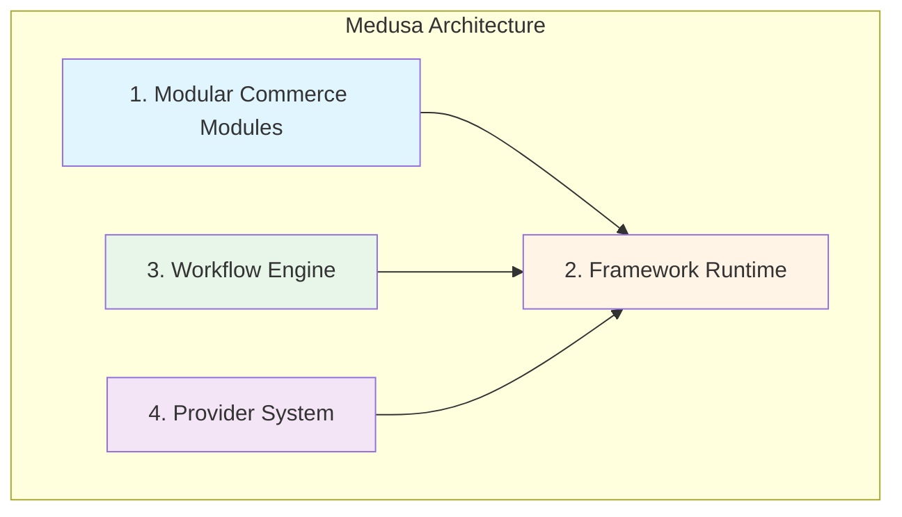
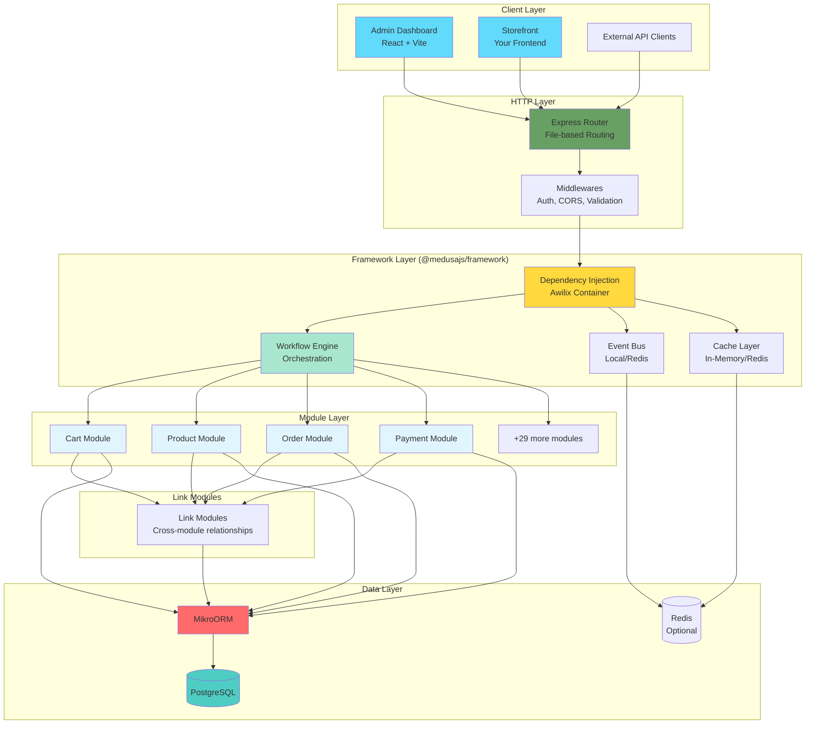
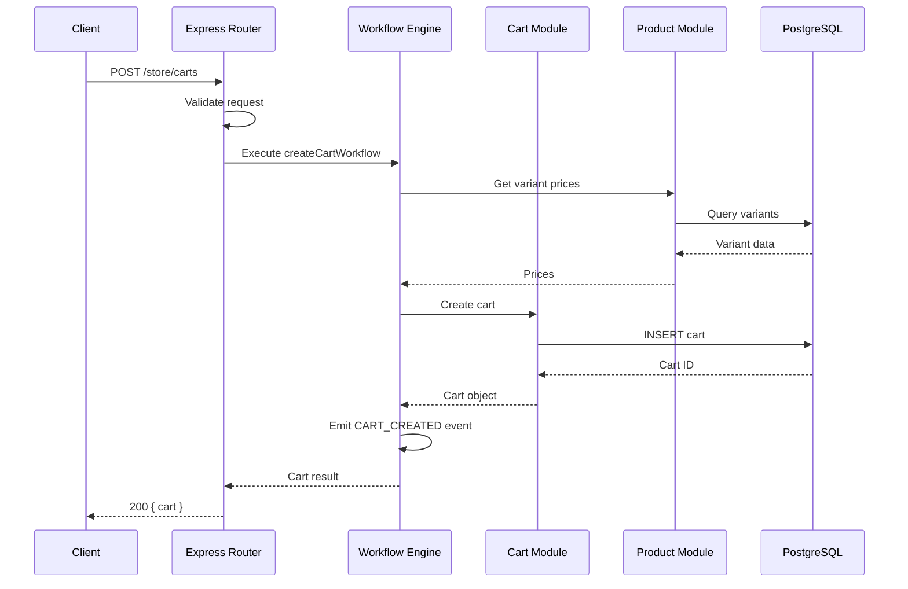
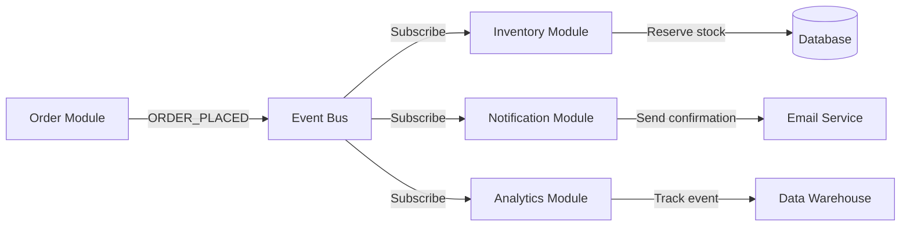
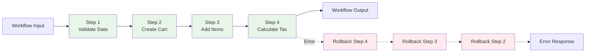

# Medusa Architecture Overview

**Version:** 2.11.3
**Last Updated:** November 18, 2025
**For:** Developers new to Medusa coming from React/JavaScript backgrounds

---

## Table of Contents

1. [High-Level Mental Model](#high-level-mental-model)
2. [The Four Pillars of Medusa](#the-four-pillars-of-medusa)
3. [Architecture Diagram](#architecture-diagram)
4. [Commerce Modules](#commerce-modules)
5. [Framework Layers](#framework-layers)
6. [Module Integration Patterns](#module-integration-patterns)
7. [Workflow Pattern](#workflow-pattern)
8. [Provider Pattern](#provider-pattern)
9. [Mental Models & Analogies](#mental-models--analogies)

---

## High-Level Mental Model

🧠 **Mental Model:** Think of Medusa as a **LEGO e-commerce platform**

- **Commerce Modules** = Individual LEGO bricks (cart, product, order, payment)
- **Framework** = The baseplate that holds everything together
- **Workflows** = Building instructions that orchestrate complex operations
- **Providers** = Swappable parts (like different types of wheels for a LEGO car)

### 🌉 Bridge from React/JavaScript

If you've built React applications:

| React Concept | Medusa Equivalent | Purpose |
|---------------|-------------------|---------|
| Components | **Commerce Modules** | Reusable, isolated units of functionality |
| Props | **Module Dependencies** | Data/services passed between modules |
| Context API | **Dependency Injection (Awilix)** | Global state/service access |
| Redux/Zustand | **Event Bus** | State updates across the system |
| Custom Hooks | **Workflows** | Reusable business logic |
| Higher-Order Components | **Providers** | Extensibility and customization |

---

## The Four Pillars of Medusa

Medusa's architecture is built on four foundational pillars:



1. **Modular Commerce Modules**: 33+ isolated, composable modules (cart, product, order, etc.)
2. **Framework Runtime**: HTTP server, database, DI container, event bus
3. **Workflow Engine**: Orchestrates complex, multi-step operations with automatic rollback
4. **Provider System**: Pluggable implementations (payment processors, file storage, etc.)

---

## Architecture Diagram



### Request Flow Example



---

## Commerce Modules

Medusa v2 provides **33+ commerce modules** out of the box. Each module is:

- ✅ **Isolated**: Has its own database models, services, and business logic
- ✅ **Composable**: Can work independently or with other modules
- ✅ **Swappable**: Can be replaced with custom implementations
- ✅ **Testable**: Unit and integration tests in isolation

### Core Commerce Modules

| Category | Modules | Purpose |
|----------|---------|---------|
| **Shopping Experience** | `cart`, `product`, `pricing`, `promotion` | Browse and purchase |
| **Order Management** | `order`, `fulfillment`, `inventory`, `stock-location` | Process orders |
| **Payment & Finance** | `payment`, `currency`, `tax` | Financial operations |
| **Customer Management** | `customer`, `auth`, `user` | User accounts |
| **Content & Organization** | `file`, `region`, `sales-channel`, `store` | Configuration |
| **Infrastructure** | `cache-*`, `event-bus-*`, `workflow-engine-*` | Technical services |

### Module Locations

```
/packages/modules/
├── cart/              # Shopping cart management
├── product/           # Product catalog
├── order/             # Order processing
├── payment/           # Payment handling
├── pricing/           # Price calculation
├── promotion/         # Discounts & promotions
├── customer/          # Customer data
├── auth/              # Authentication
├── user/              # User management
├── inventory/         # Stock management
├── fulfillment/       # Shipping & delivery
├── tax/               # Tax calculation
├── region/            # Geographic regions
├── currency/          # Currency support
├── sales-channel/     # Multi-channel sales
├── store/             # Store configuration
├── stock-location/    # Warehouse locations
├── file/              # File storage
├── notification/      # Notifications
├── api-key/           # API key management
├── analytics/         # Analytics tracking
├── settings/          # System settings
├── locking/           # Distributed locking
├── cache-inmemory/    # In-memory caching
├── cache-redis/       # Redis caching
├── event-bus-local/   # Local event bus
├── event-bus-redis/   # Redis event bus
├── workflow-engine-inmemory/  # Workflow orchestration
├── workflow-engine-redis/     # Redis-backed workflows
└── link-modules/      # Cross-module relationships
```

### Module Anatomy

Each module follows the same structure:

```
/packages/modules/cart/
├── src/
│   ├── index.ts              # Module registration
│   ├── models/               # Database entities (MikroORM)
│   │   ├── cart.ts
│   │   ├── line-item.ts
│   │   └── address.ts
│   ├── services/             # Business logic
│   │   └── cart-module.ts    # Main service implementation
│   ├── migrations/           # Database migrations
│   └── types/                # TypeScript types
├── package.json
└── README.md
```

**Real Example:** Cart Module Entry Point
`/packages/modules/cart/src/index.ts`:

```typescript
import { Module, Modules } from "@medusajs/framework/utils"
import { CartModuleService } from "./services"

export default Module(Modules.CART, {
  service: CartModuleService,
})
```

💡 **Aha Moment:** The `Module()` function is like React's `createContext()` - it registers the module with the framework so it can be dependency-injected anywhere.

---

## Framework Layers

The `@medusajs/framework` package (v2.11.3) provides the runtime environment for all modules.

### Framework Structure

```
/packages/core/framework/
├── src/
│   ├── http/              # Express HTTP server & routing
│   ├── database/          # MikroORM configuration
│   ├── config/            # Configuration loader
│   ├── logger/            # Winston logging
│   ├── caching/           # Cache abstraction
│   ├── subscribers/       # Event subscribers
│   ├── workflows/         # Workflow runtime
│   ├── links/             # Link module definitions
│   ├── jobs/              # Background jobs
│   ├── telemetry/         # Observability
│   ├── feature-flags/     # Feature toggles
│   ├── utils/             # Utilities
│   ├── types/             # Type definitions
│   ├── modules-sdk/       # Module SDK
│   ├── workflows-sdk/     # Workflow SDK
│   ├── orchestration/     # Workflow orchestration
│   └── medusa-app-loader.ts  # Application bootstrap
```

### Layer 1: HTTP Layer

**File:** `/packages/core/framework/src/http/`

- **Express.js 4.21** server
- **File-based routing** (similar to Next.js)
- **Automatic middleware injection** (auth, validation, CORS)
- **Type-safe request/response handlers**

**Route Example:** `/packages/medusa/src/api/store/carts/route.ts`

```typescript
import { createCartWorkflow } from "@medusajs/core-flows"
import {
  AuthenticatedMedusaRequest,
  MedusaResponse,
} from "@medusajs/framework/http"

export const POST = async (
  req: AuthenticatedMedusaRequest<HttpTypes.StoreCreateCart>,
  res: MedusaResponse<HttpTypes.StoreCartResponse>
) => {
  const { result } = await createCartWorkflow(req.scope).run({
    input: req.validatedBody,
  })

  res.status(200).json({ cart: result })
}
```

🌉 **Bridge from Express:** This is Express, but with TypeScript superpowers:
- `req.scope` = DI container (like `req.app` but for services)
- `req.validatedBody` = Pre-validated request data (like Zod validation)
- Workflows replace traditional service layer calls

### Layer 2: Database Layer

**File:** `/packages/core/framework/src/database/`

- **MikroORM v6.4.16** as the ORM
- **PostgreSQL** as the primary database
- **Automatic migrations** from module definitions
- **Multi-tenancy support** (optional)

**Entity Example:** Cart Model

```typescript
import { model } from "@medusajs/framework/utils"

const Cart = model.define("cart", {
  id: model.id().primaryKey(),
  email: model.text().nullable(),
  currency_code: model.text(),
  region_id: model.text(),
  customer_id: model.text().nullable(),
  sales_channel_id: model.text().nullable(),
  // Relations
  items: model.hasMany(() => LineItem, { mappedBy: "cart" }),
  region: model.belongsTo(() => Region),
})
```

### Layer 3: Dependency Injection

**File:** `/packages/core/framework/src/container/`

- **Awilix v8.0.1** for DI
- **Automatic service registration**
- **Request-scoped containers**
- **Type-safe service resolution**

**DI Pattern:**

```typescript
// In a workflow or route handler
const cartService = req.scope.resolve("cartService")
const productService = req.scope.resolve("productService")

// Services are automatically available!
const cart = await cartService.retrieve(cartId)
```

🧠 **Mental Model:** DI Container = Global service registry
- Like React Context but for backend services
- Services registered once, resolved anywhere
- Request-scoped = fresh instance per HTTP request

### Layer 4: Event Bus

**File:** `/packages/core/framework/src/event-bus/`

- **Pub/Sub pattern** for module communication
- **Local** (in-memory) or **Redis** implementations
- **Type-safe event definitions**
- **Automatic subscriber registration**

**Event Example:**

```typescript
// Emitting an event in a workflow
import { CartWorkflowEvents } from "@medusajs/framework/utils"

emitEventStep({
  eventName: CartWorkflowEvents.CREATED,
  data: { id: cart.id },
})

// Subscribing to an event
import { SubscriberArgs } from "@medusajs/framework"

export default async function cartCreatedHandler({
  event,
  container,
}: SubscriberArgs<{ id: string }>) {
  const analyticsService = container.resolve("analyticsService")
  await analyticsService.trackCartCreated(event.data.id)
}
```

---

## Module Integration Patterns

Modules communicate through three primary patterns:

### 1. Direct Module Access (via DI)

```typescript
// Access another module's service
const productService = container.resolve(Modules.PRODUCT)
const variants = await productService.listProductVariants({ id: variantIds })
```

### 2. Link Modules (Cross-Module Relationships)

**Purpose:** Define relationships between modules without tight coupling.

**Example:** Linking Cart Items to Product Variants

```typescript
// Define the link (happens automatically in framework)
defineLink(Modules.CART, { lineItem: "LineItem" }, Modules.PRODUCT, {
  variant: "ProductVariant",
})

// Query across modules
const cartWithProducts = await query.graph({
  entity: "cart",
  fields: ["id", "items.*", "items.variant.*"],
  filters: { id: cartId },
})

// Result: Cart with line items AND their product variant details
```

💡 **Aha Moment:** Link modules are like SQL foreign keys + GraphQL resolvers - they create relationships without hardcoding dependencies.

### 3. Event Bus (Async Communication)



---

## Workflow Pattern

**Location:** `/packages/core/workflows-sdk/`

Workflows are Medusa's solution for orchestrating complex, multi-step operations.

### Why Workflows?

🧠 **Mental Model:** Workflows = Redux Saga + Automatic Rollback

**Problems they solve:**
1. **Complex operations** spanning multiple modules
2. **Atomic transactions** - all steps succeed or all roll back
3. **Reusability** - compose workflows from smaller steps
4. **Testing** - test workflows and steps independently

### Workflow Structure



### Real Workflow Example

**File:** `/packages/core/core-flows/src/cart/workflows/create-carts.ts`

```typescript
import { createWorkflow, WorkflowResponse } from "@medusajs/framework/workflows-sdk"

export const createCartWorkflow = createWorkflow(
  "create-cart",
  (input: WorkflowData<CreateCartInput>) => {
    // Step 1: Find or create customer
    const customerData = findOrCreateCustomerStep({
      customerId: input.customer_id,
      email: input.email,
    })

    // Step 2: Find region
    const region = findOneOrAnyRegionStep({
      regionId: input.region_id,
    })

    // Step 3: Get product prices
    const { variants, lineItems } = getVariantsAndItemsWithPrices.runAsStep({
      input: {
        items: input.items,
        region,
      },
    })

    // Step 4: Create cart
    const carts = createCartsStep([{
      ...input,
      items: lineItems,
      region_id: region.id,
    }])

    // Step 5: Emit event
    emitEventStep({
      eventName: CartWorkflowEvents.CREATED,
      data: { id: carts[0].id },
    })

    return new WorkflowResponse(carts[0])
  }
)
```

### Workflow Execution

```typescript
// In an API route
const { result } = await createCartWorkflow(container).run({
  input: {
    region_id: "reg_123",
    items: [{ variant_id: "var_123", quantity: 1 }],
  },
})
```

### Workflow Hooks

Workflows can define hooks for customization:

```typescript
// Define hook in workflow
const cartCreated = createHook("cartCreated", { cart })

// Consume hook in your code
createCartWorkflow.hooks.cartCreated(({ cart }, { container }) => {
  // Custom logic after cart creation
  console.log(`Cart created: ${cart.id}`)
  return new StepResponse(cart)
})
```

🌉 **Bridge from React:** Workflow hooks ≈ React hooks (useEffect, useMemo)
- Inject custom logic at specific points
- Access to container (services)
- Return transformed data

---

## Provider Pattern

**Location:** `/packages/modules/providers/`

Providers are **pluggable implementations** for modules that interact with external services.

### Provider Categories

```
/packages/modules/providers/
├── payment-stripe/          # Stripe payment processing
├── payment-paypal/          # PayPal payments
├── file-s3/                 # AWS S3 file storage
├── file-local/              # Local filesystem
├── notification-sendgrid/   # SendGrid emails
└── fulfillment-manual/      # Manual fulfillment
```

### Provider Structure

Every provider implements a standard interface:

**Example:** Payment Provider Interface

```typescript
export interface IPaymentProvider {
  // Capture a payment
  capturePayment(paymentData: PaymentData): Promise<PaymentResponse>

  // Authorize a payment
  authorizePayment(paymentData: PaymentData): Promise<PaymentResponse>

  // Refund a payment
  refundPayment(refundData: RefundData): Promise<RefundResponse>

  // Cancel a payment
  cancelPayment(paymentData: PaymentData): Promise<PaymentResponse>
}
```

### Using Providers

```typescript
// In medusa-config.js
module.exports = {
  modules: {
    payment: {
      resolve: "@medusajs/payment-stripe",
      options: {
        apiKey: process.env.STRIPE_API_KEY,
      },
    },
    file: {
      resolve: "@medusajs/file-s3",
      options: {
        bucket: process.env.S3_BUCKET,
        region: process.env.S3_REGION,
      },
    },
  },
}
```

🧠 **Mental Model:** Providers = Strategy Pattern
- Define interface → Implement variations → Swap at runtime
- Like React component props: same interface, different implementations

---

## Mental Models & Analogies

### 1. Medusa vs Shopify/WooCommerce

| Aspect | Shopify/WooCommerce | Medusa |
|--------|---------------------|--------|
| **Architecture** | Monolithic | Modular (microservices-ready) |
| **Extensibility** | Apps/Plugins | Modules, Providers, Workflows |
| **Database** | Hidden/Abstracted | Direct PostgreSQL access |
| **Customization** | Limited | Full control over every layer |
| **Hosting** | Managed (Shopify) | Self-hosted or cloud |

### 2. Medusa vs Traditional MVC

| MVC Layer | Medusa Equivalent |
|-----------|-------------------|
| **Model** | Module Services + MikroORM Models |
| **View** | Admin Dashboard (React) + Your Storefront |
| **Controller** | API Routes + Workflows |
| **+ Orchestration** | Workflows (unique to Medusa) |
| **+ Events** | Event Bus (unique to Medusa) |

### 3. Learning Path Analogy

```
Beginner (Week 1-2)
└── Understanding modules and services
    (Like learning React components)

Intermediate (Week 3-4)
└── Working with workflows
    (Like composing custom hooks)

Advanced (Month 2+)
└── Creating custom modules and providers
    (Like building a component library)

Expert (Month 3+)
└── Multi-module orchestration and event-driven architecture
    (Like building a state management system)
```

---

## Key Takeaways

### ✅ Understand These Concepts

1. **Modules are isolated units** - Each has models, services, migrations
2. **Framework provides infrastructure** - HTTP, DB, DI, Events, Workflows
3. **Workflows orchestrate operations** - Multi-step, automatic rollback
4. **Providers enable extensibility** - Swap implementations (Stripe vs PayPal)
5. **Link modules connect data** - Cross-module relationships without tight coupling
6. **Event bus decouples communication** - Publish/subscribe pattern

### 🎯 Next Steps

1. Read `PROJECT_STRUCTURE.md` to understand the monorepo layout
2. Read `TECH_STACK_GUIDE.md` to learn the technologies in detail
3. Read `DATA_FLOW_GUIDE.md` to see end-to-end request examples
4. Explore `/packages/modules/cart/` to see a real module
5. Try creating a custom workflow in `/src/workflows/`

---

## Additional Resources

- **Official Docs:** https://docs.medusajs.com
- **GitHub:** https://github.com/medusajs/medusa
- **Module SDK:** https://docs.medusajs.com/resources/module-sdk
- **Workflow SDK:** https://docs.medusajs.com/resources/workflows
- **Architecture Guide:** https://docs.medusajs.com/resources/architectural-modules

---

**File Path:** `/home/user/medusa/docs/learning/ARCHITECTURE_OVERVIEW.md`
**Related Files:**
- `PROJECT_STRUCTURE.md` - Monorepo breakdown
- `TECH_STACK_GUIDE.md` - Technology deep dive
- `DATA_FLOW_GUIDE.md` - Request flow examples
- `TECH_STACK_RESEARCH.md` - Technology version analysis
