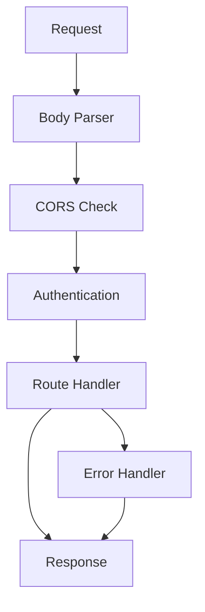
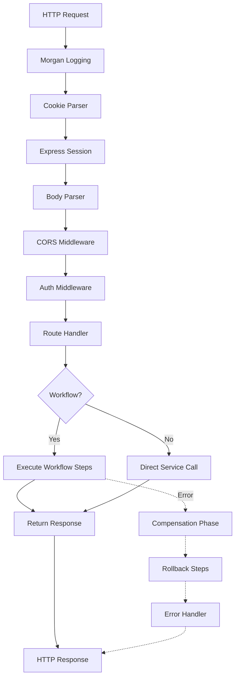

# Backend Architecture - API Server & Framework

> **Version**: ✅ CURRENT - Medusa 2.11.3 (Updated: Nov 2025)

A comprehensive deep-dive into the Medusa backend architecture, powered by Express 4.21, Awilix 8.0.1, and a sophisticated module system.

## Table of Contents

- [Tech Stack Overview](#tech-stack-overview)
- [Express HTTP Server](#express-http-server)
- [Dependency Injection with Awilix](#dependency-injection-with-awilix)
- [API Route Structure](#api-route-structure)
- [Middleware Pipeline](#middleware-pipeline)
- [Workflows SDK](#workflows-sdk)
- [Module Loading](#module-loading)
- [Request Lifecycle](#request-lifecycle)
- [Mental Models](#mental-models)
- [Bridge: Express Basics → Medusa Patterns](#bridge-express-basics--medusa-patterns)

---

## Tech Stack Overview

### Core Dependencies ✅ CURRENT

**Location**: `/home/user/medusa/packages/core/framework/package.json`

```json
{
  "dependencies": {
    "express": "^4.21.0",
    "awilix": "8.0.1",
    "zod": "3.25.76",
    "cors": "^2.8.5",
    "compression": "^1.8.0",
    "express-session": "^1.17.3",
    "cookie-parser": "^1.4.6",
    "morgan": "^1.9.1",
    "jsonwebtoken": "^9.0.2"
  }
}
```

**Medusa Package**: `/home/user/medusa/packages/medusa/package.json`

```json
{
  "dependencies": {
    "express": "^4.21.0",
    "multer": "^2.0.2",
    "compression": "^1.8.0",
    "zod": "3.25.76",
    "uuid": "^9.0.0"
  }
}
```

### Why These Technologies?

- **Express 4.21**: Battle-tested, vast ecosystem, middleware-based
- **Awilix 8.0**: Dependency injection for testability and modularity
- **Zod 3.25**: Runtime validation + TypeScript inference
- **Workflows SDK**: Orchestration with automatic compensation (rollback)

---

## Express HTTP Server

### Server Bootstrap

**File**: `/home/user/medusa/packages/core/framework/src/http/express-loader.ts:18`

```typescript
import { MedusaContainer } from "@medusajs/framework/types"
import { ContainerRegistrationKeys } from "@medusajs/framework/utils"
import express, { Express, RequestHandler } from "express"
import session from "express-session"
import cookieParser from "cookie-parser"
import morgan from "morgan"

export async function expressLoader({
  app,
  container,
}: {
  app: Express
  container: MedusaContainer
}): Promise<{
  app: Express
  shutdown: () => Promise<void>
}> {
  const configModule = configManager.config
  const logger = container.resolve(ContainerRegistrationKeys.LOGGER)

  // Trust proxy for correct IP forwarding
  app.set("trust proxy", 1)

  // Session configuration
  const sessionOpts = {
    name: sessionOptions?.name ?? "connect.sid",
    resave: sessionOptions?.resave ?? true,
    saveUninitialized: false,
    secret: sessionOptions?.secret ?? http?.cookieSecret,
    cookie: {
      sameSite: isProduction ? "none" : false,
      secure: isProduction,
      maxAge: 10 * 60 * 60 * 1000, // 10 hours
    },
    store: null, // Redis or DynamoDB store
  }

  // Middleware stack
  app.use(loggingMiddleware)      // HTTP logging
  app.use(cookieParser())         // Parse cookies
  app.use(session(sessionOpts))   // Session management
  app.use("/static", express.static(path.join(baseDir, "static")))

  return { app, shutdown }
}
```

🧠 **Mental Model**: Express setup follows the **middleware onion pattern**:

```
┌─────────────────────────────────────┐
│ Logging (morgan)                    │
│  ┌──────────────────────────────┐   │
│  │ Cookie Parser                │   │
│  │  ┌───────────────────────┐   │   │
│  │  │ Session               │   │   │
│  │  │  ┌────────────────┐   │   │   │
│  │  │  │ Your Route     │   │   │   │
│  │  │  └────────────────┘   │   │   │
│  │  └───────────────────────┘   │   │
│  └──────────────────────────────┘   │
└─────────────────────────────────────┘
```

### Session Store Options

Medusa supports multiple session backends:

```typescript
// Redis (Production)
if (configModule?.projectConfig?.redisUrl) {
  const RedisStore = createStore(session)
  redisClient = new Redis(configModule.projectConfig.redisUrl)
  sessionOpts.store = new RedisStore({
    client: redisClient,
    prefix: `sess:`,
  })
}

// DynamoDB (AWS)
if (configModule?.projectConfig.sessionOptions?.dynamodbOptions) {
  const DynamoDBStore = storeFactory({ session })
  sessionOpts.store = new DynamoDBStore({
    ...configModule.projectConfig.sessionOptions.dynamodbOptions,
  })
}
```

💡 **Aha Moment**: Session persistence is **pluggable** - swap Redis for DynamoDB without code changes, just config.

---

## Dependency Injection with Awilix

Medusa uses **Awilix** for dependency injection, enabling:
- Testable code (inject mocks)
- Loose coupling between modules
- Automatic lifecycle management

### Container Registration

**Awilix Version**: 8.0.1 (via `@medusajs/deps`)

```typescript
import { asClass, asFunction, asValue, Lifetime } from "awilix"

// Singleton registration
container.register({
  logger: asValue(logger), // Pre-instantiated value

  // Scoped per request
  productService: asClass(ProductService, {
    lifetime: Lifetime.SCOPED
  }),

  // Singleton service
  eventBusService: asClass(EventBusService, {
    lifetime: Lifetime.SINGLETON
  }),
})
```

### Lifetimes Explained

| Lifetime | Description | Use Case |
|----------|-------------|----------|
| `SINGLETON` | One instance for entire app | Event bus, logger, config |
| `SCOPED` | One instance per request | Services that need transaction context |
| `TRANSIENT` | New instance every time | Stateless utilities |

🧠 **Mental Model**: Think of Awilix like a **smart factory**:
- You register blueprints (classes/functions)
- Awilix builds instances when needed
- Dependencies are auto-injected

**Mnemonic**: "**A**wilix **W**ires **I**njected **L**ifetimes **I**ntelligently"

### Resolving Dependencies

```typescript
import { MedusaRequest } from "@medusajs/framework/http"

// In a route handler
export async function GET(req: MedusaRequest, res: MedusaResponse) {
  // req.scope is the Awilix container for this request
  const productService = req.scope.resolve("product")

  const products = await productService.list()

  res.json({ products })
}
```

💡 **Aha Moment**: `req.scope` is a **request-scoped container** - services resolved from it share the same transaction context!

---

## API Route Structure

Medusa uses **file-based routing** similar to Next.js:

```
packages/medusa/src/api/
├── admin/                    # Admin API (/admin/*)
│   ├── products/
│   │   ├── route.ts         # GET/POST /admin/products
│   │   ├── [id]/
│   │   │   └── route.ts     # GET/PUT/DELETE /admin/products/:id
│   │   └── middlewares.ts   # Route-specific middleware
│   ├── orders/
│   └── ...
├── store/                    # Storefront API (/store/*)
│   ├── products/
│   └── carts/
└── auth/                     # Auth API (/auth/*)
```

### Route File Pattern

**File**: `/home/user/medusa/packages/medusa/src/api/admin/products/route.ts:17`

```typescript
import { createProductsWorkflow } from "@medusajs/core-flows"
import {
  AuthenticatedMedusaRequest,
  MedusaResponse,
  refetchEntity,
} from "@medusajs/framework/http"
import { HttpTypes } from "@medusajs/framework/types"

// GET /admin/products
export const GET = async (
  req: AuthenticatedMedusaRequest<HttpTypes.AdminProductListParams>,
  res: MedusaResponse<HttpTypes.AdminProductListResponse>
) => {
  const { data: products, metadata } = await refetchEntities({
    entity: "product",
    idOrFilter: req.filterableFields,
    scope: req.scope,
    fields: req.queryConfig.fields ?? [],
    pagination: req.queryConfig.pagination,
  })

  res.json({
    products,
    count: metadata.count,
    offset: metadata.skip,
    limit: metadata.take,
  })
}

// POST /admin/products
export const POST = async (
  req: AuthenticatedMedusaRequest<HttpTypes.AdminCreateProduct>,
  res: MedusaResponse<HttpTypes.AdminProductResponse>
) => {
  const { additional_data, ...products } = req.validatedBody

  // Execute workflow
  const { result } = await createProductsWorkflow(req.scope).run({
    input: { products: [products], additional_data },
  })

  const product = await refetchEntity({
    entity: "product",
    idOrFilter: result[0].id,
    scope: req.scope,
    fields: req.queryConfig.fields ?? [],
  })

  res.status(200).json({ product })
}
```

🧠 **Mental Model - Route Exports**:
- Export `GET` → handles GET requests
- Export `POST` → handles POST requests
- Export `AUTHENTICATE = false` → opt out of auth
- Export `CORS = { origin: "*" }` → custom CORS

**Mnemonic**: "**G**ET **P**OST **A**uthenticate **C**ORS" = Route configuration

### Dynamic Route Parameters

```typescript
// File: /admin/products/[id]/route.ts

export const GET = async (
  req: AuthenticatedMedusaRequest,
  res: MedusaResponse
) => {
  const productId = req.params.id // Auto-extracted from URL

  const product = await refetchEntity({
    entity: "product",
    idOrFilter: productId,
    scope: req.scope,
  })

  res.json({ product })
}
```

---

## Middleware Pipeline

**File**: `/home/user/medusa/packages/core/framework/src/http/router.ts:30`

### API Loader Architecture

The `ApiLoader` class orchestrates route and middleware loading:

```typescript
export class ApiLoader {
  async load() {
    // 1. Load HTTP resources
    const {
      routes,
      middlewares,
      routesFinder,
      bodyParserConfigRoutes,
      errorHandler,
    } = await this.#loadHttpResources()

    // 2. Apply body parser middleware
    this.#applyBodyParserMiddleware("/", bodyParserRoutesFinder)

    // 3. Apply CORS for admin routes
    this.#applyCorsMiddleware(
      routesFinder,
      "/admin",
      "shouldAppendAdminCors",
      this.#createCorsOptions(config.http.adminCors)
    )

    // 4. Apply auth middleware for admin routes
    this.#applyAuthMiddleware(routesFinder, "/admin", "user", [
      "bearer",
      "session",
      "api-key",
    ])

    // 5. Apply CORS + auth for store routes
    this.#applyCorsMiddleware(routesFinder, "/store", ...)
    this.#applyStorePublishableKeyMiddleware("/store")
    this.#applyAuthMiddleware(routesFinder, "/store", "customer", ...)

    // 6. Register all routes and middlewares
    sortedRoutes.forEach((route) => {
      this.#registerExpressHandler(route)
    })

    // 7. Error handler (last middleware)
    this.#app.use(errorHandler ?? errorHandler())
  }
}
```

### Middleware Application Order



### Conditional CORS Pattern

**File**: `/home/user/medusa/packages/core/framework/src/http/router.ts:193`

```typescript
#applyCorsMiddleware(
  routesFinder: RoutesFinder<RouteDescriptor>,
  namespace: string,
  toggleKey: "shouldAppendAdminCors" | "shouldAppendStoreCors",
  corsOptions: CorsOptions
) {
  const corsFn = cors(corsOptions)

  const corsMiddleware: RequestHandler = function corsMiddleware(
    req,
    res,
    next
  ) {
    const path = `${namespace}${req.path}`
    const matchingRoute = routesFinder.find(path, req.method)

    // Only apply CORS if route opts in
    if (matchingRoute && matchingRoute[toggleKey] === true) {
      return corsFn(req, res, next)
    }

    return next() // Skip CORS
  }

  this.#app.use(namespace, corsMiddleware)
}
```

💡 **Aha Moment**: CORS is **selectively applied** based on route configuration, not globally. This allows fine-grained control per endpoint.

### Authentication Middleware

**File**: `/home/user/medusa/packages/core/framework/src/http/router.ts:240`

```typescript
#applyAuthMiddleware(
  routesFinder: RoutesFinder<RouteDescriptor>,
  namespace: string,
  actorType: string | string[],
  authType: AuthType | AuthType[],
  options?: { allowUnauthenticated?: boolean }
) {
  const originalFn = authenticate(actorType, authType, options)

  const authMiddleware: RequestHandler = function authMiddleware(
    req,
    res,
    next
  ) {
    const matchingRoute = routesFinder.find(path, req.method)

    // Skip auth if route opts out
    if (matchingRoute && matchingRoute.optedOutOfAuth) {
      return next()
    }

    return originalFn(req, res, next)
  }

  this.#app.use(namespace, authMiddleware)
}
```

**Auth Types**:
- `bearer`: JWT token in Authorization header
- `session`: Express session cookies
- `api-key`: API key in header

**Actor Types**:
- `user`: Admin users
- `customer`: Store customers

---

## Workflows SDK

Workflows are Medusa's answer to **complex multi-step operations** with automatic rollback.

### Why Workflows?

Traditional approach (❌ fragile):
```typescript
async function createOrderFromCart(cartId) {
  const order = await orderService.create(cart)      // Step 1
  await paymentService.capture(order.payment_id)     // Step 2
  await inventoryService.reserve(order.items)        // Step 3

  // ❌ If step 3 fails, steps 1-2 are NOT rolled back
}
```

Workflow approach (✅ resilient):
```typescript
const createOrderWorkflow = createWorkflow(
  "create-order",
  (input) => {
    const order = createOrderStep(input)              // Step 1
    const payment = capturePaymentStep(order)         // Step 2
    const inventory = reserveInventoryStep(order)     // Step 3

    return new WorkflowResponse(order)
  }
)

// ✅ If any step fails, all previous steps auto-rollback via compensation
```

### Workflow Anatomy

**File**: `/home/user/medusa/packages/core/core-flows/src/cart/workflows/add-to-cart.ts:114`

```typescript
import {
  createWorkflow,
  createStep,
  StepResponse,
  WorkflowResponse,
  transform,
  parallelize,
  when,
} from "@medusajs/framework/workflows-sdk"

export const addToCartWorkflow = createWorkflow(
  {
    name: addToCartWorkflowId,
    idempotent: false,
  },
  (input: AddToCartWorkflowInputDTO) => {
    // 1. Lock the cart (prevent concurrent modifications)
    acquireLockStep({ key: input.cart_id })

    // 2. Get cart data
    const { data: cart } = useQueryGraphStep({
      entity: "cart",
      filters: { id: input.cart_id },
    })

    // 3. Validate cart
    validateCartStep({ cart })

    // 4. Transform input data
    const variantIds = transform({ input }, (data) => {
      return data.input.items.map((i) => i.variant_id)
    })

    // 5. Get variants with prices
    const { variants, lineItems } = getVariantsAndItemsWithPrices.runAsStep({
      input: { cart, items: input.items, variantIds },
    })

    // 6. Validate prices
    validateLineItemPricesStep({ items: lineItems })

    // 7. Determine actions (create vs update)
    const { itemsToCreate, itemsToUpdate } = getLineItemActionsStep({
      id: cart.id,
      items: lineItems,
    })

    // 8. Parallel execution
    const [createdLineItems, updatedLineItems] = parallelize(
      createLineItemsStep({ id: cart.id, items: itemsToCreate }),
      updateLineItemsStep({ id: cart.id, items: itemsToUpdate })
    )

    // 9. Release lock
    releaseLockStep({ key: cart.id })

    return new WorkflowResponse(void 0)
  }
)
```

🧠 **Mental Model - Workflow Execution Flow**:

```
┌────────────────────────────────────────────┐
│ Workflow Execution                         │
├────────────────────────────────────────────┤
│ acquireLockStep          ✓ [compensate: release] │
│    ↓                                       │
│ useQueryGraphStep        ✓ [no compensation]     │
│    ↓                                       │
│ validateCartStep         ✓ [no compensation]     │
│    ↓                                       │
│ createLineItemsStep      ✓ [compensate: delete]  │
│    ↓                                       │
│ ❌ ERROR!                                  │
│    ↓                                       │
│ 🔄 COMPENSATION PHASE                      │
│    ↓                                       │
│ deleteLineItemsStep      ✓ [rollback]     │
│    ↓                                       │
│ releaseLockStep          ✓ [rollback]     │
└────────────────────────────────────────────┘
```

### Creating a Step with Compensation

**File**: `/home/user/medusa/packages/core/workflows-sdk/src/utils/composer/create-step.ts:422`

```typescript
import { createStep, StepResponse } from "@medusajs/framework/workflows-sdk"

export const createProductStep = createStep(
  "createProductStep",

  // Invocation function
  async function (input: CreateProductInput, { container }) {
    const productService = container.resolve("product")
    const product = await productService.create(input)

    // Return: (output, compensationInput)
    return new StepResponse(
      { product },           // Output (goes to next step)
      { productId: product.id }  // Compensation input
    )
  },

  // Compensation function (rollback)
  async function (compensationInput, { container }) {
    if (!compensationInput) return

    const productService = container.resolve("product")
    await productService.delete([compensationInput.productId])
  }
)
```

💡 **Aha Moment**: The `StepResponse` constructor takes **two arguments**:
1. **Output** - data passed to the next step
2. **Compensation Input** - data passed to the compensation function for rollback

### Conditional Steps with `when()`

```typescript
const result = when(
  "should-charge-customer",
  { order },
  ({ order }) => order.total > 0  // Condition
).then(() => {
  // Only run if condition is true
  return chargeCustomerStep({ order })
})
```

### Parallel Execution with `parallelize()`

```typescript
const [inventory, notification] = parallelize(
  reserveInventoryStep({ items }),
  sendEmailStep({ to: customer.email })
)
```

**Mnemonic**: "**W**orkflows **O**rchestrate **R**eliable **K**ompensating **F**lows"

---

## Module Loading

Medusa's module system enables **pluggable architecture** where each domain is self-contained.

### Module Structure

**File**: `/home/user/medusa/packages/modules/cart/src/index.ts:1`

```typescript
import { Module, Modules } from "@medusajs/framework/utils"
import { CartModuleService } from "./services"

export default Module(Modules.CART, {
  service: CartModuleService,
})
```

Each module exports:
- **Service**: Business logic
- **Models**: Data entities
- **Migrations**: Database schema
- **Types**: TypeScript interfaces

### Module Registration

Modules are registered in the Medusa container:

```typescript
container.register({
  [Modules.CART]: asClass(CartModuleService),
  [Modules.PRODUCT]: asClass(ProductModuleService),
  [Modules.ORDER]: asClass(OrderModuleService),
  // ... 30+ more modules
})
```

### Accessing Modules in Routes

```typescript
export const GET = async (req: MedusaRequest, res: MedusaResponse) => {
  // Resolve module from container
  const cartModule = req.scope.resolve(Modules.CART)

  const carts = await cartModule.list({ customer_id: "cus_123" })

  res.json({ carts })
}
```

---

## Request Lifecycle

### Complete Request Flow



### Request Object Structure

```typescript
interface MedusaRequest extends Request {
  scope: MedusaContainer           // Awilix container
  session: Session                 // Express session
  user?: User                      // Authenticated user
  auth_context?: AuthContext       // Auth metadata
  validatedBody: any               // Zod-validated body
  validatedQuery: any              // Zod-validated query
  filterableFields: any            // Parsed filters
  queryConfig: {
    fields: string[]               // Requested fields
    pagination: { limit, offset }  // Pagination
  }
  restrictedFields: RestrictedFields // Fields to exclude
}
```

### Response Helpers

```typescript
import { MedusaResponse } from "@medusajs/framework/http"

// Structured JSON response
res.json({ products, count, offset, limit })

// Error response (handled by error middleware)
throw new MedusaError(
  MedusaError.Types.NOT_FOUND,
  "Product not found"
)
```

---

## Mental Models

### 🧠 Dependency Injection Mental Model

```
┌─────────────────────────────────────────┐
│ Awilix Container (Factory)              │
├─────────────────────────────────────────┤
│                                         │
│  Blueprints (Registered):               │
│  ┌─────────────────────────────────┐   │
│  │ productService: ProductService  │   │
│  │ cartService: CartService        │   │
│  │ logger: Logger                  │   │
│  └─────────────────────────────────┘   │
│                                         │
│  Request comes in → Scope created       │
│  ┌─────────────────────────────────┐   │
│  │ Request Scope Container         │   │
│  │  - productService (instance)    │   │
│  │  - cartService (instance)       │   │
│  │  - logger (singleton ref)       │   │
│  └─────────────────────────────────┘   │
│                                         │
│  Dependencies auto-injected             │
└─────────────────────────────────────────┘
```

### 🌉 Bridge: Express Basics → Medusa Patterns

| Express Basics | Medusa Pattern | Why? |
|----------------|----------------|------|
| `app.get('/products', handler)` | Export `GET` from `route.ts` | File-based routing, auto-discovery |
| `req.body` | `req.validatedBody` | Zod validation, type safety |
| `const service = new Service()` | `req.scope.resolve("service")` | DI, testability, scoping |
| Try-catch error handling | Workflow compensation | Automatic rollback, resilience |
| Inline business logic | Workflow steps | Reusability, observability |

### 💡 Key Aha Moments

1. **req.scope is your container**: Every request has its own DI scope
2. **Workflows > Transactions**: Compensation handles rollback automatically
3. **File = Route**: No route registration boilerplate
4. **Zod Schemas = Runtime Types**: Validation + TypeScript in one

---

## Validation Patterns

### Zod Schema Pattern

```typescript
import { z } from "zod"
import { validateBody } from "@medusajs/framework/http"

const CreateProductSchema = z.object({
  title: z.string().min(1, "Title is required"),
  handle: z.string().optional(),
  status: z.enum(["draft", "published", "rejected"]),
  variants: z.array(z.object({
    title: z.string(),
    sku: z.string().optional(),
    prices: z.array(z.object({
      amount: z.number().positive(),
      currency_code: z.string().length(3),
    })),
  })),
})

// In route.ts
export const POST = validateBody(
  CreateProductSchema,
  async (req, res) => {
    // req.validatedBody is typed and validated
    const product = await createProductWorkflow(req.scope).run({
      input: req.validatedBody
    })

    res.json({ product })
  }
)
```

---

## Error Handling

### Error Handler Middleware

**File**: `/home/user/medusa/packages/core/framework/src/http/middlewares/error-handler.ts`

```typescript
export const errorHandler = (): ErrorRequestHandler => {
  return (err, req, res, next) => {
    const logger = req.scope.resolve(ContainerRegistrationKeys.LOGGER)

    // Log error
    logger.error(err)

    // Format error response
    const { status = 500, message, code } = err

    res.status(status).json({
      type: err.type || "unknown_error",
      message,
      code,
    })
  }
}
```

### Custom Errors

```typescript
import { MedusaError } from "@medusajs/framework/utils"

throw new MedusaError(
  MedusaError.Types.NOT_FOUND,
  `Product with id ${id} not found`,
  MedusaError.Codes.NOT_FOUND
)
```

---

## File References

All file paths mentioned:

1. **Express Loader**: `/home/user/medusa/packages/core/framework/src/http/express-loader.ts:18`
2. **API Router**: `/home/user/medusa/packages/core/framework/src/http/router.ts:30`
3. **Product Route**: `/home/user/medusa/packages/medusa/src/api/admin/products/route.ts:17`
4. **Create Step**: `/home/user/medusa/packages/core/workflows-sdk/src/utils/composer/create-step.ts:422`
5. **Create Workflow**: `/home/user/medusa/packages/core/workflows-sdk/src/utils/composer/create-workflow.ts:101`
6. **Add to Cart Workflow**: `/home/user/medusa/packages/core/core-flows/src/cart/workflows/add-to-cart.ts:114`
7. **Cart Module**: `/home/user/medusa/packages/modules/cart/src/index.ts:1`

---

## Summary

The Medusa backend is a sophisticated Express application that:

- Uses **Express 4.21** with a plugin middleware architecture
- Implements **Dependency Injection** via **Awilix 8.0.1**
- Provides **type-safe validation** with **Zod 3.25.76**
- Orchestrates complex operations with **Workflows SDK** (auto-compensation)
- Organizes code via **33+ self-contained modules**
- Uses **file-based routing** for API endpoints
- Supports **multiple auth strategies** (bearer, session, API keys)

**Key Principle**: Resilience through workflows, modularity through DI, safety through types.
