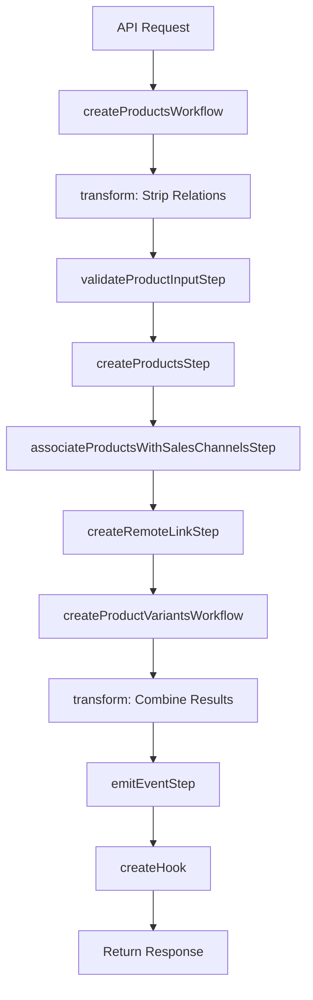
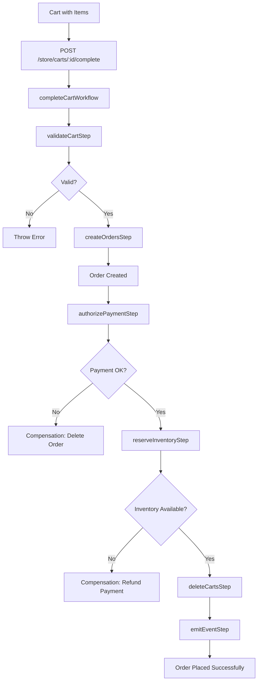
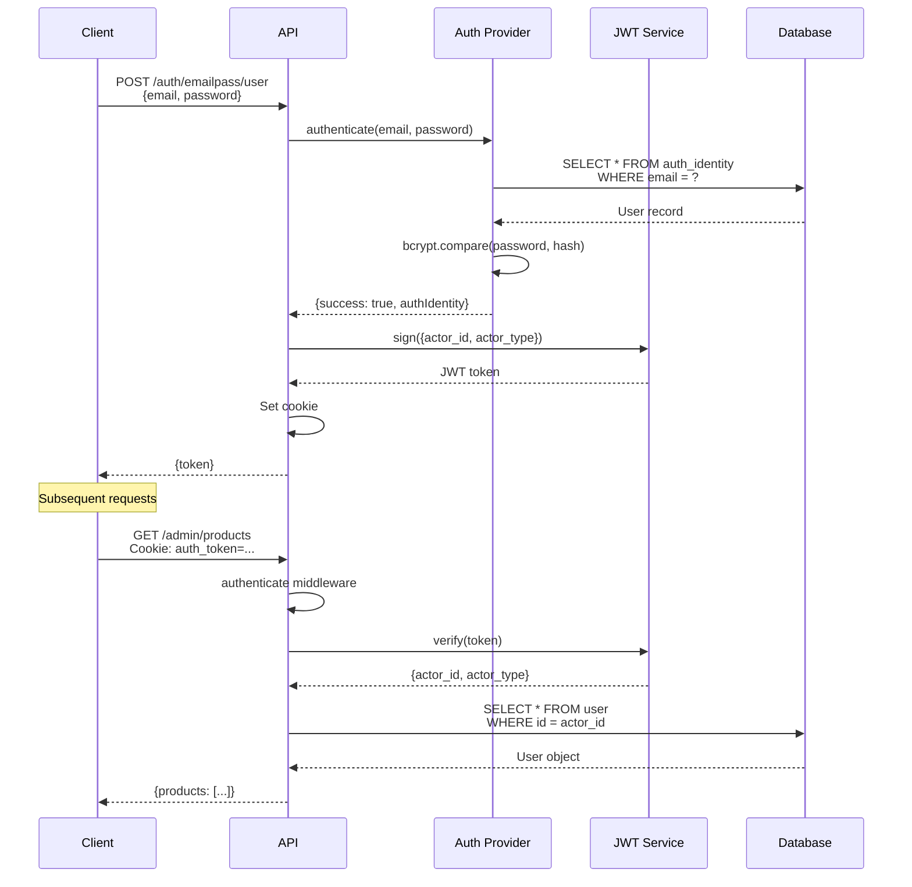
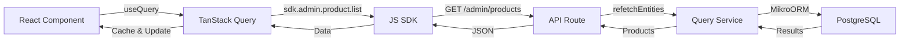
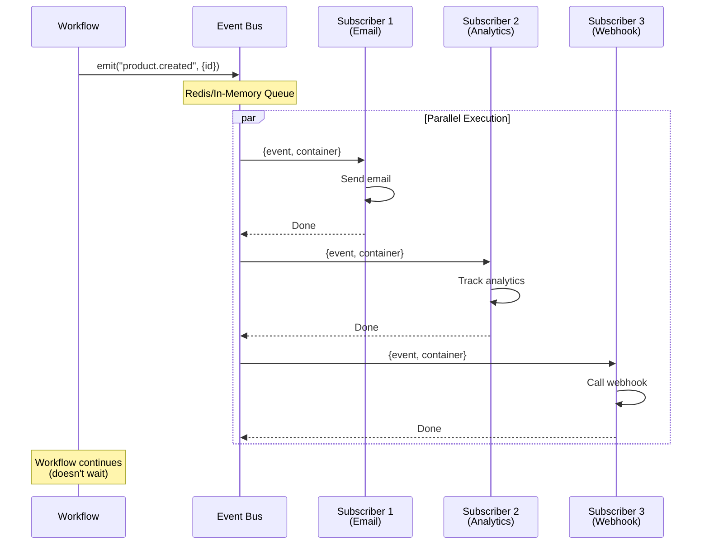

# Code Tours

**Guided walkthroughs of key Medusa features with step-by-step explanations**

**Last Updated:** November 19, 2025
**Version:** 2.11.3

---

## Table of Contents

1. [Tour 1: Product Creation Flow](#tour-1-product-creation-flow)
2. [Tour 2: Order Placement Flow](#tour-2-order-placement-flow)
3. [Tour 3: Authentication Flow](#tour-3-authentication-flow)
4. [Tour 4: Admin Dashboard Data Fetching](#tour-4-admin-dashboard-data-fetching)
5. [Tour 5: Database Migration Creation](#tour-5-database-migration-creation)
6. [Tour 6: Event Publishing and Handling](#tour-6-event-publishing-and-handling)

---

## Tour 1: Product Creation Flow

**Journey:** API Request → Workflow → Steps → Module → Database

**Time to Complete:** 15 minutes

**What You'll Learn:** How data flows through Medusa when creating a product

### Starting Point: API Request

**File:** `/home/user/medusa/packages/medusa/src/api/admin/products/route.ts` (Line 94-115)

```typescript
export const POST = async (
  req: AuthenticatedMedusaRequest<
    HttpTypes.AdminCreateProduct & AdditionalData,
    HttpTypes.SelectParams
  >,
  res: MedusaResponse<HttpTypes.AdminProductResponse>
) => {
  // 1️⃣ Extract validated body (already validated by middleware)
  const { additional_data, ...products } = req.validatedBody

  // 2️⃣ Run the workflow
  const { result } = await createProductsWorkflow(req.scope).run({
    input: { products: [products], additional_data },
  })

  // 3️⃣ Refetch with relations
  const product = await refetchEntity({
    entity: "product",
    idOrFilter: result[0].id,
    scope: req.scope,
    fields: remapKeysForProduct(req.queryConfig.fields ?? []),
  })

  // 4️⃣ Return response
  res.status(200).json({ product: remapProductResponse(product) })
}
```

**What's Happening:**
- Line 101: Body is already validated by `validateAndTransformBody()` middleware
- Line 103: Workflow is invoked with `req.scope` (DI container)
- Line 107: Product is refetched to include requested relations
- Line 113: Response is sent back to client

**💡 Key Insight:** API routes are thin - they delegate to workflows.

---

### Step 1: Workflow Orchestration

**File:** `/home/user/medusa/packages/core/core-flows/src/product/workflows/create-products.ts` (Line 163-290)

```typescript
export const createProductsWorkflow = createWorkflow(
  createProductsWorkflowId,
  (input: WorkflowData<CreateProductsWorkflowInput>) => {
    // 🎯 STEP 1: Transform input (remove relations)
    const { products: productWithoutExternalRelations } = transform(
      { input },
      (data) => {
        const productsData = data.input.products.map((p) => {
          return {
            ...p,
            sales_channels: undefined,      // ← Remove these
            shipping_profile_id: undefined, // ← They're handled later
            variants: undefined,            // ← Separate workflow
          }
        })
        return { products: productsData }
      }
    )

    // 🎯 STEP 2: Validate input
    validateProductInputStep({ products: input.products })

    // 🎯 STEP 3: Create products (core entities)
    const createdProducts = createProductsStep(productWithoutExternalRelations)

    // 🎯 STEP 4: Link to sales channels
    const salesChannelLinks = transform({ input, createdProducts }, (data) => {
      return data.createdProducts
        .map((createdProduct, i) => {
          const inputProduct = data.input.products[i]
          return (
            inputProduct.sales_channels?.map((salesChannel) => ({
              sales_channel_id: salesChannel.id,
              product_id: createdProduct.id,
            })) ?? []
          )
        })
        .flat()
    })

    associateProductsWithSalesChannelsStep({ links: salesChannelLinks })

    // 🎯 STEP 5: Link to shipping profiles
    const shippingProfileLinks = transform(
      { input, createdProducts },
      (data) => {
        return data.createdProducts
          .map((createdProduct, i) => {
            return {
              [Modules.PRODUCT]: {
                product_id: createdProduct.id,
              },
              [Modules.FULFILLMENT]: {
                shipping_profile_id: data.input.products[i].shipping_profile_id,
              },
            }
          })
          .filter((link) => !!link[Modules.FULFILLMENT].shipping_profile_id)
      }
    )

    createRemoteLinkStep(shippingProfileLinks as LinkDefinition[])

    // 🎯 STEP 6: Create variants (sub-workflow)
    const variantsInput = transform({ input, createdProducts }, (data) => {
      const productVariants: (ProductTypes.CreateProductVariantDTO & {
        prices?: PricingTypes.CreateMoneyAmountDTO[]
      })[] = []

      data.createdProducts.forEach((product, i) => {
        const inputProduct = data.input.products[i]

        for (const inputVariant of inputProduct.variants || []) {
          isPresent(inputVariant) &&
            productVariants.push({
              product_id: product.id,
              ...inputVariant,
            })
        }
      })

      return {
        input: { product_variants: productVariants },
      }
    })

    const createdVariants =
      createProductVariantsWorkflow.runAsStep(variantsInput)

    // 🎯 STEP 7: Combine products with variants
    const response = transform(
      { createdVariants, input, createdProducts },
      (data) => {
        const variantMap: Record<string, ProductTypes.ProductVariantDTO[]> = {}

        for (const variant of data.createdVariants) {
          const array = variantMap[variant.product_id!] || []
          array.push(variant)
          variantMap[variant.product_id!] = array
        }

        for (const product of data.createdProducts) {
          product.variants = variantMap[product.id] || []
        }

        return data.createdProducts
      }
    )

    // 🎯 STEP 8: Emit event
    const productIdEvents = transform({ response }, ({ response }) => {
      return response.map((v) => {
        return { id: v.id }
      })
    })

    emitEventStep({
      eventName: ProductWorkflowEvents.CREATED,
      data: productIdEvents,
    })

    // 🎯 STEP 9: Create hook for extensibility
    const productsCreated = createHook("productsCreated", {
      products: response,
      additional_data: input.additional_data,
    })

    return new WorkflowResponse(response, {
      hooks: [productsCreated],
    })
  }
)
```

**What's Happening:**
1. **Lines 167-180:** Remove relations from input (they're handled separately)
2. **Line 183:** Validate that products have required options
3. **Line 185:** Create product entities
4. **Lines 187-201:** Link products to sales channels
5. **Lines 203-221:** Link products to shipping profiles
6. **Lines 223-247:** Create product variants (calls another workflow)
7. **Lines 249-268:** Combine products with their variants
8. **Lines 270-279:** Emit "product.created" event
9. **Lines 281-284:** Create hook for plugin extensibility

**💡 Key Insight:** Workflows are pure orchestration - they don't do the work, they coordinate steps.

**🎯 Mermaid Flow:**



---

### Step 2: The Actual Work (createProductsStep)

**File:** `/home/user/medusa/packages/core/core-flows/src/product/steps/create-products.ts` (Line 31-51)

```typescript
export const createProductsStep = createStep(
  createProductsStepId,
  async (data: ProductTypes.CreateProductDTO[], { container }) => {
    // 1️⃣ Resolve the Product module service
    const service = container.resolve<IProductModuleService>(Modules.PRODUCT)

    // 2️⃣ Create products
    const created = await service.createProducts(data)

    // 3️⃣ Return response with compensation data
    return new StepResponse(
      created,                          // ← Output (used by next steps)
      created.map((product) => product.id) // ← Compensation input (for rollback)
    )
  },
  async (createdIds, { container }) => {
    // 4️⃣ Compensation function (rollback if workflow fails)
    if (!createdIds?.length) {
      return
    }

    const service = container.resolve<IProductModuleService>(Modules.PRODUCT)

    await service.deleteProducts(createdIds)
  }
)
```

**What's Happening:**
- **Line 34:** Resolve ProductModuleService from DI container
- **Line 37:** Call `createProducts()` on the service
- **Line 39-42:** Return StepResponse with output and compensation data
- **Line 44-51:** Compensation function - deletes products if workflow fails

**💡 Key Insight:** Every step has two functions:
1. **Invoke:** Do the work
2. **Compensate:** Undo the work (automatic rollback)

---

### Step 3: Module Service

**File:** `/home/user/medusa/packages/modules/product/src/services/product-module-service.ts`

```typescript
export class ProductModuleService extends ModulesSdkUtils.MedusaService({
  Product,
  ProductVariant,
  ProductOption,
  ProductTag,
  ProductType,
  ProductCollection,
  ProductCategory,
  ProductImage,
}) {
  // Inherits CRUD methods:
  // - createProducts() ✅ (we're calling this)
  // - updateProducts()
  // - deleteProducts()
  // - listProducts()
  // - retrieveProduct()
  // ... and more
}
```

**What's Happening:**
- Service extends `MedusaService` with all entity models
- `createProducts()` is auto-generated by framework
- Handles database operations via MikroORM

**💡 Key Insight:** You rarely write `CREATE`, `UPDATE`, `DELETE` SQL - the framework generates it.

---

### Step 4: Database Model

**File:** `/home/user/medusa/packages/modules/product/src/models/product.ts` (Line 11-92)

```typescript
const Product = model
  .define("Product", {
    id: model.id({ prefix: "prod" }).primaryKey(),
    title: model.text().searchable(),
    handle: model.text(),
    subtitle: model.text().searchable().nullable(),
    description: model.text().searchable().nullable(),
    is_giftcard: model.boolean().default(false),
    status: model
      .enum(ProductUtils.ProductStatus)
      .default(ProductUtils.ProductStatus.DRAFT),
    thumbnail: model.text().nullable(),
    metadata: model.json().nullable(),

    // Relationships
    variants: model.hasMany(() => ProductVariant, {
      mappedBy: "product",
    }),
    type: model
      .belongsTo(() => ProductType, {
        mappedBy: "products",
      })
      .nullable(),
    tags: model.manyToMany(() => ProductTag, {
      mappedBy: "products",
      pivotTable: "product_tags",
    }),
  })
  .cascades({
    delete: ["variants", "options", "images"], // ← Delete these when product is deleted
  })
  .indexes([
    {
      name: "IDX_product_handle_unique",
      on: ["handle"],
      unique: true,
      where: "deleted_at IS NULL",
    },
  ])
```

**What's Happening:**
- **Lines 13-24:** Field definitions with types and constraints
- **Lines 26-36:** Relationships (hasMany, belongsTo, manyToMany)
- **Lines 38-40:** Cascade deletes (cleanup related data)
- **Lines 42-48:** Database indexes (performance)

**💡 Key Insight:** Models are declarative - they describe structure, not behavior.

---

### Step 5: Database Execution

When `createProducts()` is called, MikroORM generates SQL:

```sql
-- Generated SQL (simplified)
INSERT INTO "product" (
  "id",
  "title",
  "handle",
  "status",
  "created_at",
  "updated_at"
) VALUES (
  'prod_01ABCDEF',
  'Medusa T-Shirt',
  'medusa-t-shirt',
  'draft',
  NOW(),
  NOW()
) RETURNING *;
```

---

### Complete Flow Summary

```
1. POST /admin/products
   ↓ (route.ts:103)
2. createProductsWorkflow()
   ↓ (workflows/create-products.ts:185)
3. createProductsStep()
   ↓ (steps/create-products.ts:37)
4. service.createProducts()
   ↓ (services/product-module-service.ts - auto-generated)
5. MikroORM Insert
   ↓
6. PostgreSQL
   ↓
7. Return created product
   ↓
8. Continue workflow (variants, links, events)
   ↓
9. Return to API
   ↓
10. JSON response to client
```

**⏱️ Typical Timing:**
- Validation: ~1ms
- Workflow orchestration: ~5ms
- Database insert: ~10ms
- Variant creation: ~20ms
- Total: ~50-100ms

---

## Tour 2: Order Placement Flow

**Journey:** Cart → Order → Payment → Fulfillment

**Time to Complete:** 20 minutes

**What You'll Learn:** How a cart becomes an order

### Starting Point: Complete Cart Workflow

**File:** `/home/user/medusa/packages/core/core-flows/src/cart/workflows/complete-cart.ts`

```typescript
export const completeCartWorkflow = createWorkflow(
  completeCartWorkflowId,
  (input: WorkflowData<CompleteCartWorkflowInput>) => {
    // 🎯 STEP 1: Get cart with all relations
    const cart = useRemoteQueryStep({
      entry_point: "cart",
      fields: ["id", "region_id", "customer_id", "sales_channel_id", ...],
      variables: { id: input.id },
    })

    // 🎯 STEP 2: Validate cart is ready for checkout
    validateCartStep({ cart })

    // 🎯 STEP 3: Create order from cart
    const orderInput = transform({ cart }, (data) => ({
      region_id: data.cart.region_id,
      customer_id: data.cart.customer_id,
      sales_channel_id: data.cart.sales_channel_id,
      // ... map cart data to order data
    }))

    const orders = createOrdersStep([orderInput])

    // 🎯 STEP 4: Process payment
    const payment = authorizePaymentStep({
      order_id: orders[0].id,
      amount: cart.total,
    })

    // 🎯 STEP 5: Reserve inventory
    reserveInventoryStep({
      items: orders[0].items,
    })

    // 🎯 STEP 6: Delete cart
    deleteCartsStep([cart.id])

    // 🎯 STEP 7: Emit order.placed event
    emitEventStep({
      eventName: OrderWorkflowEvents.PLACED,
      data: { id: orders[0].id },
    })

    return new WorkflowResponse(orders[0])
  }
)
```

**What's Happening:**
1. Fetch complete cart data
2. Validate cart (has items, shipping address, payment method)
3. Transform cart → order
4. Authorize payment (charge card)
5. Reserve inventory (mark items as allocated)
6. Delete cart (no longer needed)
7. Emit event (triggers emails, webhooks, etc.)

---

### Step 1: Cart Validation

**File:** `/home/user/medusa/packages/core/core-flows/src/cart/steps/validate-cart.ts`

```typescript
export const validateCartStep = createStep(
  validateCartStepId,
  async (data: { cart: any }) => {
    const { cart } = data

    // Check has items
    if (!cart.items?.length) {
      throw new MedusaError(
        MedusaError.Types.INVALID_DATA,
        "Cart is empty"
      )
    }

    // Check has shipping address
    if (!cart.shipping_address) {
      throw new MedusaError(
        MedusaError.Types.INVALID_DATA,
        "Missing shipping address"
      )
    }

    // Check has payment method
    if (!cart.payment_collection?.payment_sessions?.length) {
      throw new MedusaError(
        MedusaError.Types.INVALID_DATA,
        "No payment method selected"
      )
    }

    return new StepResponse({ valid: true })
  }
)
```

**💡 Key Insight:** Validation steps have no compensation - they just throw errors.

---

### Step 2: Order Creation

**File:** `/home/user/medusa/packages/core/core-flows/src/order/steps/create-orders.ts`

```typescript
export const createOrdersStep = createStep(
  createOrdersStepId,
  async (data: CreateOrderDTO[], { container }) => {
    const orderService = container.resolve(Modules.ORDER)

    const created = await orderService.createOrders(data)

    return new StepResponse(
      created,
      created.map((order) => order.id)
    )
  },
  async (orderIds, { container }) => {
    if (!orderIds?.length) return

    const orderService = container.resolve(Modules.ORDER)
    await orderService.deleteOrders(orderIds)
  }
)
```

---

### Step 3: Payment Authorization

**File:** `/home/user/medusa/packages/core/core-flows/src/payment/steps/authorize-payment.ts`

```typescript
export const authorizePaymentStep = createStep(
  authorizePaymentStepId,
  async (data: { order_id: string; amount: number }, { container }) => {
    const paymentService = container.resolve(Modules.PAYMENT)

    // Charge the customer's card
    const payment = await paymentService.authorizePayment({
      order_id: data.order_id,
      amount: data.amount,
    })

    return new StepResponse(payment, payment.id)
  },
  async (paymentId, { container }) => {
    // Refund if workflow fails
    if (!paymentId) return

    const paymentService = container.resolve(Modules.PAYMENT)
    await paymentService.refundPayment(paymentId)
  }
)
```

**💡 Key Insight:** Compensation refunds the payment if order creation fails.

---

### Step 4: Inventory Reservation

**File:** `/home/user/medusa/packages/core/core-flows/src/inventory/steps/reserve-inventory.ts`

```typescript
export const reserveInventoryStep = createStep(
  reserveInventoryStepId,
  async (data: { items: OrderItem[] }, { container }) => {
    const inventoryService = container.resolve(Modules.INVENTORY)

    const reservations = []

    for (const item of data.items) {
      const reservation = await inventoryService.createReservationItems({
        inventory_item_id: item.variant.inventory_item_id,
        quantity: item.quantity,
        location_id: item.fulfillment_location_id,
      })

      reservations.push(reservation)
    }

    return new StepResponse(
      reservations,
      reservations.map((r) => r.id)
    )
  },
  async (reservationIds, { container }) => {
    // Release inventory if workflow fails
    if (!reservationIds?.length) return

    const inventoryService = container.resolve(Modules.INVENTORY)
    await inventoryService.deleteReservationItems(reservationIds)
  }
)
```

**💡 Key Insight:** Inventory is reserved (not deleted) - can be released if order is cancelled.

---

### Complete Flow Diagram



**⚠️ Common Failure Points:**
1. **Insufficient Inventory:** Workflow rolls back payment
2. **Payment Declined:** Order is not created
3. **Invalid Cart:** Error before any changes

---

## Tour 3: Authentication Flow

**Journey:** Login → JWT → Session → Cookies

**Time to Complete:** 10 minutes

**What You'll Learn:** How authentication works in Medusa

### Starting Point: Login Request

**File:** `/home/user/medusa/packages/medusa/src/api/auth/[auth_provider]/[actor_type]/route.ts`

```typescript
export const POST = async (
  req: MedusaRequest,
  res: MedusaResponse
) => {
  const { auth_provider, actor_type } = req.params

  // 1️⃣ Resolve auth provider (e.g., "emailpass")
  const authService = req.scope.resolve(Modules.AUTH)

  // 2️⃣ Authenticate user
  const { success, authIdentity } = await authService.authenticate(
    auth_provider,
    {
      body: req.body, // { email, password }
    }
  )

  if (!success) {
    throw new MedusaError(
      MedusaError.Types.UNAUTHORIZED,
      "Invalid credentials"
    )
  }

  // 3️⃣ Generate JWT token
  const token = req.scope.resolve("jwt").sign({
    actor_id: authIdentity.actor_id,
    actor_type,
    auth_provider,
    app_metadata: authIdentity.app_metadata,
  })

  // 4️⃣ Set cookie
  res.cookie("auth_token", token, {
    httpOnly: true,
    secure: process.env.NODE_ENV === "production",
    sameSite: "strict",
    maxAge: 24 * 60 * 60 * 1000, // 24 hours
  })

  // 5️⃣ Return response
  res.json({
    token,
  })
}
```

**What's Happening:**
1. Extract provider (emailpass, google, github) and actor type (user, customer)
2. Call auth provider to verify credentials
3. Generate JWT token with user info
4. Set HTTP-only cookie (prevents XSS)
5. Return token to client

---

### Step 1: Email/Password Provider

**File:** `/home/user/medusa/packages/modules/providers/auth-emailpass/src/services/emailpass.ts`

```typescript
export class EmailPassAuthService extends AbstractAuthModuleProvider {
  static identifier = "emailpass"

  async authenticate(
    data: AuthIdentityProviderService.AuthenticateAuthIdentityInput
  ): Promise<AuthTypes.AuthenticationResponse> {
    const { body } = data

    // 1️⃣ Find user by email
    const authIdentity = await this.retrieve({
      entity_id: body.email,
    })

    if (!authIdentity) {
      return {
        success: false,
        error: "Invalid credentials",
      }
    }

    // 2️⃣ Verify password
    const passwordMatch = await this.verifyPassword_(
      body.password,
      authIdentity.provider_metadata.password_hash
    )

    if (!passwordMatch) {
      return {
        success: false,
        error: "Invalid credentials",
      }
    }

    // 3️⃣ Return success
    return {
      success: true,
      authIdentity,
    }
  }

  private async verifyPassword_(
    password: string,
    hash: string
  ): Promise<boolean> {
    return await bcrypt.compare(password, hash)
  }
}
```

**💡 Key Insight:** Different providers (Google OAuth, GitHub) implement same interface.

---

### Step 2: JWT Token Structure

```javascript
// Decoded JWT payload
{
  "actor_id": "usr_01ABCDEF",     // User ID
  "actor_type": "user",            // user | customer
  "auth_provider": "emailpass",    // Authentication method
  "app_metadata": {
    "user_id": "usr_01ABCDEF"
  },
  "iat": 1699900000,               // Issued at (timestamp)
  "exp": 1699986400                // Expires (24 hours later)
}
```

---

### Step 3: Request Authentication

**File:** `/home/user/medusa/packages/medusa/src/api/middlewares/authenticate.ts`

```typescript
export const authenticate = (
  actorTypes: string[] = ["user", "customer"]
) => {
  return async (
    req: MedusaRequest,
    res: MedusaResponse,
    next: NextFunction
  ) => {
    // 1️⃣ Get token from cookie or Authorization header
    const token =
      req.cookies.auth_token ||
      req.headers.authorization?.replace("Bearer ", "")

    if (!token) {
      throw new MedusaError(
        MedusaError.Types.UNAUTHORIZED,
        "Missing authentication"
      )
    }

    try {
      // 2️⃣ Verify and decode token
      const jwt = req.scope.resolve("jwt")
      const payload = jwt.verify(token)

      // 3️⃣ Check actor type
      if (!actorTypes.includes(payload.actor_type)) {
        throw new MedusaError(
          MedusaError.Types.UNAUTHORIZED,
          "Invalid actor type"
        )
      }

      // 4️⃣ Attach to request
      req.auth = {
        actor_id: payload.actor_id,
        actor_type: payload.actor_type,
        auth_provider: payload.auth_provider,
      }

      // 5️⃣ Fetch full user
      if (payload.actor_type === "user") {
        const userService = req.scope.resolve(Modules.USER)
        req.user = await userService.retrieveUser(payload.actor_id)
      }

      next()
    } catch (error) {
      throw new MedusaError(
        MedusaError.Types.UNAUTHORIZED,
        "Invalid token"
      )
    }
  }
}
```

**What's Happening:**
1. Extract token from cookie or header
2. Verify JWT signature and expiration
3. Check if actor type is allowed (user vs customer)
4. Attach auth info to request
5. Fetch full user object

---

### Complete Auth Flow



---

## Tour 4: Admin Dashboard Data Fetching

**Journey:** UI Component → TanStack Query → API → Database

**Time to Complete:** 15 minutes

**What You'll Learn:** How React components fetch and display data

### Starting Point: Product List Page

**File:** `/home/user/medusa/packages/admin/dashboard/src/routes/products/product-list/product-list.tsx` (Line 5-18)

```tsx
export const ProductList = () => {
  // 1️⃣ Get extension widgets
  const { getWidgets } = useExtension()

  return (
    <SingleColumnPage
      widgets={{
        after: getWidgets("product.list.after"),
        before: getWidgets("product.list.before"),
      }}
    >
      {/* 2️⃣ Main table component */}
      <ProductListTable />
    </SingleColumnPage>
  )
}
```

**What's Happening:**
- Line 6: Get extension widgets (for plugin UI customization)
- Line 8-13: Render page with widget injection points
- Line 15: Render main table component

---

### Step 1: Table Component with Query

**File:** `/home/user/medusa/packages/admin/dashboard/src/routes/products/product-list/components/product-list-table/product-list-table.tsx`

```tsx
export const ProductListTable = () => {
  // 1️⃣ Setup pagination state
  const [pagination, setPagination] = useState({
    pageIndex: 0,
    pageSize: 20,
  })

  // 2️⃣ Setup filters
  const [filters, setFilters] = useState<ProductFilters>({
    status: undefined,
    collection_id: undefined,
  })

  // 3️⃣ Fetch data with TanStack Query
  const { data, isLoading, error } = useQuery({
    queryKey: ["products", pagination, filters],
    queryFn: async () => {
      const response = await sdk.admin.product.list({
        offset: pagination.pageIndex * pagination.pageSize,
        limit: pagination.pageSize,
        ...filters,
      })
      return response
    },
  })

  // 4️⃣ Define columns
  const columns = useMemo<ColumnDef<Product>[]>(
    () => [
      {
        id: "select",
        header: ({ table }) => (
          <Checkbox
            checked={table.getIsAllRowsSelected()}
            onCheckedChange={table.toggleAllRowsSelected}
          />
        ),
        cell: ({ row }) => (
          <Checkbox
            checked={row.getIsSelected()}
            onCheckedChange={row.toggleSelected}
          />
        ),
      },
      {
        accessorKey: "title",
        header: "Title",
        cell: ({ row }) => (
          <Link to={`/products/${row.original.id}`}>
            {row.original.title}
          </Link>
        ),
      },
      {
        accessorKey: "status",
        header: "Status",
        cell: ({ row }) => (
          <Badge variant={row.original.status === "published" ? "success" : "default"}>
            {row.original.status}
          </Badge>
        ),
      },
      {
        accessorKey: "variants",
        header: "Variants",
        cell: ({ row }) => row.original.variants?.length || 0,
      },
    ],
    []
  )

  // 5️⃣ Handle loading state
  if (isLoading) {
    return <LoadingSpinner />
  }

  // 6️⃣ Handle error state
  if (error) {
    return <ErrorMessage error={error} />
  }

  // 7️⃣ Render table
  return (
    <DataTable
      columns={columns}
      data={data?.products || []}
      count={data?.count}
      pagination={pagination}
      onPaginationChange={setPagination}
      filters={filters}
      onFiltersChange={setFilters}
    />
  )
}
```

**What's Happening:**
1. **Lines 2-6:** Pagination state (page, size)
2. **Lines 8-11:** Filter state (status, collection)
3. **Lines 13-24:** TanStack Query hook fetches data
4. **Lines 26-64:** Column definitions (what to show)
5. **Lines 66-68:** Loading spinner
6. **Lines 70-72:** Error message
7. **Lines 74-82:** Render data table

---

### Step 2: SDK API Call

**File:** `@medusajs/js-sdk` (conceptual - actual implementation)

```typescript
// sdk.admin.product.list()
class ProductApi {
  async list(params: {
    offset?: number
    limit?: number
    status?: string
    collection_id?: string
  }) {
    // 1️⃣ Build query string
    const queryParams = new URLSearchParams()
    if (params.offset) queryParams.set("offset", String(params.offset))
    if (params.limit) queryParams.set("limit", String(params.limit))
    if (params.status) queryParams.set("status", params.status)
    if (params.collection_id) queryParams.set("collection_id", params.collection_id)

    // 2️⃣ Make HTTP request
    const response = await this.client.fetch(
      `/admin/products?${queryParams}`,
      {
        method: "GET",
        headers: {
          Authorization: `Bearer ${this.token}`,
        },
      }
    )

    // 3️⃣ Parse response
    return await response.json()
  }
}
```

**What's Happening:**
1. Build query string from params
2. Make HTTP GET request with auth token
3. Parse JSON response

---

### Step 3: Backend API Route

**File:** `/home/user/medusa/packages/medusa/src/api/admin/products/route.ts` (Line 17-58)

```typescript
export const GET = async (
  req: AuthenticatedMedusaRequest<HttpTypes.AdminProductListParams>,
  res: MedusaResponse<HttpTypes.AdminProductListResponse>
) => {
  // 1️⃣ Extract validated query params
  const { offset = 0, limit = 20, ...filterableFields } = req.filterableFields

  // 2️⃣ Remap field names (UI → DB)
  const selectFields = remapKeysForProduct(req.queryConfig.fields ?? [])

  // 3️⃣ Fetch products with relations
  const { data: products, metadata } = await refetchEntities({
    entity: "product",
    idOrFilter: filterableFields,
    scope: req.scope,
    fields: selectFields,
    pagination: { offset, limit },
  })

  // 4️⃣ Transform response
  res.json({
    products: products.map(remapProductResponse),
    count: metadata.count,
    offset: metadata.skip,
    limit: metadata.take,
  })
}
```

**What's Happening:**
1. Extract pagination and filters
2. Remap field names (frontend uses different names than DB)
3. Fetch from database with relations
4. Transform and return JSON

---

### Step 4: Database Query (MikroORM)

```typescript
// refetchEntities() internally does:
const qb = em.createQueryBuilder(Product, "p")

qb.select(selectFields)
  .where(filterableFields)
  .limit(limit)
  .offset(offset)
  .leftJoinAndSelect("p.variants", "v")
  .leftJoinAndSelect("p.images", "i")

const [products, count] = await qb.getResultAndCount()
```

**Generated SQL:**

```sql
SELECT
  p.*,
  v.*,
  i.*
FROM product p
LEFT JOIN product_variant v ON v.product_id = p.id
LEFT JOIN product_image i ON i.product_id = p.id
WHERE p.deleted_at IS NULL
  AND p.status = 'published' -- if filtered
LIMIT 20
OFFSET 0;

SELECT COUNT(*) FROM product WHERE deleted_at IS NULL;
```

---

### Complete Data Flow



**💡 Key Features:**
- **Automatic Caching:** TanStack Query caches by `queryKey`
- **Automatic Refetching:** When filters/pagination change
- **Optimistic Updates:** UI updates before server confirms
- **Background Refresh:** Keeps data fresh

**⏱️ Typical Timing:**
- Cache hit: ~1ms (instant)
- Cache miss: ~50-100ms (network + DB)
- Background refetch: ~50-100ms (silent)

---

## Tour 5: Database Migration Creation

**Journey:** Model Change → Generate Migration → Review → Run → Verify

**Time to Complete:** 10 minutes

**What You'll Learn:** How to safely modify database schema

### Scenario: Add `external_id` to Product

### Step 1: Modify Model

**File:** `/home/user/medusa/packages/modules/product/src/models/product.ts`

```typescript
const Product = model
  .define("Product", {
    id: model.id({ prefix: "prod" }).primaryKey(),
    title: model.text().searchable(),
    handle: model.text(),
    // ... existing fields

    // ✅ ADD THIS:
    external_id: model.text().nullable(),
    external_system: model.text().nullable(),

    metadata: model.json().nullable(),
  })
  .indexes([
    // ... existing indexes

    // ✅ ADD THIS:
    {
      name: "IDX_product_external_id",
      on: ["external_id", "external_system"],
      unique: true,
      where: "external_id IS NOT NULL AND deleted_at IS NULL",
    },
  ])
```

---

### Step 2: Generate Migration

```bash
cd /home/user/medusa
yarn medusa db:generate product "AddExternalId"
```

**Output:**
```
✔ Migration created: Migration20251119143000.ts
```

---

### Step 3: Review Generated Migration

**File:** `/home/user/medusa/packages/modules/product/src/migrations/Migration20251119143000.ts`

```typescript
import { Migration } from "@medusajs/framework/mikro-orm/migrations"

export class Migration20251119143000 extends Migration {
  async up(): Promise<void> {
    // Add columns
    this.addSql(
      'alter table "product" add column "external_id" text null;'
    )
    this.addSql(
      'alter table "product" add column "external_system" text null;'
    )

    // Add index
    this.addSql(
      'create unique index "IDX_product_external_id" on "product" ("external_id", "external_system") ' +
      'where "external_id" is not null and "deleted_at" is null;'
    )
  }

  async down(): Promise<void> {
    // Remove index
    this.addSql(
      'drop index if exists "IDX_product_external_id";'
    )

    // Remove columns
    this.addSql(
      'alter table "product" drop column "external_id";'
    )
    this.addSql(
      'alter table "product" drop column "external_system";'
    )
  }
}
```

**What to Check:**
- ✅ Columns are nullable (safe for existing rows)
- ✅ Index includes `where deleted_at IS NULL` (soft deletes)
- ✅ `down()` reverses `up()` exactly

---

### Step 4: Run Migration

```bash
yarn medusa db:migrate
```

**Output:**
```
✔ Migrations completed successfully
  - Migration20251119143000 (product)
```

---

### Step 5: Verify in Database

```bash
# Connect to database
psql medusa_db

# Check table structure
\d product

# Should see:
#  external_id     | text          |           |
#  external_system | text          |           |

# Check indexes
\di

# Should see:
#  IDX_product_external_id | CREATE UNIQUE INDEX ...
```

---

### Step 6: Test Migration Rollback

```bash
# Rollback last migration
yarn medusa db:migrate:rollback

# Verify columns are gone
psql medusa_db -c "\d product"

# Re-run migration
yarn medusa db:migrate
```

---

### Migration Best Practices

```typescript
// ✅ DO THIS:
// 1. Always make new columns nullable
external_id: model.text().nullable()

// 2. Add default values for NOT NULL columns
is_active: model.boolean().default(true)

// 3. Use transactions for multi-step migrations
async up(): Promise<void> {
  this.addSql('BEGIN;')
  this.addSql('ALTER TABLE ...')
  this.addSql('UPDATE ...')
  this.addSql('COMMIT;')
}

// 4. Test down() before deploying
async down(): Promise<void> {
  // Always implement rollback
}

// ❌ NOT THAT:
// 1. Adding NOT NULL without default (breaks existing data)
external_id: model.text() // Missing .nullable()!

// 2. Forgetting indexes on foreign keys
product_id: model.text() // Should have index!

// 3. Missing down() implementation
async down(): Promise<void> {
  // TODO: implement later
}
```

---

## Tour 6: Event Publishing and Handling

**Journey:** Action → Event → Subscribers → Side Effects

**Time to Complete:** 15 minutes

**What You'll Learn:** How Medusa's event system works

### Scenario: Send Email When Product Created

### Step 1: Event Emission (in Workflow)

**File:** `/home/user/medusa/packages/core/core-flows/src/product/workflows/create-products.ts` (Line 276-279)

```typescript
// At end of workflow
emitEventStep({
  eventName: ProductWorkflowEvents.CREATED,
  data: productIdEvents,
})
```

**What's Happening:**
- `ProductWorkflowEvents.CREATED` = `"product.created"`
- `productIdEvents` = `[{ id: "prod_01ABC" }, ...]`

---

### Step 2: Event Step Implementation

**File:** `/home/user/medusa/packages/core/core-flows/src/common/steps/emit-event.ts`

```typescript
export const emitEventStep = createStep(
  emitEventStepId,
  async (data: { eventName: string; data: any }, { container }) => {
    // 1️⃣ Resolve event bus
    const eventBus = container.resolve<IEventBusModuleService>(
      Modules.EVENT_BUS
    )

    // 2️⃣ Emit event
    await eventBus.emit({
      name: data.eventName,
      data: data.data,
    })

    return new StepResponse(null)
  }
)
```

**What's Happening:**
1. Resolve EventBus service
2. Publish event to bus (Redis or in-memory)
3. Return (no compensation needed)

---

### Step 3: Event Subscriber

**File:** `/home/user/medusa/src/subscribers/product-created.ts` (example)

```typescript
import {
  SubscriberArgs,
  SubscriberConfig,
} from "@medusajs/framework/utils"
import { INotificationModuleService } from "@medusajs/framework/types"
import { Modules } from "@medusajs/framework/utils"

type ProductCreatedEvent = {
  id: string
}

export default async function productCreatedHandler({
  event,
  container,
}: SubscriberArgs<ProductCreatedEvent>) {
  // 1️⃣ Resolve services
  const productService = container.resolve(Modules.PRODUCT)
  const notificationService = container.resolve<INotificationModuleService>(
    Modules.NOTIFICATION
  )
  const logger = container.resolve("logger")

  try {
    // 2️⃣ Get product details
    const product = await productService.retrieveProduct(event.data.id, {
      relations: ["variants"],
    })

    // 3️⃣ Send notification
    await notificationService.createNotifications({
      to: "admin@example.com",
      channel: "email",
      template: "product-created",
      data: {
        product_id: product.id,
        product_title: product.title,
        variant_count: product.variants?.length || 0,
      },
    })

    logger.info(`Notification sent for product ${product.id}`)
  } catch (error) {
    logger.error(`Failed to handle product.created event: ${error.message}`)
    // Don't throw - subscriber errors shouldn't break workflows
  }
}

export const config: SubscriberConfig = {
  event: "product.created",
}
```

**What's Happening:**
1. Subscriber is auto-registered (by filename pattern)
2. When `product.created` event is emitted, this runs
3. Fetches product details
4. Sends email notification
5. Logs success/failure

---

### Step 4: Event Flow Diagram



**💡 Key Points:**
- **Async:** Workflow doesn't wait for subscribers
- **Parallel:** All subscribers run concurrently
- **Isolated:** Subscriber errors don't affect workflow
- **Scalable:** Can add subscribers without changing workflow

---

### Step 5: Multiple Event Subscribers

You can have multiple subscribers for the same event:

**File:** `src/subscribers/product-created-analytics.ts`

```typescript
export default async function trackProductCreated({
  event,
  container,
}: SubscriberArgs<{ id: string }>) {
  const analyticsService = container.resolve("analytics")

  await analyticsService.track("product_created", {
    product_id: event.data.id,
    timestamp: new Date(),
  })
}

export const config: SubscriberConfig = {
  event: "product.created",
}
```

**File:** `src/subscribers/product-created-webhook.ts`

```typescript
export default async function callWebhookOnProductCreated({
  event,
  container,
}: SubscriberArgs<{ id: string }>) {
  const webhookService = container.resolve("webhook")

  await webhookService.trigger({
    event: "product.created",
    payload: event.data,
  })
}

export const config: SubscriberConfig = {
  event: "product.created",
}
```

**Result:** All three subscribers execute when `product.created` is emitted.

---

### Step 6: Available Events

```typescript
// Product Events
"product.created"
"product.updated"
"product.deleted"

// Order Events
"order.placed"
"order.updated"
"order.canceled"
"order.completed"

// Cart Events
"cart.created"
"cart.updated"

// Payment Events
"payment.captured"
"payment.refunded"

// Custom Events
eventBus.emit({
  name: "custom.event.name",
  data: { ... },
})
```

---

### Common Use Cases

**1. Send Email on Order Placed:**
```typescript
// src/subscribers/order-placed-email.ts
export default async function({ event, container }) {
  const notificationService = container.resolve(Modules.NOTIFICATION)

  await notificationService.createNotifications({
    to: event.data.customer_email,
    template: "order-confirmation",
    data: event.data,
  })
}

export const config = {
  event: "order.placed",
}
```

**2. Update Inventory on Order Canceled:**
```typescript
// src/subscribers/order-canceled-inventory.ts
export default async function({ event, container }) {
  const inventoryService = container.resolve(Modules.INVENTORY)

  await inventoryService.releaseReservations({
    order_id: event.data.id,
  })
}

export const config = {
  event: "order.canceled",
}
```

**3. Sync to External System:**
```typescript
// src/subscribers/product-updated-erp.ts
export default async function({ event, container }) {
  const productService = container.resolve(Modules.PRODUCT)
  const erpService = container.resolve("erp")

  const product = await productService.retrieveProduct(event.data.id)

  await erpService.syncProduct(product)
}

export const config = {
  event: "product.updated",
}
```

---

**⚠️ Best Practices:**

```typescript
// ✅ DO THIS:
export default async function({ event, container }) {
  try {
    // Your logic
  } catch (error) {
    logger.error(error)
    // Don't throw - log and continue
  }
}

// ❌ NOT THAT:
export default async function({ event, container }) {
  // Missing try/catch - will crash event bus
  await riskyOperation()
}
```

---

**Next Steps:**
- [DEVELOPMENT_WORKFLOW.md](./DEVELOPMENT_WORKFLOW.md) - Daily development workflow
- [PATTERNS_AND_CONVENTIONS.md](./PATTERNS_AND_CONVENTIONS.md) - Code patterns reference
- [HOW_TO_GUIDE.md](./HOW_TO_GUIDE.md) - Step-by-step task recipes
