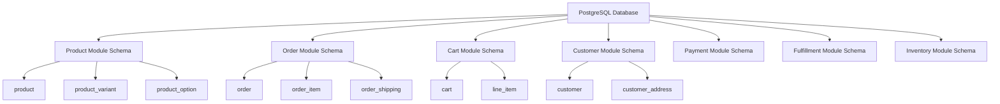
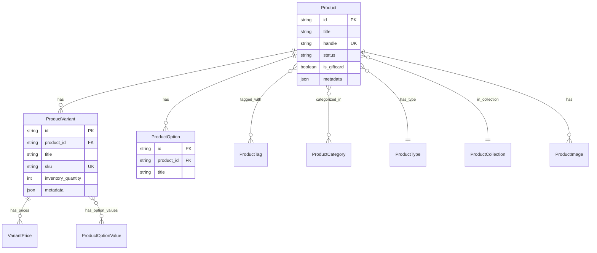
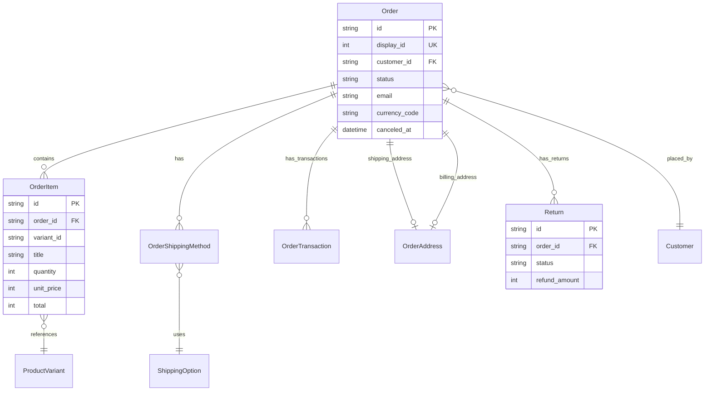
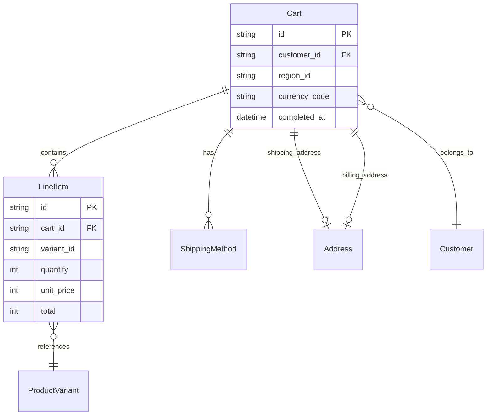
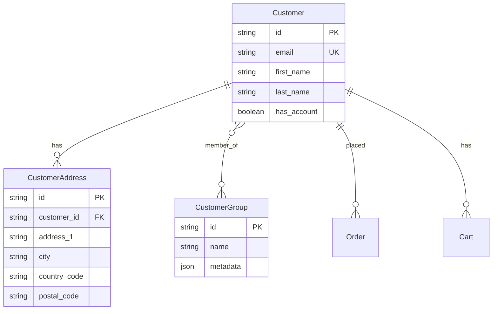

# Database Schema Reference

Complete reference for Medusa's database schema, models, and relationships.

## Table of Contents

- [Schema Overview](#schema-overview)
- [Module-Based Architecture](#module-based-architecture)
- [Core Entities](#core-entities)
- [Entity Relationships](#entity-relationships)
- [Model Definitions](#model-definitions)
- [Indexes & Performance](#indexes--performance)
- [Querying Patterns](#querying-patterns)
- [Migrations](#migrations)
- [Troubleshooting](#troubleshooting)

---

## Schema Overview

### Database Architecture

Medusa uses a **module-based database architecture** where each module manages its own database schema:



### Key Principles

✅ **Module Isolation**: Each module has its own tables
✅ **Soft Deletes**: Records are marked as deleted, not physically removed
✅ **Timestamps**: All tables have `created_at`, `updated_at`, `deleted_at`
✅ **Prefixed IDs**: Each entity has a typed prefix (e.g., `prod_`, `order_`, `cus_`)
✅ **Relationships**: Cross-module relationships via link tables

---

## Module-Based Architecture

### Database per Module

Each module maintains its own tables:

```
Product Module:
├── product
├── product_variant
├── product_option
├── product_option_value
├── product_type
├── product_collection
├── product_category
├── product_tag
└── product_image

Order Module:
├── order
├── order_item
├── order_shipping_method
├── order_address
├── order_summary
├── order_transaction
├── order_change
├── return
└── exchange

Cart Module:
├── cart
├── line_item
├── shipping_method
├── address
└── credit_line

Customer Module:
├── customer
├── customer_address
├── customer_group
└── customer_group_customer

Payment Module:
├── payment
├── payment_collection
├── payment_session
├── capture
└── refund

Fulfillment Module:
├── fulfillment
├── fulfillment_set
├── service_zone
├── geo_zone
├── shipping_option
└── shipping_profile
```

### Link Modules

Connect entities across modules:

```
Link Modules:
├── product_sales_channel (links products to sales channels)
├── product_shipping_profile (links products to shipping)
├── variant_pricing_link (links variants to prices)
├── order_promotion_link (links orders to promotions)
└── customer_group_customer (links customers to groups)
```

---

## Core Entities

### Product Entity

**Location**: `/home/user/medusa/packages/modules/product/src/models/product.ts`

```typescript
const Product = model.define("Product", {
  id: model.id({ prefix: "prod" }).primaryKey(),
  title: model.text().searchable(),
  handle: model.text(),
  subtitle: model.text().searchable().nullable(),
  description: model.text().searchable().nullable(),
  is_giftcard: model.boolean().default(false),
  status: model.enum(ProductStatus).default(ProductStatus.DRAFT),
  thumbnail: model.text().nullable(),

  // Physical attributes
  weight: model.text().nullable(),
  length: model.text().nullable(),
  height: model.text().nullable(),
  width: model.text().nullable(),
  origin_country: model.text().nullable(),
  hs_code: model.text().nullable(),
  mid_code: model.text().nullable(),
  material: model.text().nullable(),

  // Business logic
  discountable: model.boolean().default(true),
  external_id: model.text().nullable(),
  metadata: model.json().nullable(),

  // Relationships
  variants: model.hasMany(() => ProductVariant, {
    mappedBy: "product",
  }),
  type: model.belongsTo(() => ProductType, {
    mappedBy: "products",
  }).nullable(),
  tags: model.manyToMany(() => ProductTag, {
    mappedBy: "products",
    pivotTable: "product_tags",
  }),
  options: model.hasMany(() => ProductOption, {
    mappedBy: "product",
  }),
  images: model.hasMany(() => ProductImage, {
    mappedBy: "product",
  }),
  collection: model.belongsTo(() => ProductCollection, {
    mappedBy: "products",
  }).nullable(),
  categories: model.manyToMany(() => ProductCategory, {
    pivotTable: "product_category_product",
    mappedBy: "products",
  }),
})
```

**Fields:**
- `id` - Primary key with `prod_` prefix
- `title` - Product name (searchable)
- `handle` - URL-friendly identifier (unique)
- `status` - `draft` | `proposed` | `published` | `rejected`
- `is_giftcard` - Whether product is a gift card
- `discountable` - Whether product can have discounts applied
- `metadata` - JSON field for custom data

**Indexes:**
```sql
CREATE UNIQUE INDEX idx_product_handle_unique
  ON product(handle)
  WHERE deleted_at IS NULL;

CREATE INDEX idx_product_type_id
  ON product(type_id)
  WHERE deleted_at IS NULL;

CREATE INDEX idx_product_collection_id
  ON product(collection_id)
  WHERE deleted_at IS NULL;

CREATE INDEX idx_product_status
  ON product(status)
  WHERE deleted_at IS NULL;
```

### Order Entity

**Location**: `/home/user/medusa/packages/modules/order/src/models/order.ts`

```typescript
const Order = model.define("Order", {
  id: model.id({ prefix: "order" }).primaryKey(),
  display_id: model.autoincrement().searchable(),
  custom_display_id: model.text().nullable(),

  // References
  region_id: model.text().nullable(),
  customer_id: model.text().nullable(),
  sales_channel_id: model.text().nullable(),

  // Order info
  version: model.number().default(1),
  status: model.enum(OrderStatus).default(OrderStatus.PENDING),
  is_draft_order: model.boolean().default(false),
  email: model.text().searchable().nullable(),
  currency_code: model.text(),
  no_notification: model.boolean().nullable(),
  metadata: model.json().nullable(),
  canceled_at: model.dateTime().nullable(),

  // Relationships
  shipping_address: model.hasOne(() => OrderAddress, {
    mappedBy: undefined,
    foreignKey: true,
  }).searchable().nullable(),
  billing_address: model.hasOne(() => OrderAddress, {
    mappedBy: undefined,
    foreignKey: true,
  }).searchable().nullable(),
  summary: model.hasMany(() => OrderSummary, {
    mappedBy: "order",
  }),
  items: model.hasMany(() => OrderItem, {
    mappedBy: "order",
  }),
  shipping_methods: model.hasMany(() => OrderShipping, {
    mappedBy: "order",
  }),
  transactions: model.hasMany(() => OrderTransaction, {
    mappedBy: "order",
  }),
  credit_lines: model.hasMany(() => OrderCreditLine, {
    mappedBy: "order",
  }),
  returns: model.hasMany(() => Return, {
    mappedBy: "order",
  }),
})
```

**Fields:**
- `id` - Primary key with `order_` prefix
- `display_id` - Auto-incrementing human-readable ID
- `custom_display_id` - Optional custom display ID
- `status` - Order status enum
- `version` - Order version for change tracking
- `email` - Customer email (searchable)
- `currency_code` - ISO currency code

**Order Status Flow:**
```
pending → processing → completed
    ↓
  canceled
    ↓
 archived
```

**Indexes:**
```sql
CREATE INDEX idx_order_display_id ON order(display_id)
  WHERE deleted_at IS NULL;

CREATE UNIQUE INDEX idx_order_custom_display_id
  ON order(custom_display_id)
  WHERE deleted_at IS NULL;

CREATE INDEX idx_order_customer_id ON order(customer_id)
  WHERE deleted_at IS NULL;

CREATE INDEX idx_order_status ON order(status)
  WHERE deleted_at IS NULL;
```

### Cart Entity

**Location**: `/home/user/medusa/packages/modules/cart/src/models/cart.ts`

```typescript
const Cart = model.define("Cart", {
  id: model.id({ prefix: "cart" }).primaryKey(),

  // References
  region_id: model.text().nullable(),
  customer_id: model.text().nullable(),
  sales_channel_id: model.text().nullable(),

  // Cart info
  email: model.text().nullable(),
  currency_code: model.text(),
  metadata: model.json().nullable(),
  completed_at: model.dateTime().nullable(),

  // Relationships
  shipping_address: model.hasOne(() => Address, {
    mappedBy: undefined,
    foreignKey: true,
  }).nullable(),
  billing_address: model.hasOne(() => Address, {
    mappedBy: undefined,
    foreignKey: true,
  }).nullable(),
  items: model.hasMany(() => LineItem, {
    mappedBy: "cart",
  }),
  credit_lines: model.hasMany(() => CreditLine, {
    mappedBy: "cart",
  }),
  shipping_methods: model.hasMany(() => ShippingMethod, {
    mappedBy: "cart",
  }),
})
```

**Fields:**
- `id` - Primary key with `cart_` prefix
- `completed_at` - When cart was converted to order
- `email` - Customer email (for guest checkout)
- `currency_code` - Cart currency

**Cart Lifecycle:**
```
created → items_added → address_added → payment_added → completed (becomes order)
```

### Customer Entity

**Location**: `/home/user/medusa/packages/modules/customer/src/models/customer.ts`

```typescript
const Customer = model.define("Customer", {
  id: model.id({ prefix: "cus" }).primaryKey(),

  // Customer info
  company_name: model.text().searchable().nullable(),
  first_name: model.text().searchable().nullable(),
  last_name: model.text().searchable().nullable(),
  email: model.text().searchable().nullable(),
  phone: model.text().searchable().nullable(),
  has_account: model.boolean().default(false),
  created_by: model.text().nullable(),
  metadata: model.json().nullable(),

  // Relationships
  groups: model.manyToMany(() => CustomerGroup, {
    mappedBy: "customers",
    pivotEntity: () => CustomerGroupCustomer,
  }),
  addresses: model.hasMany(() => CustomerAddress, {
    mappedBy: "customer",
  }),
})
```

**Fields:**
- `id` - Primary key with `cus_` prefix
- `email` - Customer email (searchable, unique with has_account)
- `has_account` - Whether customer has login credentials
- `phone` - Customer phone number (searchable)

**Indexes:**
```sql
CREATE UNIQUE INDEX idx_customer_email_has_account
  ON customer(email, has_account)
  WHERE deleted_at IS NULL;
```

### Payment Entity

**Location**: `/home/user/medusa/packages/modules/payment/src/models/payment.ts`

```typescript
const Payment = model.define("Payment", {
  id: model.id({ prefix: "pay" }).primaryKey(),

  // Payment info
  amount: model.bigNumber(),
  currency_code: model.text(),
  provider_id: model.text(),
  data: model.json().nullable(),
  metadata: model.json().nullable(),

  // Status
  captured_at: model.dateTime().nullable(),
  canceled_at: model.dateTime().nullable(),

  // Relationships
  payment_collection: model.belongsTo(() => PaymentCollection, {
    mappedBy: "payments",
  }),
  payment_session: model.belongsTo(() => PaymentSession, {
    mappedBy: "payment",
  }),
  refunds: model.hasMany(() => Refund, {
    mappedBy: "payment",
  }),
  captures: model.hasMany(() => Capture, {
    mappedBy: "payment",
  }),
})
```

**Fields:**
- `id` - Primary key with `pay_` prefix
- `amount` - Payment amount (in cents)
- `currency_code` - ISO currency code
- `provider_id` - Payment provider identifier
- `data` - Provider-specific data (JSON)
- `captured_at` - When payment was captured
- `canceled_at` - When payment was canceled

⚠️ **Security Note**: Never store full credit card numbers. Only store provider tokens and last 4 digits.

---

## Entity Relationships

### Product Relationships



### Order Relationships



### Cart Relationships



### Customer Relationships



---

## Model Definitions

### Common Fields

All models include:

```typescript
// Timestamps (automatic)
created_at: model.dateTime()
updated_at: model.dateTime()
deleted_at: model.dateTime().nullable() // Soft delete

// Metadata (optional)
metadata: model.json().nullable()
```

### Field Types

```typescript
// Strings
model.text()              // VARCHAR
model.text().nullable()   // Nullable VARCHAR

// Numbers
model.number()            // INTEGER
model.bigNumber()         // BIGINT (for money in cents)
model.autoincrement()     // Auto-incrementing integer

// Booleans
model.boolean()           // BOOLEAN
model.boolean().default(false)

// Dates
model.dateTime()          // TIMESTAMP
model.dateTime().nullable()

// JSON
model.json()              // JSONB in PostgreSQL
model.json().nullable()

// Enums
model.enum(ProductStatus)  // ENUM type

// IDs
model.id({ prefix: "prod" }).primaryKey()
```

### Relationships

```typescript
// One-to-Many (hasMany)
variants: model.hasMany(() => ProductVariant, {
  mappedBy: "product",
})

// Many-to-One (belongsTo)
product: model.belongsTo(() => Product, {
  mappedBy: "variants",
})

// One-to-One (hasOne)
shipping_address: model.hasOne(() => Address, {
  mappedBy: undefined,
  foreignKey: true,
}).nullable()

// Many-to-Many
tags: model.manyToMany(() => ProductTag, {
  mappedBy: "products",
  pivotTable: "product_tags",
})
```

### Cascade Deletes

```typescript
Product.cascades({
  delete: ["variants", "options", "images"], // Delete related records
})

Customer.cascades({
  delete: ["addresses"],
  detach: ["groups"], // Remove relationships
})
```

### Searchable Fields

```typescript
// Make field searchable (full-text search)
title: model.text().searchable()
email: model.text().searchable()
```

---

## Indexes & Performance

### Index Types

#### Unique Indexes

Ensure uniqueness:

```sql
-- Product handle must be unique (excluding soft-deleted)
CREATE UNIQUE INDEX idx_product_handle_unique
  ON product(handle)
  WHERE deleted_at IS NULL;

-- Customer email unique per account type
CREATE UNIQUE INDEX idx_customer_email_has_account
  ON customer(email, has_account)
  WHERE deleted_at IS NULL;

-- SKU must be unique
CREATE UNIQUE INDEX idx_product_variant_sku_unique
  ON product_variant(sku)
  WHERE deleted_at IS NULL AND sku IS NOT NULL;
```

#### Performance Indexes

Speed up queries:

```sql
-- Foreign key indexes
CREATE INDEX idx_order_customer_id
  ON order(customer_id)
  WHERE deleted_at IS NULL;

-- Status filtering
CREATE INDEX idx_product_status
  ON product(status)
  WHERE deleted_at IS NULL;

-- Date range queries
CREATE INDEX idx_order_created_at
  ON order(created_at)
  WHERE deleted_at IS NULL;

-- Full-text search
CREATE INDEX idx_product_title_gin
  ON product USING gin(to_tsvector('english', title))
  WHERE deleted_at IS NULL;
```

#### Composite Indexes

Multiple columns:

```sql
-- Order lookup by customer and status
CREATE INDEX idx_order_customer_status
  ON order(customer_id, status)
  WHERE deleted_at IS NULL;

-- Product filtering
CREATE INDEX idx_product_status_type
  ON product(status, type_id)
  WHERE deleted_at IS NULL;
```

### Index Strategy

✅ **Index these:**
- Primary keys (automatic)
- Foreign keys
- Unique constraints
- Frequently filtered columns
- Sort columns
- Join columns

❌ **Avoid indexing:**
- Low cardinality columns (few distinct values)
- Frequently updated columns
- Small tables (< 1000 rows)
- Wide columns (large text/json)

### Analyzing Performance

```sql
-- Explain query plan
EXPLAIN ANALYZE
SELECT * FROM product
WHERE status = 'published'
ORDER BY created_at DESC
LIMIT 20;

-- Check index usage
SELECT
  schemaname,
  tablename,
  indexname,
  idx_scan,
  idx_tup_read,
  idx_tup_fetch
FROM pg_stat_user_indexes
WHERE schemaname = 'public'
ORDER BY idx_scan DESC;

-- Find missing indexes
SELECT
  schemaname,
  tablename,
  attname,
  n_distinct,
  correlation
FROM pg_stats
WHERE schemaname = 'public'
  AND n_distinct > 100
  AND correlation < 0.1;
```

---

## Querying Patterns

### Basic Queries

```typescript
// Find all published products
const products = await productRepository.find({
  status: "published",
})

// Find with relations
const product = await productRepository.findOne(
  { id: "prod_123" },
  {
    populate: ["variants", "images", "options"],
  }
)

// Find with filters
const products = await productRepository.find(
  {
    status: "published",
    created_at: {
      $gte: new Date("2024-01-01"),
    },
  },
  {
    limit: 20,
    offset: 0,
    orderBy: { created_at: "DESC" },
  }
)
```

### Complex Queries

```typescript
// Multiple conditions
const products = await productRepository.find({
  $or: [
    { status: "published" },
    { status: "proposed" },
  ],
  created_at: {
    $gte: new Date("2024-01-01"),
    $lte: new Date("2024-12-31"),
  },
})

// Nested relations
const order = await orderRepository.findOne(
  { id: "order_123" },
  {
    populate: [
      "items",
      "items.variant",
      "items.variant.product",
      "customer",
      "shipping_address",
    ],
  }
)

// Aggregations
const totalRevenue = await em.getRepository(Order).aggregate({
  sum: "total",
  where: {
    status: "completed",
    created_at: {
      $gte: new Date("2024-01-01"),
    },
  },
})
```

### Query Operators

```typescript
// Comparison operators
{
  price: { $gt: 1000 }        // Greater than
  price: { $gte: 1000 }       // Greater than or equal
  price: { $lt: 5000 }        // Less than
  price: { $lte: 5000 }       // Less than or equal
  price: { $ne: 0 }           // Not equal
  status: { $in: ["published", "draft"] }  // In array
  status: { $nin: ["rejected"] }  // Not in array
}

// String operators
{
  title: { $like: "%shirt%" }      // LIKE (case-sensitive)
  title: { $ilike: "%shirt%" }     // ILIKE (case-insensitive)
  email: { $startsWith: "admin" }
  email: { $endsWith: "@medusa.com" }
}

// Logical operators
{
  $and: [
    { status: "published" },
    { price: { $gt: 1000 } }
  ]
  $or: [
    { status: "published" },
    { status: "proposed" }
  ]
  $not: {
    status: "rejected"
  }
}
```

### Performance Tips

```typescript
// ✅ Good: Select only needed fields
const products = await productRepository.find(
  { status: "published" },
  {
    fields: ["id", "title", "handle"],
  }
)

// ✅ Good: Use pagination
const [products, count] = await productRepository.findAndCount(
  { status: "published" },
  {
    limit: 20,
    offset: 0,
  }
)

// ✅ Good: Eager load relations
const product = await productRepository.findOne(
  { id: "prod_123" },
  {
    populate: ["variants", "images"],
  }
)

// ❌ Bad: N+1 queries
for (const product of products) {
  const variants = await variantRepository.find({
    product_id: product.id,
  })
}

// ✅ Good: Batch loading
const products = await productRepository.find(
  { status: "published" },
  {
    populate: ["variants"],
  }
)
```

---

## Migrations

### Creating Migrations

```bash
# Generate migration
npx mikro-orm migration:create --name add_custom_field_to_product

# Run migrations
npx mikro-orm migration:up

# Rollback migration
npx mikro-orm migration:down

# Check migration status
npx mikro-orm migration:pending
```

### Migration Example

```typescript
// migrations/20241119100000_add_custom_field.ts
import { Migration } from "@mikro-orm/migrations"

export class AddCustomField extends Migration {
  async up(): Promise<void> {
    // Add column
    this.addSql(`
      ALTER TABLE "product"
      ADD COLUMN "custom_field" VARCHAR(255) NULL
    `)

    // Add index
    this.addSql(`
      CREATE INDEX idx_product_custom_field
      ON "product"(custom_field)
      WHERE deleted_at IS NULL
    `)
  }

  async down(): Promise<void> {
    // Remove index
    this.addSql(`
      DROP INDEX IF EXISTS idx_product_custom_field
    `)

    // Remove column
    this.addSql(`
      ALTER TABLE "product"
      DROP COLUMN "custom_field"
    `)
  }
}
```

### Schema Changes

```typescript
// Add new table
this.addSql(`
  CREATE TABLE "product_review" (
    "id" VARCHAR(255) PRIMARY KEY,
    "product_id" VARCHAR(255) NOT NULL,
    "customer_id" VARCHAR(255) NOT NULL,
    "rating" INTEGER NOT NULL,
    "comment" TEXT,
    "created_at" TIMESTAMP NOT NULL DEFAULT NOW(),
    "updated_at" TIMESTAMP NOT NULL DEFAULT NOW(),
    "deleted_at" TIMESTAMP NULL,
    FOREIGN KEY ("product_id") REFERENCES "product"("id"),
    FOREIGN KEY ("customer_id") REFERENCES "customer"("id")
  )
`)

// Modify column
this.addSql(`
  ALTER TABLE "product"
  ALTER COLUMN "title" TYPE VARCHAR(500)
`)

// Add constraint
this.addSql(`
  ALTER TABLE "product_variant"
  ADD CONSTRAINT check_inventory_non_negative
  CHECK (inventory_quantity >= 0)
`)
```

---

## Troubleshooting

### Common Issues

#### Slow Queries

```sql
-- Find slow queries
SELECT
  query,
  calls,
  total_time,
  mean_time,
  max_time
FROM pg_stat_statements
ORDER BY mean_time DESC
LIMIT 10;

-- Check missing indexes
EXPLAIN ANALYZE
SELECT * FROM product WHERE status = 'published';
```

**Solutions:**
- Add indexes on filtered columns
- Use pagination
- Select only needed fields
- Eager load relations

#### Deadlocks

```
ERROR: deadlock detected
```

**Solutions:**
- Access tables in consistent order
- Keep transactions short
- Use optimistic locking
- Retry failed transactions

#### Foreign Key Violations

```
ERROR: insert or update on table violates foreign key constraint
```

**Solutions:**
- Ensure referenced record exists
- Check soft-deleted records
- Validate IDs before insert

#### Duplicate Keys

```
ERROR: duplicate key value violates unique constraint
```

**Solutions:**
- Check unique constraints
- Handle conflicts with `ON CONFLICT`
- Validate data before insert

### Database Maintenance

```sql
-- Vacuum tables
VACUUM ANALYZE product;

-- Reindex
REINDEX TABLE product;

-- Check table size
SELECT
  schemaname,
  tablename,
  pg_size_pretty(pg_total_relation_size(schemaname||'.'||tablename)) AS size
FROM pg_tables
WHERE schemaname = 'public'
ORDER BY pg_total_relation_size(schemaname||'.'||tablename) DESC;

-- Check index size
SELECT
  tablename,
  indexname,
  pg_size_pretty(pg_relation_size(indexname::regclass)) AS size
FROM pg_indexes
WHERE schemaname = 'public'
ORDER BY pg_relation_size(indexname::regclass) DESC;
```

---

## Best Practices

✅ **DO:**
- Use soft deletes for data retention
- Index foreign keys
- Add unique constraints where appropriate
- Use transactions for multi-step operations
- Validate data before database operations
- Use migrations for schema changes
- Set appropriate field lengths
- Use enums for fixed value sets

❌ **DON'T:**
- Store sensitive data in plain text
- Over-index (slows writes)
- Use SELECT * in production
- Perform N+1 queries
- Skip migrations
- Hardcode IDs
- Ignore soft-deleted records in queries

---

## Resources

- [MikroORM Documentation](https://mikro-orm.io/)
- [PostgreSQL Documentation](https://www.postgresql.org/docs/)
- [Database Design Best Practices](https://www.postgresql.org/docs/current/ddl.html)
- [SQL Performance Tuning](https://www.postgresql.org/docs/current/performance-tips.html)

---

**Next Steps:**
- [Backend Architecture](./BACKEND_ARCHITECTURE.md) - Understand data flow
- [API Documentation](./API_DOCUMENTATION.md) - Query via APIs
- [Testing Guide](./TESTING_GUIDE.md) - Test database operations
- [Development Workflow](./DEVELOPMENT_WORKFLOW.md) - Database migrations
