# Medusa Data Flow Guide

**Version:** 2.11.3
**Last Updated:** November 18, 2025
**For:** Understanding how data flows through the Medusa system

---

## Table of Contents

1. [Overview](#overview)
2. [Request Lifecycle](#request-lifecycle)
3. [API Request Flow](#api-request-flow)
4. [Workflow Execution Flow](#workflow-execution-flow)
5. [Event Bus Flow](#event-bus-flow)
6. [Module Communication](#module-communication)
7. [Real-World Examples](#real-world-examples)
8. [Database Transaction Flow](#database-transaction-flow)
9. [Troubleshooting Data Flow](#troubleshooting-data-flow)

---

## Overview

Understanding data flow in Medusa requires tracing requests through multiple layers:

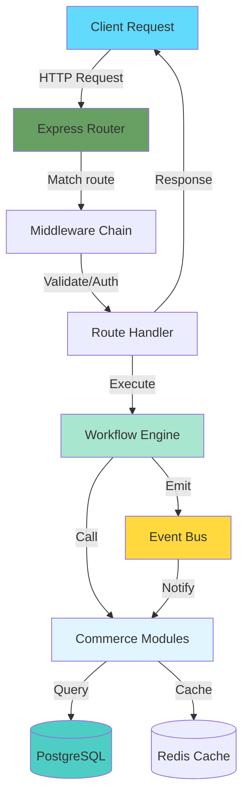

### Key Concepts

🧠 **Mental Model:** Data flows like a river through channels

1. **HTTP Layer** - The entry point (river source)
2. **Middleware** - Filters and validators (water purification)
3. **Route Handlers** - Traffic controllers (dam operators)
4. **Workflows** - Orchestrators (irrigation systems)
5. **Modules** - Workers (water wheels)
6. **Database** - Storage (reservoir)
7. **Event Bus** - Notifications (river tributaries)

---

## Request Lifecycle

### Complete Request Flow

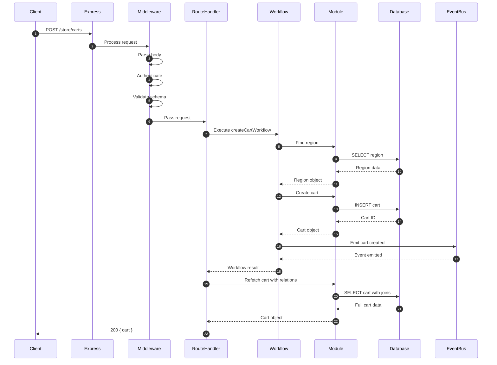

### Lifecycle Phases

| Phase | Duration | Purpose | Key Components |
|-------|----------|---------|----------------|
| **1. Request Reception** | <1ms | Receive HTTP request | Express server |
| **2. Middleware Processing** | 5-20ms | Auth, validation, parsing | Middleware chain |
| **3. Route Resolution** | <1ms | Find handler | File-based router |
| **4. Workflow Execution** | 50-500ms | Orchestrate operations | Workflow engine |
| **5. Module Operations** | 10-200ms | Business logic + DB | Commerce modules |
| **6. Database Queries** | 5-100ms | Data persistence | MikroORM + PostgreSQL |
| **7. Event Emission** | 1-5ms | Publish events | Event bus |
| **8. Response Formation** | 5-20ms | Serialize response | Route handler |
| **9. Response Transmission** | Network dependent | Send to client | Express |

**Total:** ~80-850ms (depends on complexity and network)

---

## API Request Flow

### Example: Create Cart

**API Endpoint:** `POST /store/carts`

#### 1. File-Based Route

**File:** `/packages/medusa/src/api/store/carts/route.ts`

```typescript
import { createCartWorkflow } from "@medusajs/core-flows"
import {
  AuthenticatedMedusaRequest,
  MedusaResponse,
} from "@medusajs/framework/http"
import { HttpTypes } from "@medusajs/framework/types"

export const POST = async (
  req: AuthenticatedMedusaRequest<
    HttpTypes.StoreCreateCart,
    HttpTypes.SelectParams
  >,
  res: MedusaResponse<HttpTypes.StoreCartResponse>
) => {
  // Step 1: Prepare workflow input
  const workflowInput = {
    ...req.validatedBody,  // Validated by middleware
    customer_id: req.auth_context?.actor_id,  // From auth middleware
  }

  // Step 2: Execute workflow
  const { result } = await createCartWorkflow(req.scope).run({
    input: workflowInput,
  })

  // Step 3: Refetch with requested fields
  const cart = await refetchCart(
    result.id,
    req.scope,
    req.queryConfig.fields
  )

  // Step 4: Send response
  res.status(200).json({ cart })
}
```

#### 2. Request Object Anatomy

```typescript
// AuthenticatedMedusaRequest properties:
{
  // Standard Express properties
  body: { /* request body */ },
  params: { /* route params */ },
  query: { /* query string */ },
  headers: { /* HTTP headers */ },

  // Medusa additions
  validatedBody: { /* Zod-validated body */ },
  validatedQuery: { /* Zod-validated query */ },
  auth_context: {
    actor_id: "cus_123",     // Authenticated user ID
    auth_identity_id: "...",  // Auth identity ID
    app_metadata: { /* ... */ }
  },
  scope: Container,           // DI container (Awilix)
  queryConfig: {
    fields: ["id", "email", "items.*"],  // Requested fields
    pagination: { limit: 20, offset: 0 }
  }
}
```

#### 3. Middleware Chain

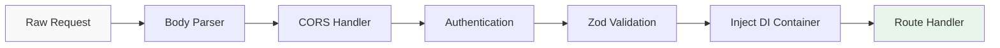

**Middleware Example:**

**File:** `/packages/medusa/src/api/middlewares.ts`

```typescript
import { authenticate } from "@medusajs/framework/http"
import { z } from "zod"

// Global middlewares
export const config = {
  routes: {
    "/store/carts": {
      method: ["POST"],
      middlewares: [
        authenticate("customer", ["session", "bearer"]),  // Auth
        validateBody(z.object({
          region_id: z.string().optional(),
          items: z.array(z.object({
            variant_id: z.string(),
            quantity: z.number().int().positive(),
          })).optional(),
        })),
      ],
    },
  },
}
```

---

## Workflow Execution Flow

### Workflow Anatomy

**File:** `/packages/core/core-flows/src/cart/workflows/create-carts.ts`

```typescript
import {
  createWorkflow,
  WorkflowData,
  WorkflowResponse,
  parallelize,
  transform,
} from "@medusajs/framework/workflows-sdk"

export const createCartWorkflow = createWorkflow(
  "create-cart",  // Workflow ID
  (input: WorkflowData<CreateCartInput>) => {
    // Step 1: Parallel operations
    const [salesChannel, region, customerData] = parallelize(
      findSalesChannelStep({ salesChannelId: input.sales_channel_id }),
      findOneOrAnyRegionStep({ regionId: input.region_id }),
      findOrCreateCustomerStep({ customerId: input.customer_id })
    )

    // Step 2: Data transformation
    const cartInput = transform({ input, region, customerData }, (data) => {
      return {
        ...data.input,
        currency_code: data.region.currency_code,
        region_id: data.region.id,
        customer_id: data.customerData.customer?.id,
      }
    })

    // Step 3: Create cart
    const carts = createCartsStep([cartInput])
    const cart = transform({ carts }, (data) => data.carts[0])

    // Step 4: Emit event
    emitEventStep({
      eventName: CartWorkflowEvents.CREATED,
      data: { id: cart.id },
    })

    // Step 5: Return result
    return new WorkflowResponse(cart)
  }
)
```

### Workflow Execution Sequence

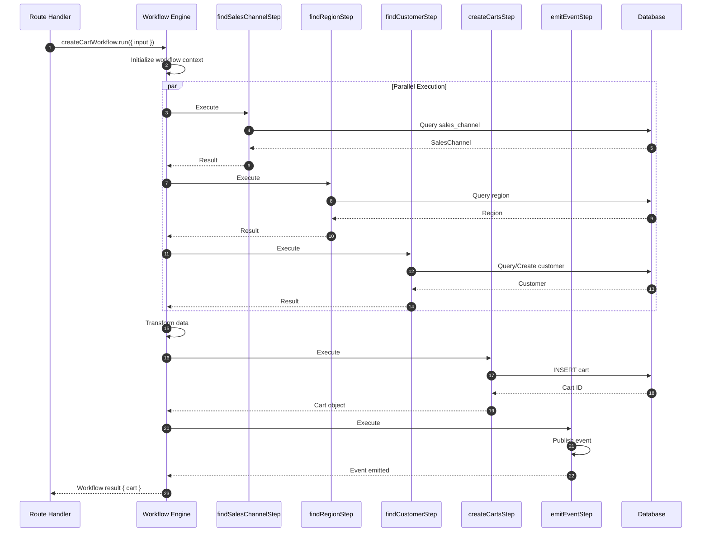

### Step Anatomy

**File:** `/packages/core/core-flows/src/cart/steps/create-carts.ts`

```typescript
import { createStep, StepResponse } from "@medusajs/framework/workflows-sdk"
import { Modules } from "@medusajs/framework/utils"

export const createCartsStep = createStep(
  "create-carts",  // Step ID
  async (input: CreateCartInput[], { container }) => {
    // Resolve cart module from DI container
    const cartService = container.resolve(Modules.CART)

    // Execute business logic
    const carts = await cartService.create(input)

    // Return result with compensation function
    return new StepResponse(
      carts,
      // Compensation: runs if workflow fails later
      async () => {
        await cartService.delete(carts.map((c) => c.id))
      }
    )
  }
)
```

### Workflow Compensation (Rollback)

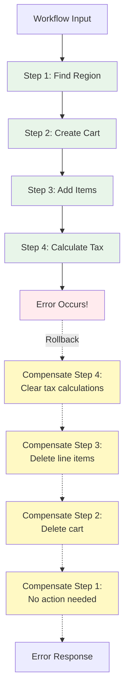

💡 **Aha Moment:** Workflows automatically rollback all completed steps if any step fails - like database transactions but across multiple modules!

---

## Event Bus Flow

### Event-Driven Communication

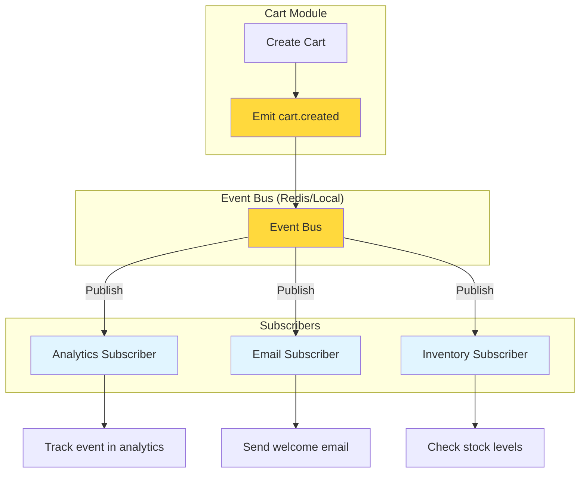

### Publishing Events

**In a Workflow:**

```typescript
import { emitEventStep } from "@medusajs/core-flows"
import { CartWorkflowEvents } from "@medusajs/framework/utils"

// Inside workflow definition
emitEventStep({
  eventName: CartWorkflowEvents.CREATED,
  data: {
    id: cart.id,
    customer_id: cart.customer_id,
    total: cart.total,
  },
})
```

### Subscribing to Events

**File:** `/packages/medusa/src/subscribers/cart-created.ts`

```typescript
import { SubscriberArgs } from "@medusajs/framework"

export default async function handleCartCreated({
  event,
  container,
}: SubscriberArgs<{ id: string }>) {
  const logger = container.resolve("logger")
  const analyticsService = container.resolve("analyticsService")

  logger.info(`Cart created: ${event.data.id}`)

  // Track in analytics
  await analyticsService.track({
    event: "cart_created",
    cartId: event.data.id,
    timestamp: event.metadata.occurred_at,
  })
}

export const config = {
  event: "cart.created",  // Event to subscribe to
}
```

### Event Flow Sequence

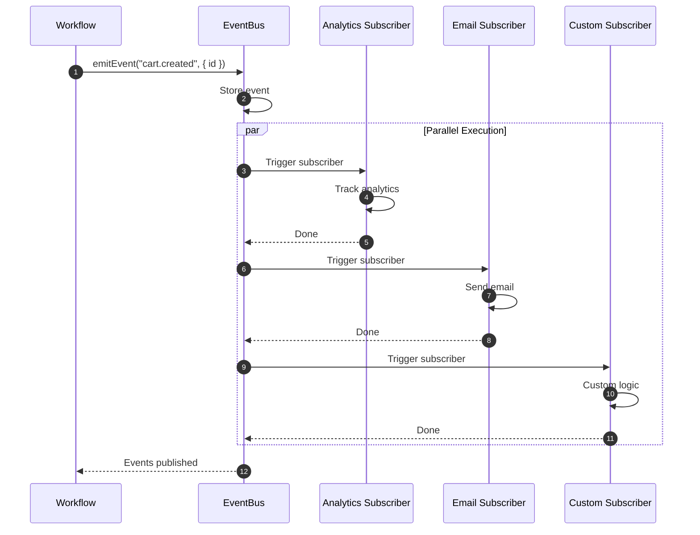

### Common Event Types

| Event Name | Emitter | Data | Use Cases |
|------------|---------|------|-----------|
| `cart.created` | Cart Module | `{ id, customer_id }` | Analytics, welcome email |
| `order.placed` | Order Module | `{ id, total, items }` | Inventory, fulfillment, email |
| `payment.captured` | Payment Module | `{ id, amount }` | Accounting, notifications |
| `product.created` | Product Module | `{ id, title }` | Search indexing, cache invalidation |
| `customer.created` | Customer Module | `{ id, email }` | Email campaigns, analytics |

---

## Module Communication

Modules communicate through three patterns:

### 1. Direct Module Access (Synchronous)

```typescript
// In a workflow or route handler
const productService = container.resolve(Modules.PRODUCT)
const pricingService = container.resolve(Modules.PRICING)

// Direct method calls
const variants = await productService.listProductVariants({ id: variantIds })
const prices = await pricingService.calculatePrices(
  { variantId: variants.map((v) => v.id) },
  { context: { region_id: regionId } }
)
```

**Flow:**

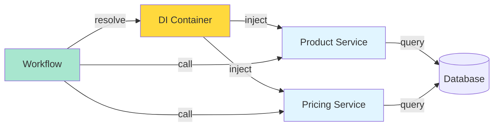

### 2. Link Modules (Relational)

**Purpose:** Define relationships between modules without tight coupling.

**Example:** Cart Line Items → Product Variants

```typescript
// Define link (automatic in framework)
defineLink(
  { linkable: Modules.CART, field: "cart.items.variant_id" },
  { linkable: Modules.PRODUCT, field: "productVariant.id" }
)

// Query across modules
const cart = await query.graph({
  entity: "cart",
  fields: ["id", "email", "items.*", "items.variant.*"],
  filters: { id: "cart_123" },
})

// Result includes variant data in line items!
{
  id: "cart_123",
  email: "customer@example.com",
  items: [
    {
      id: "item_1",
      quantity: 2,
      variant: {  // ← Joined from Product module!
        id: "var_123",
        title: "Red T-Shirt",
        price: 1999
      }
    }
  ]
}
```

**Link Module Flow:**

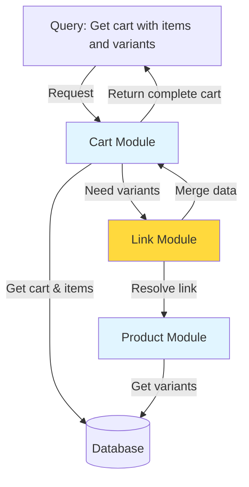

### 3. Event Bus (Asynchronous)

**Use Case:** One module needs to notify others without waiting.

```typescript
// Order module places an order
await emitEventStep({
  eventName: "order.placed",
  data: { id: order.id, items: order.items },
})

// Inventory module reserves stock
export default async function handleOrderPlaced({ event, container }) {
  const inventoryService = container.resolve(Modules.INVENTORY)
  await inventoryService.reserveQuantity(event.data.items)
}

// Fulfillment module creates shipment
export default async function handleOrderPlaced({ event, container }) {
  const fulfillmentService = container.resolve(Modules.FULFILLMENT)
  await fulfillmentService.createShipment(event.data.id)
}
```

---

## Real-World Examples

### Example 1: Complete Cart Creation

**Request:** `POST /store/carts`

**Body:**
```json
{
  "region_id": "reg_01JF8B",
  "items": [
    {
      "variant_id": "var_01JF8C",
      "quantity": 2
    }
  ],
  "email": "customer@example.com"
}
```

**Complete Flow:**

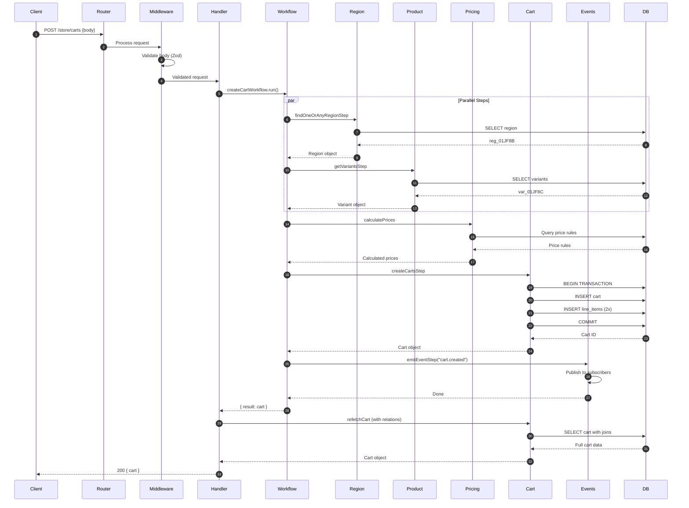

**Database Queries Executed:**

```sql
-- 1. Find region
SELECT * FROM region WHERE id = 'reg_01JF8B';

-- 2. Find variant
SELECT * FROM product_variant WHERE id = 'var_01JF8C';

-- 3. Calculate prices
SELECT * FROM price_rule
WHERE region_id = 'reg_01JF8B'
  AND variant_id = 'var_01JF8C';

-- 4. Create cart (transaction)
BEGIN;
INSERT INTO cart (id, region_id, email, currency_code)
VALUES ('cart_01JF8D', 'reg_01JF8B', 'customer@example.com', 'USD');

INSERT INTO line_item (id, cart_id, variant_id, quantity, unit_price)
VALUES ('item_01JF8E', 'cart_01JF8D', 'var_01JF8C', 2, 1999);
COMMIT;

-- 5. Refetch with relations
SELECT
  c.*,
  li.*,
  v.*,
  p.*
FROM cart c
LEFT JOIN line_item li ON li.cart_id = c.id
LEFT JOIN product_variant v ON v.id = li.variant_id
LEFT JOIN product p ON p.id = v.product_id
WHERE c.id = 'cart_01JF8D';
```

**Response:**

```json
{
  "cart": {
    "id": "cart_01JF8D",
    "email": "customer@example.com",
    "region_id": "reg_01JF8B",
    "currency_code": "USD",
    "items": [
      {
        "id": "item_01JF8E",
        "variant_id": "var_01JF8C",
        "quantity": 2,
        "unit_price": 1999,
        "total": 3998,
        "variant": {
          "id": "var_01JF8C",
          "title": "Red T-Shirt - Medium",
          "product": {
            "id": "prod_01JF8A",
            "title": "Red T-Shirt"
          }
        }
      }
    ],
    "total": 3998
  }
}
```

---

### Example 2: Place Order from Cart

**Request:** `POST /store/carts/:id/complete`

**Flow:**

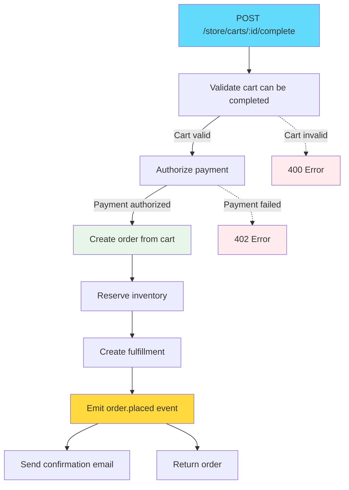

**Workflow Steps:**

1. **Validate Cart:** Check items in stock, prices current
2. **Authorize Payment:** Charge payment method
3. **Create Order:** Transform cart → order
4. **Reserve Inventory:** Decrement stock levels
5. **Create Fulfillment:** Prepare for shipping
6. **Emit Events:** Notify subscribers
7. **Send Email:** Confirmation to customer

**Code:**

```typescript
export const completeCartWorkflow = createWorkflow(
  "complete-cart",
  (input: { cart_id: string }) => {
    // Step 1: Retrieve and validate cart
    const cart = retrieveCartStep({ id: input.cart_id })
    validateCartStep({ cart })

    // Step 2: Authorize payment
    const payment = authorizePaymentStep({
      cartId: cart.id,
      amount: cart.total,
    })

    // Step 3: Create order
    const order = createOrderFromCartStep({
      cart,
      paymentId: payment.id,
    })

    // Step 4: Reserve inventory
    reserveInventoryStep({
      items: order.items,
    })

    // Step 5: Create fulfillment
    const fulfillment = createFulfillmentStep({
      orderId: order.id,
    })

    // Step 6: Emit event
    emitEventStep({
      eventName: "order.placed",
      data: { id: order.id },
    })

    return new WorkflowResponse(order)
  }
)
```

---

## Database Transaction Flow

### Transaction Management

**MikroORM Unit of Work Pattern:**

```typescript
// Workflow step with transaction
export const createProductStep = createStep(
  "create-product",
  async (input: CreateProductInput, { container }) => {
    const productService = container.resolve(Modules.PRODUCT)

    // Automatic transaction!
    const product = await productService.create({
      title: input.title,
      variants: input.variants,  // Creates variants in same transaction
    })

    return new StepResponse(product, async () => {
      // Compensation: delete product
      await productService.delete(product.id)
    })
  }
)
```

**Transaction Flow:**

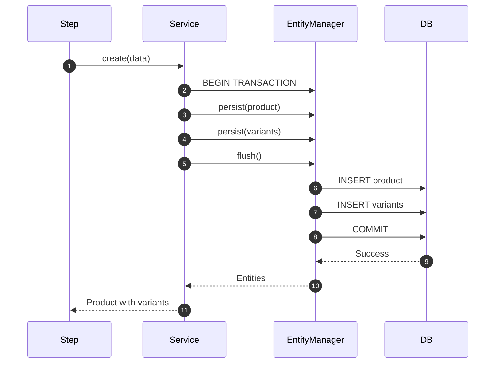

### Rollback Example

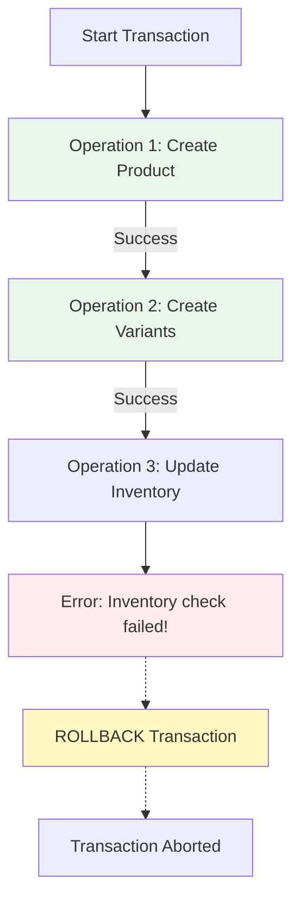

**Database State:**
- ✅ Before error: No changes committed
- ✅ After rollback: Database unchanged
- ✅ Atomic: All or nothing

---

## Troubleshooting Data Flow

### Common Issues & Solutions

#### Issue 1: Request Times Out

**Symptom:** Request takes >30 seconds, times out

**Possible Causes:**
1. Slow database query (missing index)
2. External API call hanging
3. Infinite loop in workflow

**Debug Steps:**

```typescript
// Add logging to workflow
export const myWorkflow = createWorkflow("my-workflow", (input) => {
  console.time("step-1")
  const result1 = step1(input)
  console.timeEnd("step-1")

  console.time("step-2")
  const result2 = step2(result1)
  console.timeEnd("step-2")

  // ...
})
```

**Check Database:**
```sql
-- Find slow queries
SELECT pid, now() - query_start AS duration, query
FROM pg_stat_activity
WHERE state = 'active'
ORDER BY duration DESC;
```

---

#### Issue 2: Data Inconsistency

**Symptom:** Cart shows wrong total, inventory incorrect

**Possible Causes:**
1. Event bus message lost
2. Cache not invalidated
3. Workflow compensation didn't run

**Debug Steps:**

```typescript
// Check event bus
const eventBus = container.resolve("eventBus")
const events = await eventBus.listEvents({ type: "cart.created" })
console.log("Events:", events)

// Check cache
const cacheService = container.resolve("cacheService")
const cached = await cacheService.get("cart:cart_123")
console.log("Cached cart:", cached)

// Force refetch from database
const cart = await cartService.retrieve("cart_123", { reload: true })
```

---

#### Issue 3: Workflow Fails Silently

**Symptom:** Workflow doesn't throw error, but doesn't complete

**Debug Steps:**

```typescript
// Check workflow execution
const { result, errors } = await myWorkflow(container).run({
  input: data,
  throwOnError: false,  // Don't throw, return errors
})

if (errors) {
  console.error("Workflow errors:", errors)
}
```

---

## Key Takeaways

### ✅ Remember These Flows

1. **HTTP Request** → Middleware → Route Handler → Workflow → Modules → Database
2. **Workflow Step** → Compensation function (for rollback)
3. **Event Emission** → Event Bus → Subscribers (parallel)
4. **Module Communication** → Direct call, Link modules, or Events
5. **Transactions** → Automatic per step, manual rollback via compensation

### 🧠 Mental Models

- **Request = River flow** through layers
- **Workflow = Orchestration** with automatic rollback
- **Event Bus = Broadcast** to multiple listeners
- **Modules = Islands** connected by bridges (links) and signals (events)

### 🎯 Debugging Strategy

1. **Add logging** at each layer
2. **Check database** for slow queries
3. **Inspect events** in event bus
4. **Validate cache** is fresh
5. **Test workflows** in isolation

---

## Next Steps

1. Trace a request through the codebase using a debugger
2. Add custom logging to a workflow
3. Create a new event subscriber
4. Write a workflow with compensation logic
5. Optimize a slow database query

---

## Additional Resources

- **Workflow SDK Docs:** https://docs.medusajs.com/resources/workflows
- **Event Bus Guide:** https://docs.medusajs.com/resources/event-bus
- **Module SDK:** https://docs.medusajs.com/resources/module-sdk
- **MikroORM Transactions:** https://mikro-orm.io/docs/transactions

---

**File Path:** `/home/user/medusa/docs/learning/DATA_FLOW_GUIDE.md`
**Related Files:**
- `ARCHITECTURE_OVERVIEW.md` - System architecture
- `PROJECT_STRUCTURE.md` - Codebase navigation
- `TECH_STACK_GUIDE.md` - Technology details
