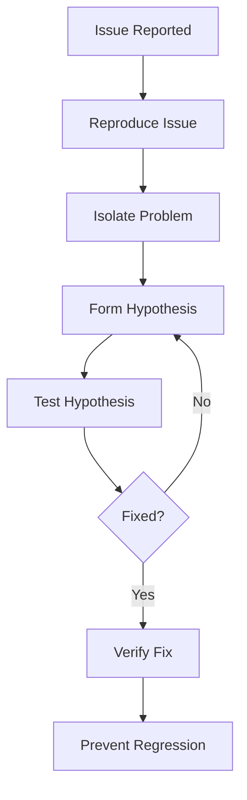

# Debugging Guide

Complete guide to debugging Medusa applications - from basic logging to advanced production debugging.

## Table of Contents

- [Debugging Mindset](#debugging-mindset)
- [Console Logging](#console-logging)
- [VSCode Debugger Setup](#vscode-debugger-setup)
- [Chrome DevTools](#chrome-devtools)
- [Database Query Debugging](#database-query-debugging)
- [Network Debugging](#network-debugging)
- [Workflow Debugging](#workflow-debugging)
- [Event Bus Debugging](#event-bus-debugging)
- [Common Error Patterns](#common-error-patterns)
- [Performance Debugging](#performance-debugging)
- [Production Debugging](#production-debugging)
- [Debugging Tools](#debugging-tools)

---

## Debugging Mindset

### The Debugging Process



### Best Practices

✅ **DO:**
- Reproduce the issue consistently
- Form hypotheses before testing
- Use debugger over console.log when possible
- Keep a debugging journal
- Test one change at a time
- Document your findings

❌ **DON'T:**
- Make random changes hoping to fix it
- Debug in production without safeguards
- Skip understanding the root cause
- Leave debug code in production
- Ignore warnings

---

## Console Logging

### Basic Logging

```typescript
// ✅ Good: Structured logging with context
console.log("Creating order:", {
  customerId: order.customer_id,
  items: order.items.length,
  total: order.total,
})

// ❌ Bad: Vague logging
console.log("order", order)

// 💡 Pro tip: Use template literals for clarity
console.log(`Processing order ${orderId} for customer ${customerId}`)
```

### Log Levels

```typescript
import { Logger } from "@medusajs/framework"

class ProductService {
  constructor({ logger }) {
    this.logger = logger
  }

  async createProduct(data) {
    this.logger.info("Creating product", { data })

    try {
      const product = await this.productRepository.create(data)
      this.logger.info("Product created successfully", {
        productId: product.id
      })
      return product
    } catch (error) {
      this.logger.error("Failed to create product", {
        error: error.message,
        stack: error.stack,
        data
      })
      throw error
    }
  }

  async updateInventory(productId, quantity) {
    this.logger.debug("Updating inventory", { productId, quantity })
    // Debug logs only show in development
  }
}
```

### Logging Best Practices

```typescript
// ✅ Log at entry/exit of important functions
async function processPayment(paymentData) {
  logger.info("processPayment started", { paymentId: paymentData.id })

  try {
    const result = await paymentProvider.charge(paymentData)
    logger.info("processPayment completed", {
      paymentId: paymentData.id,
      status: result.status
    })
    return result
  } catch (error) {
    logger.error("processPayment failed", {
      paymentId: paymentData.id,
      error: error.message,
    })
    throw error
  }
}

// ✅ Log state changes
async function updateOrderStatus(orderId, status) {
  const order = await getOrder(orderId)
  logger.info("Order status changing", {
    orderId,
    from: order.status,
    to: status,
  })

  order.status = status
  await order.save()
}

// ✅ Log external API calls
async function fetchShippingRates(address) {
  logger.debug("Fetching shipping rates", { address })

  const response = await axios.post("/shipping-rates", address)

  logger.debug("Shipping rates received", {
    count: response.data.rates.length
  })

  return response.data.rates
}
```

### Conditional Logging

```typescript
// Log only in development
if (process.env.NODE_ENV === "development") {
  console.log("Debug info:", debugData)
}

// Log with environment variable flag
if (process.env.DEBUG_WORKFLOWS === "true") {
  console.log("Workflow state:", workflowState)
}

// Use debug library
import debug from "debug"

const log = debug("medusa:product")
log("Product created: %o", product)
```

---

## VSCode Debugger Setup

### Launch Configuration

Create `.vscode/launch.json`:

```json
{
  "version": "0.2.0",
  "configurations": [
    {
      "type": "node",
      "request": "launch",
      "name": "Debug Medusa Server",
      "runtimeExecutable": "yarn",
      "runtimeArgs": ["dev"],
      "cwd": "${workspaceFolder}",
      "console": "integratedTerminal",
      "skipFiles": ["<node_internals>/**"],
      "env": {
        "NODE_ENV": "development"
      }
    },
    {
      "type": "node",
      "request": "launch",
      "name": "Debug Jest Tests",
      "program": "${workspaceFolder}/node_modules/.bin/jest",
      "args": [
        "--runInBand",
        "--no-cache",
        "${file}"
      ],
      "console": "integratedTerminal",
      "internalConsoleOptions": "neverOpen",
      "disableOptimisticBPs": true,
      "windows": {
        "program": "${workspaceFolder}/node_modules/jest/bin/jest"
      }
    },
    {
      "type": "node",
      "request": "launch",
      "name": "Debug Integration Tests",
      "runtimeExecutable": "yarn",
      "runtimeArgs": [
        "test:integration:api",
        "--runInBand"
      ],
      "cwd": "${workspaceFolder}",
      "console": "integratedTerminal"
    },
    {
      "type": "node",
      "request": "attach",
      "name": "Attach to Process",
      "port": 9229,
      "restart": true,
      "skipFiles": ["<node_internals>/**"]
    }
  ]
}
```

### Using Breakpoints

```typescript
// 1. Click left margin in VSCode to set breakpoint
// 2. Press F5 to start debugging
// 3. Use Debug Console to inspect variables

class OrderService {
  async createOrder(data) {
    // Set breakpoint here ⬅️
    const cart = await this.cartService.retrieve(data.cart_id)

    // Breakpoint here to inspect cart ⬅️
    const order = await this.orderRepository.create({
      customer_id: cart.customer_id,
      items: cart.items,
      total: cart.total,
    })

    // Breakpoint to verify order created ⬅️
    return order
  }
}
```

### Conditional Breakpoints

Right-click breakpoint → "Edit Breakpoint" → Add condition:

```javascript
// Break only when orderId matches
orderId === "order_12345"

// Break when total exceeds threshold
order.total > 10000

// Break on specific status
order.status === "pending"
```

### Logpoints

Right-click → "Add Logpoint" instead of breakpoint:

```javascript
// Instead of console.log, use logpoint:
Order ID: {orderId}, Status: {status}
```

### Debug Console Commands

```javascript
// Inspect variables
cart
cart.items
cart.items[0]

// Evaluate expressions
cart.total > 1000
cart.items.map(i => i.title)

// Call functions
this.calculateTotal(cart)

// Modify state (be careful!)
cart.total = 5000
```

---

## Chrome DevTools

### Debugging Frontend

1. Open Chrome DevTools (F12)
2. Go to Sources tab
3. Find your source file (webpack:///./)
4. Set breakpoints

### React DevTools

Install React DevTools extension:

```bash
# View component hierarchy
# Inspect props and state
# Track component updates
# Profile performance
```

### Debugging Network Requests

```typescript
// In browser console, monitor API calls:
const originalFetch = window.fetch
window.fetch = function(...args) {
  console.log('Fetch called:', args[0])
  return originalFetch.apply(this, args)
    .then(response => {
      console.log('Response:', response.status, args[0])
      return response
    })
}

// Or use Network tab:
// 1. Filter by XHR/Fetch
// 2. Click request to see headers/payload/response
// 3. Right-click → Copy → Copy as cURL
```

### Console Tricks

```javascript
// Table view for arrays
console.table(products)

// Group related logs
console.group('Order Processing')
console.log('Validating cart...')
console.log('Creating order...')
console.log('Processing payment...')
console.groupEnd()

// Time operations
console.time('fetchProducts')
await fetchProducts()
console.timeEnd('fetchProducts')

// Count occurrences
function updateCart() {
  console.count('updateCart called')
}

// Stack trace
console.trace('Order creation flow')
```

---

## Database Query Debugging

### MikroORM Query Logging

Enable query logging in `medusa-config.js`:

```javascript
module.exports = {
  projectConfig: {
    database_type: "postgres",
    database_logging: true, // Enable query logging
  },
}
```

### Log Individual Queries

```typescript
import { MikroORM } from "@mikro-orm/core"

// Enable query logging programmatically
const em = await MikroORM.init({
  debug: true, // Log all queries
})

// Log specific query
const products = await em.find(Product, { status: "published" })
// Logs: SELECT * FROM "product" WHERE "status" = 'published'
```

### Analyze Slow Queries

```typescript
// Add timing
const start = Date.now()
const products = await productRepository.find({ status: "published" })
console.log(`Query took ${Date.now() - start}ms`)

// Log query with EXPLAIN
await em.getConnection().execute(`
  EXPLAIN ANALYZE
  SELECT * FROM "product" WHERE "status" = 'published'
`)
```

### Using pg Client for Direct Queries

```bash
# Connect to database
psql -h localhost -U postgres -d medusa_db

# Analyze queries
EXPLAIN ANALYZE SELECT * FROM "product" WHERE "status" = 'published';

# Check indexes
\d product

# View slow queries
SELECT * FROM pg_stat_statements
ORDER BY mean_exec_time DESC
LIMIT 10;
```

### Common Query Issues

```typescript
// ❌ N+1 Query Problem
for (const order of orders) {
  const customer = await customerRepository.findOne(order.customer_id)
  // This runs a query for EACH order!
}

// ✅ Fix: Use eager loading
const orders = await orderRepository.find(
  { status: "pending" },
  { populate: ["customer"] }
)

// ❌ Missing indexes
const products = await productRepository.find({
  title: { $like: "%shirt%" }
})
// Slow without index on title

// ✅ Add index (in migration)
await knex.schema.alterTable("product", (table) => {
  table.index("title")
})
```

---

## Network Debugging

### Debugging API Calls

```typescript
// Add request/response interceptors
import axios from "axios"

axios.interceptors.request.use(request => {
  console.log('Starting Request:', {
    method: request.method,
    url: request.url,
    data: request.data,
  })
  return request
})

axios.interceptors.response.use(
  response => {
    console.log('Response:', {
      status: response.status,
      data: response.data,
    })
    return response
  },
  error => {
    console.error('Request Failed:', {
      status: error.response?.status,
      data: error.response?.data,
      message: error.message,
    })
    return Promise.reject(error)
  }
)
```

### Using cURL for Testing

```bash
# Test GET request
curl -X GET "http://localhost:9000/store/products" \
  -H "Content-Type: application/json"

# Test POST with authentication
curl -X POST "http://localhost:9000/admin/products" \
  -H "Content-Type: application/json" \
  -H "Authorization: Bearer YOUR_TOKEN" \
  -d '{
    "title": "Test Product",
    "handle": "test-product"
  }' | jq

# Test with cookies
curl -X GET "http://localhost:9000/admin/products" \
  -H "Cookie: connect.sid=YOUR_SESSION_ID" \
  --verbose
```

### Postman Debugging

```javascript
// Pre-request script
pm.environment.set("timestamp", Date.now())
console.log("Request starting at:", new Date())

// Test script
pm.test("Response time is acceptable", function () {
  pm.expect(pm.response.responseTime).to.be.below(200)
})

pm.test("Status code is 200", function () {
  pm.response.to.have.status(200)
})

console.log("Response data:", pm.response.json())
```

### Network Tab in Browser

1. Open DevTools → Network tab
2. Filter by API endpoint
3. Check:
   - Status code
   - Response time
   - Headers (authentication, content-type)
   - Request payload
   - Response data

---

## Workflow Debugging

### Enable Workflow Logging

```typescript
import { createWorkflow } from "@medusajs/framework/workflows"

const myWorkflow = createWorkflow(
  "create-order",
  function (input) {
    // Log at workflow start
    console.log("Workflow started with input:", input)

    const cart = useStep("retrieve-cart", async ({ cartId }) => {
      console.log("Step: retrieve-cart", { cartId })
      const cart = await cartService.retrieve(cartId)
      console.log("Cart retrieved:", cart)
      return cart
    })

    const order = useStep("create-order", async ({ cart }) => {
      console.log("Step: create-order", { cart })
      const order = await orderService.create(cart)
      console.log("Order created:", order)
      return order
    })

    return order
  }
)
```

### Debugging Step Failures

```typescript
import { StepResponse } from "@medusajs/framework/workflows"

const processPaymentStep = createStep(
  "process-payment",
  async (input, context) => {
    const { paymentData } = input

    console.log("Processing payment:", paymentData)

    try {
      const payment = await paymentService.processPayment(paymentData)

      console.log("Payment processed successfully:", payment)

      // Return with compensation function
      return new StepResponse(payment, {
        paymentId: payment.id,
      })
    } catch (error) {
      console.error("Payment processing failed:", {
        error: error.message,
        stack: error.stack,
        paymentData,
      })
      throw error
    }
  },
  // Compensation (rollback) function
  async (compensateData, context) => {
    console.log("Compensating payment:", compensateData)

    try {
      await paymentService.refund(compensateData.paymentId)
      console.log("Payment compensation successful")
    } catch (error) {
      console.error("Payment compensation failed:", error)
      throw error
    }
  }
)
```

### Debugging Workflow State

```typescript
// Get workflow execution state
const { result, errors } = await myWorkflow.run({
  input: { cartId: "cart_123" },
  throwOnError: false,
})

if (errors) {
  console.error("Workflow errors:", errors)

  errors.forEach((error, index) => {
    console.error(`Error ${index}:`, {
      step: error.step,
      message: error.message,
      action: error.action,
    })
  })
}

console.log("Workflow result:", result)
```

### Workflow Execution Tracking

```typescript
// Track workflow progress
const workflow = myWorkflow.run({
  input: { cartId: "cart_123" },
  hooks: {
    onStepBegin: (step) => {
      console.log(`Step starting: ${step.name}`)
    },
    onStepSuccess: (step, output) => {
      console.log(`Step completed: ${step.name}`, output)
    },
    onStepFailure: (step, error) => {
      console.error(`Step failed: ${step.name}`, error)
    },
    onWorkflowComplete: (result) => {
      console.log("Workflow completed:", result)
    },
  },
})
```

---

## Event Bus Debugging

### Local Event Bus Debugging

```typescript
// Subscribe to all events for debugging
import { EventBusService } from "@medusajs/framework"

class DebugSubscriber {
  constructor({ eventBusService }) {
    // Subscribe to all events
    eventBusService.subscribe("*", this.handleEvent.bind(this))
  }

  handleEvent(data, eventName) {
    console.log("Event emitted:", {
      eventName,
      data,
      timestamp: new Date(),
    })
  }
}
```

### Redis Event Bus Debugging

```bash
# Connect to Redis
redis-cli

# Monitor all commands
MONITOR

# Subscribe to channel
SUBSCRIBE medusa:events

# Check event queue
LLEN medusa:events:queue

# View event data
LRANGE medusa:events:queue 0 10
```

### Event Emission Tracking

```typescript
// Wrap event bus to track emissions
class DebugEventBus {
  constructor(eventBus) {
    this.eventBus = eventBus
    this.emissions = []
  }

  async emit(eventName, data) {
    console.log("Emitting event:", { eventName, data })

    this.emissions.push({
      eventName,
      data,
      timestamp: Date.now(),
    })

    try {
      const result = await this.eventBus.emit(eventName, data)
      console.log("Event emitted successfully:", eventName)
      return result
    } catch (error) {
      console.error("Event emission failed:", {
        eventName,
        error: error.message,
      })
      throw error
    }
  }

  getEmissions() {
    return this.emissions
  }
}
```

---

## Common Error Patterns

### Database Connection Errors

```typescript
// Error: Connection timeout
// Cause: Database not running or wrong credentials

// Debug:
console.log("Database config:", {
  host: process.env.DATABASE_HOST,
  port: process.env.DATABASE_PORT,
  database: process.env.DATABASE_NAME,
})

// Test connection
try {
  await em.getConnection().execute("SELECT 1")
  console.log("Database connection successful")
} catch (error) {
  console.error("Database connection failed:", error)
}
```

### Module Resolution Errors

```typescript
// Error: Cannot find module '@medusajs/...'

// Debug:
// 1. Check node_modules
ls node_modules/@medusajs/

// 2. Reinstall dependencies
yarn install

// 3. Clear cache
yarn cache clean
rm -rf node_modules
yarn install

// 4. Check package.json
cat package.json | grep @medusajs
```

### Type Errors

```typescript
// Error: Type 'X' is not assignable to type 'Y'

// Debug: Add explicit types
const product: Product = await productService.retrieve(id)

// Check type definition
// Hover over variable in VSCode
// Or use TypeScript playground
```

### Async/Await Errors

```typescript
// ❌ Missing await
const order = orderService.create(data) // Returns Promise!
console.log(order.id) // undefined

// ✅ Proper await
const order = await orderService.create(data)
console.log(order.id) // Works!

// ❌ Forgotten try/catch
const order = await orderService.create(data) // Might throw!

// ✅ Proper error handling
try {
  const order = await orderService.create(data)
} catch (error) {
  console.error("Failed to create order:", error)
  // Handle error
}
```

### Null/Undefined Errors

```typescript
// ❌ Accessing property of undefined
const price = product.variants[0].price // TypeError!

// ✅ Safe access
const price = product.variants?.[0]?.price

// ✅ With fallback
const price = product.variants?.[0]?.price ?? 0

// ✅ Guard clause
if (!product.variants?.length) {
  throw new Error("Product has no variants")
}
const price = product.variants[0].price
```

---

## Performance Debugging

### Measuring Execution Time

```typescript
// Simple timing
const start = Date.now()
await expensiveOperation()
console.log(`Operation took ${Date.now() - start}ms`)

// Using console.time
console.time("fetchProducts")
const products = await productService.list()
console.timeEnd("fetchProducts")

// High-resolution timing
const { performance } = require("perf_hooks")
const start = performance.now()
await operation()
console.log(`Took ${performance.now() - start}ms`)
```

### Profiling CPU Usage

```bash
# Run with profiler
node --prof server.js

# Generate readable output
node --prof-process isolate-*.log > profile.txt

# View profile
cat profile.txt
```

### Memory Profiling

```typescript
// Track memory usage
const used = process.memoryUsage()
console.log("Memory usage:", {
  rss: `${Math.round(used.rss / 1024 / 1024)}MB`,
  heapTotal: `${Math.round(used.heapTotal / 1024 / 1024)}MB`,
  heapUsed: `${Math.round(used.heapUsed / 1024 / 1024)}MB`,
})

// Take heap snapshot
const v8 = require("v8")
const fs = require("fs")

const snapshot = v8.writeHeapSnapshot()
console.log("Heap snapshot written to:", snapshot)
```

### Finding Memory Leaks

```bash
# Run with heap snapshot
node --inspect server.js

# Open chrome://inspect
# Take heap snapshots before/after operation
# Compare snapshots to find leaks
```

### Database Query Performance

```sql
-- Explain query plan
EXPLAIN ANALYZE
SELECT * FROM "product"
WHERE "status" = 'published'
ORDER BY "created_at" DESC
LIMIT 20;

-- Check missing indexes
SELECT schemaname, tablename, indexname
FROM pg_indexes
WHERE tablename = 'product';

-- View slow queries
SELECT query, calls, total_time, mean_time
FROM pg_stat_statements
ORDER BY mean_time DESC
LIMIT 10;
```

---

## Production Debugging

### Structured Logging

```typescript
import winston from "winston"

const logger = winston.createLogger({
  level: "info",
  format: winston.format.json(),
  defaultMeta: { service: "medusa-backend" },
  transports: [
    new winston.transports.File({ filename: "error.log", level: "error" }),
    new winston.transports.File({ filename: "combined.log" }),
  ],
})

// Use in production
logger.info("Order created", {
  orderId: order.id,
  customerId: customer.id,
  total: order.total,
  timestamp: new Date(),
})
```

### Error Tracking

```typescript
// Sentry integration
import * as Sentry from "@sentry/node"

Sentry.init({
  dsn: process.env.SENTRY_DSN,
  environment: process.env.NODE_ENV,
})

// Capture exceptions
try {
  await processOrder(orderId)
} catch (error) {
  Sentry.captureException(error, {
    tags: {
      section: "order-processing",
    },
    extra: {
      orderId,
    },
  })
  throw error
}
```

### Health Checks

```typescript
// Health check endpoint
app.get("/health", async (req, res) => {
  const health = {
    uptime: process.uptime(),
    timestamp: Date.now(),
    status: "ok",
    checks: {},
  }

  // Check database
  try {
    await em.getConnection().execute("SELECT 1")
    health.checks.database = "ok"
  } catch (error) {
    health.checks.database = "error"
    health.status = "error"
  }

  // Check Redis
  try {
    await redisClient.ping()
    health.checks.redis = "ok"
  } catch (error) {
    health.checks.redis = "error"
    health.status = "error"
  }

  res.status(health.status === "ok" ? 200 : 503).json(health)
})
```

### Request Tracing

```typescript
// Add correlation ID to requests
import { v4 as uuidv4 } from "uuid"

app.use((req, res, next) => {
  req.correlationId = req.headers["x-correlation-id"] || uuidv4()
  res.setHeader("x-correlation-id", req.correlationId)

  logger.info("Request started", {
    correlationId: req.correlationId,
    method: req.method,
    url: req.url,
  })

  next()
})

// Use in logs
logger.info("Processing order", {
  correlationId: req.correlationId,
  orderId,
})
```

### Production Logs Analysis

```bash
# Search logs
grep "ERROR" combined.log

# Follow logs in real-time
tail -f combined.log

# Filter by timestamp
awk '/2024-11-19/' combined.log

# Count errors by type
grep "ERROR" combined.log | awk '{print $5}' | sort | uniq -c

# Find slow requests (> 1s)
grep "Request completed" combined.log | awk '$NF > 1000'
```

---

## Debugging Tools

### VSCode Extensions

- **Debugger for Chrome**: Debug frontend React code
- **REST Client**: Test API endpoints in VSCode
- **Error Lens**: Inline error display
- **GitLens**: Debug when changes were introduced

### Browser DevTools

- **React DevTools**: Component debugging
- **Redux DevTools**: State debugging
- **Network Tab**: API call inspection
- **Performance Tab**: Performance profiling
- **Sources Tab**: Breakpoint debugging

### Database Tools

- **pgAdmin**: PostgreSQL GUI
- **DBeaver**: Universal database tool
- **pg client**: Command-line interface

```bash
# Connect to database
psql -h localhost -U postgres -d medusa_db

# Common queries
\dt              # List tables
\d product       # Describe table
SELECT * FROM product LIMIT 5;
```

### Redis Tools

- **Redis CLI**: Command-line interface
- **RedisInsight**: Redis GUI

```bash
# Connect to Redis
redis-cli

# Common commands
KEYS *                    # List all keys
GET key                   # Get value
MONITOR                   # Watch all commands
INFO                      # Server info
```

### Network Tools

- **Postman**: API testing and documentation
- **Insomnia**: Alternative API client
- **cURL**: Command-line HTTP client
- **Wireshark**: Network packet analyzer

---

## Debugging Checklist

✅ **Before Debugging:**
- [ ] Can you reproduce the issue consistently?
- [ ] Do you have the latest code?
- [ ] Are dependencies up to date?
- [ ] Is the database in a known state?

✅ **During Debugging:**
- [ ] Have you isolated the problem area?
- [ ] Are you using appropriate tools (debugger vs. logs)?
- [ ] Have you checked recent changes (git blame)?
- [ ] Have you searched for similar issues?

✅ **After Fixing:**
- [ ] Can you still reproduce the original issue?
- [ ] Have you added tests to prevent regression?
- [ ] Have you documented the fix?
- [ ] Have you removed debug code?

---

## Resources

- [VSCode Debugging Guide](https://code.visualstudio.com/docs/editor/debugging)
- [Chrome DevTools Documentation](https://developer.chrome.com/docs/devtools/)
- [Node.js Debugging Guide](https://nodejs.org/en/docs/guides/debugging-getting-started/)
- [PostgreSQL Documentation](https://www.postgresql.org/docs/)
- [Redis Documentation](https://redis.io/documentation)

---

**Next Steps:**
- [Testing Guide](./TESTING_GUIDE.md) - Write tests to catch bugs early
- [Performance Optimization](./PATTERNS_AND_CONVENTIONS.md) - Optimize slow code
- [API Documentation](./API_DOCUMENTATION.md) - Debug API issues
