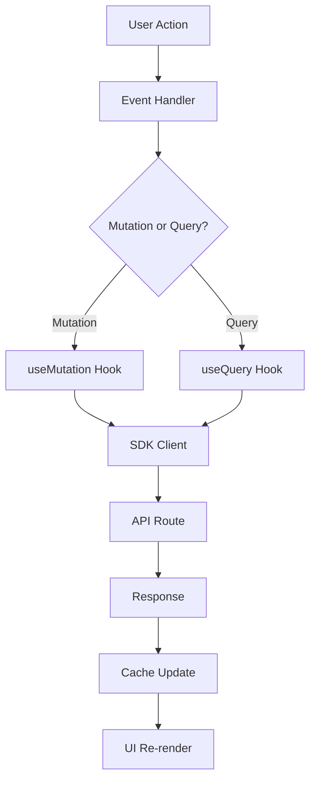

# Frontend Architecture - Admin Dashboard

> **Version**: ✅ CURRENT - Medusa 2.11.3 (Updated: Nov 2025)

A comprehensive deep-dive into the Medusa admin dashboard architecture, built with React 18, Vite, and modern frontend patterns.

## Table of Contents

- [Tech Stack Overview](#tech-stack-overview)
- [Application Structure](#application-structure)
- [Component Architecture](#component-architecture)
- [State Management](#state-management)
- [Routing System](#routing-system)
- [Form Handling](#form-handling)
- [Build Process](#build-process)
- [Mental Models](#mental-models)
- [Comparison: React vs Medusa Patterns](#comparison-react-vs-medusa-patterns)

---

## Tech Stack Overview

### Core Dependencies ✅ CURRENT

**Location**: `/home/user/medusa/packages/admin/dashboard/package.json`

```json
{
  "dependencies": {
    "react": "^18.3.1",
    "react-dom": "^18.3.1",
    "react-router-dom": "6.20.1",
    "@tanstack/react-query": "5.64.2",
    "@tanstack/react-table": "8.20.5",
    "react-hook-form": "7.49.1",
    "@hookform/resolvers": "3.4.2",
    "zod": "3.25.76",
    "@medusajs/ui": "4.0.27",
    "@medusajs/icons": "2.11.3",
    "i18next": "23.7.11",
    "react-i18next": "13.5.0",
    "@radix-ui/react-dialog": "1.1.4",
    "date-fns": "^3.6.0"
  },
  "devDependencies": {
    "@medusajs/admin-vite-plugin": "2.11.3"
  }
}
```

### Why These Versions?

- **React 18.3**: Latest stable with concurrent features
- **Vite**: Fast HMR and modern build tooling
- **TanStack Query 5.64**: Server state management with automatic caching
- **React Router 6.20**: File-based routing with nested layouts
- **React Hook Form 7.49**: Performant form handling with minimal re-renders
- **Zod 3.25**: TypeScript-first schema validation

---

## Application Structure

### Directory Layout

```
packages/admin/dashboard/src/
├── app.tsx                    # App component with plugin system
├── main.tsx                   # React 18 entry point
├── index.css                  # Global styles (Tailwind)
├── dashboard-app/             # Core dashboard orchestration
│   ├── dashboard-app.tsx      # Main DashboardApp class
│   ├── forms/                 # Form system
│   ├── links/                 # Navigation links
│   └── routes/                # Route utilities
├── routes/                    # 35+ route modules
│   ├── products/              # Product management routes
│   ├── orders/                # Order management routes
│   ├── customers/             # Customer management routes
│   └── ...
├── components/                # Reusable UI components
│   ├── layout/                # Page layouts
│   ├── utilities/             # Utility components
│   └── forms/                 # Form components
├── hooks/                     # Custom React hooks
│   ├── api/                   # API query hooks (TanStack Query)
│   └── table/                 # Table-related hooks
├── providers/                 # React Context providers
│   ├── theme-provider/        # Theme management
│   ├── i18n-provider/         # Internationalization
│   ├── extension-provider/    # Extension/plugin system
│   └── ...
└── lib/                       # Shared libraries
    ├── query-client.ts        # TanStack Query configuration
    ├── client.ts              # JS SDK client
    └── ...
```

### File Location Reference

- **Entry Point**: `/home/user/medusa/packages/admin/dashboard/src/main.tsx:5`
- **App Component**: `/home/user/medusa/packages/admin/dashboard/src/app.tsx:26`
- **Providers**: `/home/user/medusa/packages/admin/dashboard/src/providers/providers.tsx:16`

---

## Component Architecture

### Application Bootstrap

**File**: `/home/user/medusa/packages/admin/dashboard/src/main.tsx`

```tsx
import React from "react"
import ReactDOM from "react-dom/client"
import App from "./app.js"

ReactDOM.createRoot(document.getElementById("root")!).render(
  <React.StrictMode>
    <App />
  </React.StrictMode>
)
```

🧠 **Mental Model**: Classic React 18 bootstrap with Strict Mode for development checks.

### Plugin-Based App Architecture

**File**: `/home/user/medusa/packages/admin/dashboard/src/app.tsx`

```tsx
import { DashboardApp } from "./dashboard-app"
import { DashboardPlugin } from "./dashboard-app/types"

// Virtual imports from Vite plugin
import displayModule from "virtual:medusa/displays"
import formModule from "virtual:medusa/forms"
import i18nModule from "virtual:medusa/i18n"
import menuItemModule from "virtual:medusa/menu-items"
import routeModule from "virtual:medusa/routes"
import widgetModule from "virtual:medusa/widgets"

import "./index.css"

const localPlugin = {
  widgetModule,
  routeModule,
  displayModule,
  formModule,
  menuItemModule,
  i18nModule,
}

interface AppProps {
  plugins?: DashboardPlugin[]
}

function App({ plugins = [] }: AppProps) {
  const app = new DashboardApp({
    plugins: [localPlugin, ...plugins],
  })

  return <div>{app.render()}</div>
}

export default App
```

💡 **Aha Moment**: The admin uses a plugin architecture where extensions are loaded via Vite's virtual modules (`virtual:medusa/*`). This allows for dynamic customization without rebuilding the core.

### Provider Stack

**File**: `/home/user/medusa/packages/admin/dashboard/src/providers/providers.tsx`

```tsx
import { Toaster, TooltipProvider } from "@medusajs/ui"
import { QueryClientProvider } from "@tanstack/react-query"
import type { PropsWithChildren } from "react"
import { HelmetProvider } from "react-helmet-async"
import { I18n } from "../components/utilities/i18n"
import { DashboardApp } from "../dashboard-app"
import { queryClient } from "../lib/query-client"
import { ExtensionProvider } from "./extension-provider"
import { I18nProvider } from "./i18n-provider"
import { ThemeProvider } from "./theme-provider"
import { FeatureFlagProvider } from "./feature-flag-provider"

type ProvidersProps = PropsWithChildren<{
  api: DashboardApp["api"]
}>

export const Providers = ({ api, children }: ProvidersProps) => {
  return (
    <TooltipProvider>
      <ExtensionProvider api={api}>
        <HelmetProvider>
          <QueryClientProvider client={queryClient}>
            <ThemeProvider>
              <FeatureFlagProvider>
                <I18n />
                <I18nProvider>{children}</I18nProvider>
                <Toaster />
              </FeatureFlagProvider>
            </ThemeProvider>
          </QueryClientProvider>
        </HelmetProvider>
      </ExtensionProvider>
    </TooltipProvider>
  )
}
```

🧠 **Mental Model - Provider Nesting Order**: Outside to Inside
1. **UI Layer** (TooltipProvider) - Radix UI primitives
2. **Extensions** (ExtensionProvider) - Plugin system
3. **Head Management** (HelmetProvider) - Document head
4. **Data Layer** (QueryClientProvider) - TanStack Query
5. **Theming** (ThemeProvider) - Dark/light mode
6. **Feature Flags** (FeatureFlagProvider) - Conditional features
7. **i18n** (I18nProvider) - Internationalization

**Mnemonic**: "**U**sers **E**xpect **H**elpful **D**ata **T**hrough **F**eature **I**nternationalization"

---

## State Management

### TanStack Query Pattern

Medusa uses **TanStack Query** (React Query) for all server state management. This eliminates the need for Redux or other global state libraries.

#### Query Client Configuration

**File**: `/home/user/medusa/packages/admin/dashboard/src/lib/query-client.ts`

```tsx
import { QueryClient } from "@tanstack/react-query"

export const queryClient = new QueryClient({
  defaultOptions: {
    queries: {
      refetchOnWindowFocus: false,
      retry: false,
      staleTime: 90000, // 90 seconds
    },
  },
})
```

#### API Hook Pattern

**File**: `/home/user/medusa/packages/admin/dashboard/src/hooks/api/products.tsx`

```tsx
import { HttpTypes } from "@medusajs/types"
import {
  useQuery,
  useMutation,
  UseQueryOptions,
  UseMutationOptions,
} from "@tanstack/react-query"
import { sdk } from "../../lib/client"
import { queryClient } from "../../lib/query-client"
import { queryKeysFactory } from "../../lib/query-key-factory"

const PRODUCTS_QUERY_KEY = "products" as const
export const productsQueryKeys = queryKeysFactory(PRODUCTS_QUERY_KEY)

// ✅ Query Hook Pattern
export const useProduct = (
  id: string,
  query?: Record<string, any>,
  options?: Omit<UseQueryOptions, "queryFn" | "queryKey">
) => {
  const { data, ...rest } = useQuery({
    queryFn: () => sdk.admin.product.retrieve(id, query),
    queryKey: productsQueryKeys.detail(id, query),
    ...options,
  })

  return { ...data, ...rest }
}

// ✅ Mutation Hook Pattern with Cache Invalidation
export const useUpdateProduct = (
  id: string,
  options?: UseMutationOptions<
    HttpTypes.AdminProductResponse,
    FetchError,
    HttpTypes.AdminUpdateProduct
  >
) => {
  return useMutation({
    mutationFn: (payload) => sdk.admin.product.update(id, payload),
    onSuccess: async (data, variables, context) => {
      // Invalidate lists to refetch
      await queryClient.invalidateQueries({
        queryKey: productsQueryKeys.lists(),
      })
      // Invalidate specific product detail
      await queryClient.invalidateQueries({
        queryKey: productsQueryKeys.detail(id),
      })

      options?.onSuccess?.(data, variables, context)
    },
    ...options,
  })
}
```

🧠 **Mental Model**:
- **Queries** = Read operations (GET)
- **Mutations** = Write operations (POST/PUT/DELETE)
- **Cache Invalidation** = Tell React Query to refetch stale data

💡 **Aha Moment**: The `queryKeysFactory` creates hierarchical cache keys:
```tsx
productsQueryKeys.all()           // ["products"]
productsQueryKeys.lists()         // ["products", "list"]
productsQueryKeys.list({ q: "" }) // ["products", "list", { q: "" }]
productsQueryKeys.detail("prod_123") // ["products", "detail", "prod_123"]
```

This hierarchy allows for **surgical cache invalidation**:
- Invalidate `lists()` → refetch all product lists
- Invalidate `detail(id)` → refetch only one product

---

## Routing System

### Route Structure

Medusa admin has **35+ route modules**, each following a consistent pattern:

**Directory**: `/home/user/medusa/packages/admin/dashboard/src/routes/`

```
routes/
├── products/
│   ├── product-list/
│   │   ├── product-list.tsx              # Page component
│   │   └── components/
│   │       └── product-list-table/       # Table component
│   ├── product-detail/
│   ├── product-create/
│   └── ...
├── orders/
├── customers/
└── ...
```

### Page Component Pattern

**File**: `/home/user/medusa/packages/admin/dashboard/src/routes/products/product-list/product-list.tsx`

```tsx
import { SingleColumnPage } from "../../../components/layout/pages"
import { useExtension } from "../../../providers/extension-provider"
import { ProductListTable } from "./components/product-list-table"

export const ProductList = () => {
  const { getWidgets } = useExtension()

  return (
    <SingleColumnPage
      widgets={{
        after: getWidgets("product.list.after"),
        before: getWidgets("product.list.before"),
      }}
    >
      <ProductListTable />
    </SingleColumnPage>
  )
}
```

🧠 **Mental Model**: Pages are thin wrappers that:
1. Use the `useExtension` hook to get plugin widgets
2. Render a layout component (`SingleColumnPage`)
3. Pass widgets for before/after injection points
4. Render the main content component

💡 **Aha Moment**: The `widgets` prop creates **extension points** where plugins can inject custom UI:
```tsx
// Plugin can register widgets at "product.list.before"
// They'll render before the ProductListTable
```

### React Router 6.20 Usage

React Router 6.20 is used with **file-based routing** conventions:

```tsx
// Configured via the Vite plugin
// Routes are discovered from the routes/ directory
```

---

## Form Handling

Medusa uses **React Hook Form + Zod** for all forms, providing:
- Type-safe validation
- Minimal re-renders
- Automatic error handling

### Form Pattern

```tsx
import { zodResolver } from "@hookform/resolvers/zod"
import { useForm } from "react-hook-form"
import { z } from "zod"

// 1. Define Zod schema
const ProductSchema = z.object({
  title: z.string().min(1, "Title is required"),
  handle: z.string().optional(),
  description: z.string().optional(),
  status: z.enum(["draft", "published"]),
})

type ProductFormValues = z.infer<typeof ProductSchema>

// 2. Use form hook with Zod resolver
export const ProductForm = () => {
  const form = useForm<ProductFormValues>({
    resolver: zodResolver(ProductSchema),
    defaultValues: {
      title: "",
      status: "draft",
    },
  })

  const { mutateAsync } = useCreateProduct()

  const onSubmit = form.handleSubmit(async (data) => {
    await mutateAsync(data)
  })

  return (
    <form onSubmit={onSubmit}>
      <Input
        {...form.register("title")}
        error={form.formState.errors.title?.message}
      />
      {/* More fields... */}
      <Button type="submit">Create Product</Button>
    </form>
  )
}
```

🧠 **Mental Model**:
1. **Schema First**: Define validation with Zod
2. **Type Inference**: TypeScript types auto-generated from schema
3. **Hook Connection**: `zodResolver` connects Zod to React Hook Form
4. **Registration**: `register()` connects inputs to form state
5. **Submission**: `handleSubmit()` validates before calling handler

**Mnemonic**: "**S**chema **T**ypes **H**ook **R**egister **S**ubmit"

---

## Build Process

### Vite Configuration

Medusa uses **Vite** for development and **tsup** for production builds:

**Development**:
```bash
vite         # Fast HMR with ESM
```

**Production**:
```bash
tsup         # TypeScript bundler for libraries
```

### Virtual Modules

The Vite plugin creates virtual modules for extensions:

```tsx
import routeModule from "virtual:medusa/routes"
```

These are generated at build time from plugin configurations.

### Tailwind CSS Integration

**Version**: 3.4.3

```tsx
// index.css
@tailwind base;
@tailwind components;
@tailwind utilities;
```

Used via the `@medusajs/ui-preset` package for consistent design tokens.

---

## Mental Models

### 🧠 Data Flow Mental Model



### 🌉 Bridge: Traditional React → Medusa Admin

| Traditional React | Medusa Admin Pattern | Why? |
|------------------|---------------------|------|
| Redux/Context for server state | TanStack Query | Automatic caching, refetching, loading states |
| Manual fetch() calls | SDK client hooks | Type-safe, consistent error handling |
| useState for forms | React Hook Form + Zod | Better performance, validation |
| CSS Modules/Styled | Tailwind + Radix UI | Rapid development, accessible components |
| Hard-coded routes | Plugin-based routes | Extensibility without core changes |

### 💡 Key Aha Moments

1. **No Global State Library Needed**: TanStack Query IS your server state manager
2. **Plugins Without Rebuilding**: Virtual modules enable dynamic extensions
3. **Type Safety Everywhere**: Zod schemas → TypeScript types → Runtime validation
4. **Cache Invalidation > State Updates**: Let React Query handle refetching

---

## Comparison: React Patterns vs Medusa Patterns

### State Management

**❌ Don't use Redux for server state:**
```tsx
// Traditional Redux pattern
const dispatch = useDispatch()
const products = useSelector(state => state.products.items)

useEffect(() => {
  dispatch(fetchProducts())
}, [])
```

**✅ Use TanStack Query:**
```tsx
// Medusa pattern
const { products, isLoading } = useProducts({ limit: 20 })
// Auto-fetches, caches, handles loading/error states
```

### Forms

**❌ Don't manually manage form state:**
```tsx
// Manual state management
const [title, setTitle] = useState("")
const [errors, setErrors] = useState({})

const validate = () => {
  const newErrors = {}
  if (!title) newErrors.title = "Required"
  setErrors(newErrors)
  return Object.keys(newErrors).length === 0
}
```

**✅ Use React Hook Form + Zod:**
```tsx
// Medusa pattern
const form = useForm({
  resolver: zodResolver(ProductSchema)
})
// Validation is automatic, errors are typed
```

### API Calls

**❌ Don't use raw fetch:**
```tsx
// Manual fetch
const [data, setData] = useState(null)
const [loading, setLoading] = useState(false)

const fetchProduct = async () => {
  setLoading(true)
  const res = await fetch(`/admin/products/${id}`)
  const data = await res.json()
  setData(data)
  setLoading(false)
}
```

**✅ Use SDK hooks:**
```tsx
// Medusa pattern
const { product, isLoading } = useProduct(id)
// Automatic loading, error, refetch, cache
```

---

## Component Patterns

### Layout Components

Medusa provides layout primitives for consistent page structure:

```tsx
import { SingleColumnPage } from "../components/layout/pages"
import { TwoColumnPage } from "../components/layout/pages"

// Single column (list pages)
<SingleColumnPage widgets={widgets}>
  <Content />
</SingleColumnPage>

// Two column (detail pages)
<TwoColumnPage
  widgets={widgets}
  sidebar={<Sidebar />}
>
  <MainContent />
</TwoColumnPage>
```

### Table Pattern

Using TanStack Table 8.20.5:

```tsx
import { useDataTable } from "../../../hooks/use-data-table"

export const ProductListTable = () => {
  const { products, count, isLoading } = useProducts()

  const table = useDataTable({
    data: products ?? [],
    columns: productColumns,
    count,
    getRowId: (row) => row.id,
    enablePagination: true,
    enableFilters: true,
  })

  return <DataTable table={table} />
}
```

---

## Internationalization (i18n)

**Version**: i18next 23.7.11

```tsx
import { useTranslation } from "react-i18next"

export const ProductForm = () => {
  const { t } = useTranslation()

  return (
    <div>
      <h1>{t("products.create.title")}</h1>
      <p>{t("products.create.description")}</p>
    </div>
  )
}
```

Translation files are organized by namespace and loaded dynamically.

---

## Extension Points

The admin dashboard provides multiple extension points:

1. **Routes**: Add custom pages
2. **Widgets**: Inject UI into existing pages
3. **Forms**: Add custom fields
4. **Menu Items**: Add navigation items
5. **Displays**: Custom field renderers

**Example**: Adding a widget to product detail page

```tsx
// In your plugin
export default {
  widgetModule: {
    zones: [
      {
        zone: "product.details.after",
        widget: MyCustomWidget,
      },
    ],
  },
}
```

---

## Performance Optimizations

1. **React.memo**: Used for expensive list items
2. **Virtual Scrolling**: TanStack Virtual for long lists
3. **Code Splitting**: React.lazy for route-based splitting
4. **TanStack Query Caching**: 90-second stale time reduces API calls
5. **React Hook Form**: Uncontrolled components minimize re-renders

---

## File References

All file paths mentioned:

1. **Package.json**: `/home/user/medusa/packages/admin/dashboard/package.json`
2. **Main Entry**: `/home/user/medusa/packages/admin/dashboard/src/main.tsx:5`
3. **App Component**: `/home/user/medusa/packages/admin/dashboard/src/app.tsx:26`
4. **Providers**: `/home/user/medusa/packages/admin/dashboard/src/providers/providers.tsx:16`
5. **Product List**: `/home/user/medusa/packages/admin/dashboard/src/routes/products/product-list/product-list.tsx:5`
6. **API Hooks**: `/home/user/medusa/packages/admin/dashboard/src/hooks/api/products.tsx`

---

## Summary

The Medusa admin dashboard is a modern React application that:

- Uses **React 18** with concurrent features
- Manages server state with **TanStack Query 5.64**
- Handles forms with **React Hook Form 7.49 + Zod 3.25**
- Routes with **React Router 6.20**
- Styles with **Tailwind CSS 3.4** + **Radix UI**
- Builds with **Vite** (dev) and **tsup** (prod)
- Extends via **plugin architecture** and **virtual modules**

**Key Principle**: Composition over configuration, with type safety at every layer.
