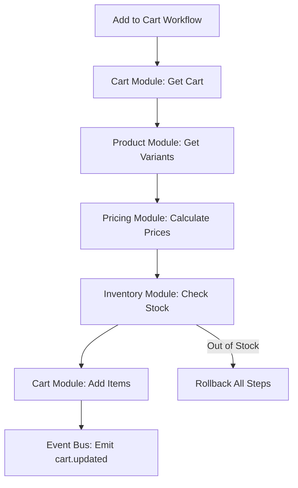
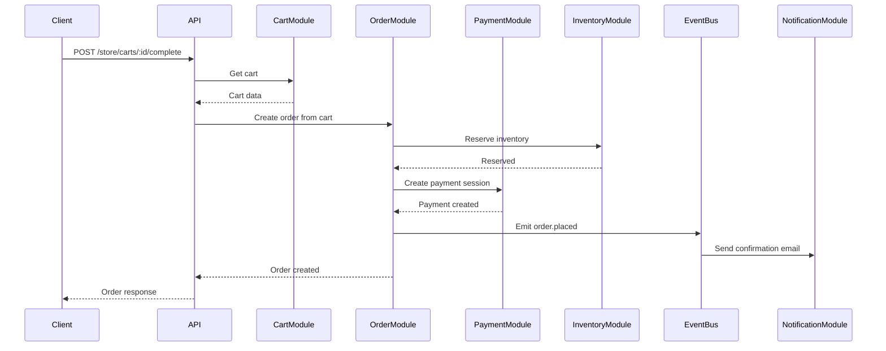

# Integration Guide - Module Communication & Orchestration

> **Version**: ✅ CURRENT - Medusa 2.11.3 (Updated: Nov 2025)

A comprehensive guide to how Medusa's 33+ modules integrate, communicate, and orchestrate complex operations across module boundaries.

## Table of Contents

- [Module System Overview](#module-system-overview)
- [Module-to-Module Communication](#module-to-module-communication)
- [Link Modules](#link-modules)
- [Event Bus](#event-bus)
- [Workflow Orchestration](#workflow-orchestration)
- [Provider Integration](#provider-integration)
- [API Composition](#api-composition)
- [Real Integration Examples](#real-integration-examples)
- [Debugging Integration Issues](#debugging-integration-issues)
- [Testing Integrated Flows](#testing-integrated-flows)

---

## Module System Overview

### The 33+ Module Architecture

Medusa is composed of domain-specific modules that encapsulate business logic:

```
Core Modules (13):
├── Cart          - Shopping cart management
├── Product       - Product catalog
├── Order         - Order processing
├── Customer      - Customer management
├── Payment       - Payment processing
├── Fulfillment   - Shipping & fulfillment
├── Inventory     - Stock management
├── Pricing       - Price calculations
├── Promotion     - Discounts & promotions
├── Region        - Geographic regions
├── Tax           - Tax calculations
├── User          - Admin users
└── Store         - Store settings

Infrastructure Modules (10):
├── Event Bus (Local/Redis)
├── Workflow Engine (InMemory/Redis)
├── Cache (InMemory/Redis)
├── Locking (Postgres/Redis)
├── Notification
├── File
├── API Key
├── Auth
├── Settings
└── Analytics

Link Modules (10+):
├── Product ←→ Sales Channel
├── Product Variant ←→ Inventory Item
├── Product Variant ←→ Price Set
├── Order ←→ Cart
├── Order ←→ Payment Collection
└── ... (more relationship links)
```

🧠 **Mental Model**: Medusa modules are like **microservices in a monolith**:
- Each module has its own database schema
- Modules don't directly import each other's code
- Communication happens via:
  1. **Remote Links** (data relationships)
  2. **Event Bus** (async messaging)
  3. **Workflows** (orchestration)

**Mnemonic**: "**M**odules **M**essage via **L**inks, **E**vents, **W**orkflows"

---

## Module-to-Module Communication

### The Three Communication Patterns

| Pattern | When to Use | Example |
|---------|-------------|---------|
| **Remote Links** | Querying related data across modules | Get product with sales channels |
| **Event Bus** | Reacting to changes in other modules | Send email when order placed |
| **Workflows** | Multi-module transactions | Cart → Order → Payment flow |

### Module Registration

**File**: `/home/user/medusa/packages/modules/cart/src/index.ts:1`

```typescript
import { Module, Modules } from "@medusajs/framework/utils"
import { CartModuleService } from "./services"

export default Module(Modules.CART, {
  service: CartModuleService,
})
```

Each module exports a service that implements the module interface:

```typescript
export class CartModuleService implements ICartModuleService {
  // Public API of the cart module
  async list(filters, config) { }
  async retrieve(id, config) { }
  async create(data) { }
  async update(id, data) { }
  async delete(id) { }
  // ... more methods
}
```

💡 **Aha Moment**: Modules are **dependency injected** into the container, so you never `import CartModuleService` directly - you resolve it:

```typescript
const cartModule = container.resolve(Modules.CART)
```

---

## Link Modules

Link modules create **relationships between modules** without tight coupling.

### What is a Link Module?

A link module is a **join table with a service API**:

```
Product Module        Link Module           Sales Channel Module
┌─────────────┐      ┌──────────────┐      ┌──────────────┐
│ Product     │      │ ProductSales │      │ SalesChannel │
│             │──────│ Channel      │──────│              │
│ id          │      │ product_id   │      │ id           │
│ title       │      │ sales_chan...│      │ name         │
└─────────────┘      └──────────────┘      └──────────────┘
```

### Link Module Definition

**File**: `/home/user/medusa/packages/modules/link-modules/src/definitions/order-cart.ts:1`

```typescript
import { ModuleJoinerConfig } from "@medusajs/framework/types"
import { LINKS, Modules } from "@medusajs/framework/utils"

export const OrderCart: ModuleJoinerConfig = {
  serviceName: LINKS.OrderCart,
  isLink: true,

  // Database config
  databaseConfig: {
    tableName: "order_cart",
    idPrefix: "ordercart",
  },

  alias: [
    {
      name: ["order_cart", "order_carts"],
      entity: "LinkOrderCart",
    },
  ],

  primaryKeys: ["id", "order_id", "cart_id"],

  // Relationships
  relationships: [
    {
      serviceName: Modules.ORDER,
      entity: "Order",
      primaryKey: "id",
      foreignKey: "order_id",
      alias: "order",
    },
    {
      serviceName: Modules.CART,
      entity: "Cart",
      primaryKey: "id",
      foreignKey: "cart_id",
      alias: "cart",
    },
  ],

  // Extend modules with virtual fields
  extends: [
    {
      serviceName: Modules.ORDER,
      entity: "Order",
      fieldAlias: {
        cart: "cart_link.cart", // order.cart → follows link
      },
      relationship: {
        serviceName: LINKS.OrderCart,
        primaryKey: "order_id",
        foreignKey: "id",
        alias: "cart_link",
      },
    },
    {
      serviceName: Modules.CART,
      entity: "Cart",
      fieldAlias: {
        order: "order_link.order", // cart.order → follows link
      },
      relationship: {
        serviceName: LINKS.OrderCart,
        primaryKey: "cart_id",
        foreignKey: "id",
        alias: "order_link",
      },
    },
  ],
}
```

### Using Link Modules

```typescript
import { Modules } from "@medusajs/framework/utils"

// Query order with cart data (follows link)
const order = await query.graph({
  entity: "order",
  filters: { id: "order_123" },
  fields: [
    "id",
    "total",
    "cart.*", // ← Follows order_cart link
  ],
})

// Result:
// {
//   id: "order_123",
//   total: 10000,
//   cart: {
//     id: "cart_456",
//     customer_id: "cus_789",
//     items: [...]
//   }
// }
```

💡 **Aha Moment**: Link modules enable **graph queries** across module boundaries without SQL joins - the framework handles the complexity!

### Common Link Modules

**File**: `/home/user/medusa/packages/modules/link-modules/src/definitions/`

```
Link Modules:
├── product-sales-channel.ts          - Products in sales channels
├── product-variant-inventory-item.ts - Variant inventory tracking
├── product-variant-price-set.ts      - Variant pricing
├── order-cart.ts                     - Order created from cart
├── order-payment-collection.ts       - Order payments
├── order-fulfillment.ts              - Order shipments
├── order-promotion.ts                - Order discounts
├── cart-payment-collection.ts        - Cart payment sessions
├── cart-promotion.ts                 - Cart promotions
└── customer-account-holder.ts        - Customer accounts
```

🧠 **Mental Model - Link Modules**:

```
Without Link Modules (❌ tight coupling):
┌─────────┐  import  ┌─────────┐
│ Product │─────────→│ Sales   │
│ Module  │          │ Channel │
└─────────┘          └─────────┘

With Link Modules (✅ loose coupling):
┌─────────┐          ┌─────────┐          ┌─────────┐
│ Product │          │  Link   │          │ Sales   │
│ Module  │◄────────►│ Module  │◄────────►│ Channel │
└─────────┘          └─────────┘          └─────────┘
```

---

## Event Bus

The Event Bus enables **asynchronous communication** between modules.

### Event Bus Types

| Type | Use Case | Persistence |
|------|----------|-------------|
| `@medusajs/event-bus-local` | Development, testing | In-memory |
| `@medusajs/event-bus-redis` | Production | Redis Streams |

### Publishing Events

**Example**: Cart module publishes cart.updated event

```typescript
import { CartWorkflowEvents } from "@medusajs/framework/utils"

export class CartModuleService {
  async update(id: string, data: UpdateCartDTO) {
    const cart = await this.repository_.update(id, data)

    // Emit event
    await this.eventBusService_.emit(CartWorkflowEvents.UPDATED, {
      id: cart.id,
    })

    return cart
  }
}
```

### Subscribing to Events

**File**: `/home/user/medusa/packages/medusa/src/subscribers/cart-updated.ts` (example)

```typescript
import {
  SubscriberConfig,
  SubscriberArgs
} from "@medusajs/framework"
import { Modules } from "@medusajs/framework/utils"

export default async function cartUpdatedHandler({
  event,
  container,
}: SubscriberArgs<{ id: string }>) {
  const notificationService = container.resolve(Modules.NOTIFICATION)
  const cartService = container.resolve(Modules.CART)

  const cart = await cartService.retrieve(event.data.id)

  // Send notification
  await notificationService.create({
    to: cart.email,
    template: "cart-updated",
    data: { cart },
  })
}

export const config: SubscriberConfig = {
  event: "cart.updated",
  context: {
    subscriberId: "cart-updated-notification",
  },
}
```

### Event Patterns

```typescript
// Cart events
CartWorkflowEvents.CREATED   // "cart.created"
CartWorkflowEvents.UPDATED   // "cart.updated"

// Order events
OrderWorkflowEvents.PLACED   // "order.placed"
OrderWorkflowEvents.SHIPPED  // "order.shipped"

// Product events
ProductEvents.CREATED        // "product.created"
ProductEvents.UPDATED        // "product.updated"
```

🧠 **Mental Model - Event Bus**:

```
┌──────────────────────────────────────────────┐
│ Event Bus (Redis Streams)                    │
├──────────────────────────────────────────────┤
│                                              │
│ Publisher (Cart Module)                      │
│    ↓                                         │
│ emit("cart.updated", { id: "cart_123" })     │
│    ↓                                         │
│ ┌──────────────────────────────────────┐    │
│ │ Event Queue                          │    │
│ │ • cart.updated: { id: "cart_123" }   │    │
│ └──────────────────────────────────────┘    │
│    ↓                                         │
│ Subscribers:                                 │
│ ✓ Notification handler                       │
│ ✓ Analytics handler                          │
│ ✓ Cache invalidation handler                 │
└──────────────────────────────────────────────┘
```

**Mnemonic**: "**E**vents **E**nable **A**sync **A**ctions" = EEAA

---

## Workflow Orchestration

Workflows orchestrate **multi-module operations** with automatic rollback.

### Cross-Module Workflow Example

**File**: `/home/user/medusa/packages/core/core-flows/src/cart/workflows/add-to-cart.ts:114`

This workflow coordinates across Cart, Product, Inventory, and Pricing modules:

```typescript
import {
  createWorkflow,
  parallelize,
  when,
  WorkflowResponse,
} from "@medusajs/framework/workflows-sdk"

export const addToCartWorkflow = createWorkflow(
  "add-to-cart",
  (input: AddToCartWorkflowInputDTO) => {
    // 1. Lock cart (Locking Module)
    acquireLockStep({ key: input.cart_id })

    // 2. Get cart (Cart Module)
    const { data: cart } = useQueryGraphStep({
      entity: "cart",
      filters: { id: input.cart_id },
    })

    // 3. Validate cart (Cart Module)
    validateCartStep({ cart })

    // 4. Get variants with prices (Product + Pricing Modules)
    const { variants, lineItems } = getVariantsAndItemsWithPrices.runAsStep({
      input: { cart, items: input.items },
    })

    // 5. Validate inventory (Inventory Module)
    confirmVariantInventoryWorkflow.runAsStep({
      input: {
        sales_channel_id: cart.sales_channel_id,
        variants,
        items: input.items,
      },
    })

    // 6. Create/update line items (Cart Module)
    const [createdLineItems, updatedLineItems] = parallelize(
      createLineItemsStep({ id: cart.id, items: itemsToCreate }),
      updateLineItemsStep({ id: cart.id, items: itemsToUpdate })
    )

    // 7. Refresh pricing (Pricing Module)
    refreshCartItemsWorkflow.runAsStep({
      input: { cart_id: cart.id, items: allItems },
    })

    // 8. Emit event (Event Bus)
    parallelize(
      emitEventStep({ eventName: CartWorkflowEvents.UPDATED, data: { id: cart.id } }),
      releaseLockStep({ key: cart.id })
    )

    return new WorkflowResponse(void 0)
  }
)
```

### Workflow Steps Span Modules



💡 **Aha Moment**: Workflows are the **glue** that binds modules together for complex operations, while maintaining module independence.

---

## Provider Integration

Providers are **pluggable implementations** of module interfaces:

### Provider Types

```
Payment Providers:
├── @medusajs/payment-stripe
└── Custom payment provider

Fulfillment Providers:
├── @medusajs/fulfillment-manual
└── Custom shipping provider

Notification Providers:
├── @medusajs/notification-local
├── @medusajs/notification-sendgrid
└── Custom notification provider

File Providers:
├── @medusajs/file-local
├── @medusajs/file-s3
└── Custom storage provider
```

### Provider Registration

**In medusa-config.ts**:

```typescript
module.exports = defineConfig({
  modules: [
    {
      resolve: "@medusajs/payment-stripe",
      options: {
        apiKey: process.env.STRIPE_API_KEY,
      },
    },
    {
      resolve: "@medusajs/file-s3",
      options: {
        bucket: process.env.S3_BUCKET,
        region: process.env.S3_REGION,
      },
    },
  ],
})
```

### Using Providers in Workflows

```typescript
import { Modules } from "@medusajs/framework/utils"

export const capturePaymentStep = createStep(
  "capture-payment",
  async ({ paymentId }, { container }) => {
    const paymentModule = container.resolve(Modules.PAYMENT)

    // paymentModule delegates to configured provider (e.g., Stripe)
    const payment = await paymentModule.capturePayment({
      payment_id: paymentId,
    })

    return new StepResponse(
      { payment },
      { paymentId }
    )
  },
  async ({ paymentId }, { container }) => {
    const paymentModule = container.resolve(Modules.PAYMENT)

    // Compensation: refund payment
    await paymentModule.refundPayment({
      payment_id: paymentId,
    })
  }
)
```

🧠 **Mental Model - Provider Pattern**:

```
┌─────────────────────────────────────────┐
│ Payment Module (Interface)              │
├─────────────────────────────────────────┤
│ - capturePayment()                      │
│ - refundPayment()                       │
└─────────────────────────────────────────┘
              ↑ implements
              │
    ┌─────────┴──────────┐
    │                    │
┌───┴────┐        ┌──────┴────┐
│ Stripe │        │ PayPal    │
│Provider│        │ Provider  │
└────────┘        └───────────┘
```

---

## API Composition

API routes compose data from **multiple modules**:

### Example: Get Order with Related Data

**File**: `/home/user/medusa/packages/medusa/src/api/admin/orders/[id]/route.ts` (example)

```typescript
import { refetchEntity } from "@medusajs/framework/http"
import { Modules } from "@medusajs/framework/utils"

export const GET = async (req, res) => {
  const orderId = req.params.id

  // Uses remote query to compose data across modules
  const order = await refetchEntity({
    entity: "order",
    idOrFilter: orderId,
    scope: req.scope,
    fields: [
      "id",
      "status",
      "total",
      "currency_code",

      // Customer data (Customer Module via link)
      "customer.id",
      "customer.email",
      "customer.first_name",

      // Items (Order Module)
      "items.*",
      "items.product.*", // Product Module via link

      // Payment (Payment Module via link)
      "payment_collection.*",
      "payment_collection.payments.*",

      // Fulfillment (Fulfillment Module via link)
      "fulfillments.*",
      "fulfillments.shipping_option.*",
    ],
  })

  res.json({ order })
}
```

### Remote Query Architecture

```typescript
// Remote Query composes data from multiple modules
{
  "order": {              // Order Module
    "id": "order_123",
    "total": 10000,
    "customer": {         // Customer Module (via link)
      "email": "...",
    },
    "items": [{           // Order Module
      "product": {        // Product Module (via link)
        "title": "...",
      }
    }],
    "payment_collection": { // Payment Module (via link)
      "payments": [...]
    }
  }
}
```

💡 **Aha Moment**: The API layer uses **remote query** to compose responses from multiple modules, hiding the complexity from the client!

---

## Real Integration Examples

### Example 1: Cart → Order → Payment Flow



**Workflow Code**:

```typescript
export const completeCartWorkflow = createWorkflow(
  "complete-cart",
  (input: { cart_id: string }) => {
    // 1. Get cart (Cart Module)
    const cart = getCartStep(input.cart_id)

    // 2. Validate cart (Cart Module)
    validateCartStep({ cart })

    // 3. Reserve inventory (Inventory Module)
    reserveInventoryStep({ items: cart.items })

    // 4. Create order (Order Module)
    const order = createOrderFromCartStep({ cart })

    // 5. Capture payment (Payment Module)
    capturePaymentStep({ payment_id: order.payment_id })

    // 6. Emit event (Event Bus)
    emitEventStep({
      eventName: "order.placed",
      data: { id: order.id },
    })

    return new WorkflowResponse(order)
  }
)
```

### Example 2: Product Price Calculation

**Workflow**: Get Product with Calculated Prices

```typescript
export const getProductWithPricesStep = createStep(
  "get-product-with-prices",
  async ({ productId, context }, { container }) => {
    const productModule = container.resolve(Modules.PRODUCT)
    const pricingModule = container.resolve(Modules.PRICING)
    const query = container.resolve("query")

    // 1. Get product data
    const product = await query.graph({
      entity: "product",
      filters: { id: productId },
      fields: [
        "id",
        "title",
        "variants.*",
        "variants.calculated_price", // Link to pricing module
      ],
    })

    // 2. Calculate prices with context
    const pricesWithContext = await pricingModule.calculatePrices(
      { variant_id: product.variants.map(v => v.id) },
      {
        context: {
          currency_code: context.currency_code,
          region_id: context.region_id,
          customer_group_id: context.customer_group_id,
        },
      }
    )

    // 3. Merge prices into product
    product.variants.forEach((variant) => {
      variant.calculated_price = pricesWithContext[variant.id]
    })

    return new StepResponse({ product })
  }
)
```

### Example 3: Inventory Reservation with Rollback

```typescript
export const reserveInventoryStep = createStep(
  "reserve-inventory",
  async ({ items }, { container }) => {
    const inventoryModule = container.resolve(Modules.INVENTORY)

    const reservations = []

    // Reserve each item
    for (const item of items) {
      const reservation = await inventoryModule.createReservationItems({
        inventory_item_id: item.inventory_item_id,
        location_id: item.location_id,
        quantity: item.quantity,
      })

      reservations.push(reservation)
    }

    return new StepResponse(
      { reservations },
      { reservationIds: reservations.map(r => r.id) }
    )
  },
  async ({ reservationIds }, { container }) => {
    const inventoryModule = container.resolve(Modules.INVENTORY)

    // Compensation: Delete reservations
    await inventoryModule.deleteReservationItems(reservationIds)
  }
)
```

---

## Debugging Integration Issues

### 1. Enable Debug Logging

**medusa-config.ts**:

```typescript
module.exports = defineConfig({
  projectConfig: {
    logger: {
      level: "debug", // or "silly" for verbose
    },
  },
})
```

### 2. Workflow Execution Logs

Workflows automatically log each step:

```
[DEBUG] workflow.add-to-cart.started { input: {...} }
[DEBUG] workflow.add-to-cart.step.acquire-lock.started
[DEBUG] workflow.add-to-cart.step.acquire-lock.completed
[DEBUG] workflow.add-to-cart.step.get-cart.started
[DEBUG] workflow.add-to-cart.step.get-cart.completed
[DEBUG] workflow.add-to-cart.step.validate-cart.started
[ERROR] workflow.add-to-cart.step.validate-cart.failed { error: "Cart is completed" }
[DEBUG] workflow.add-to-cart.compensation.started
[DEBUG] workflow.add-to-cart.compensation.release-lock.started
[DEBUG] workflow.add-to-cart.compensation.release-lock.completed
```

### 3. Module Resolution Issues

```typescript
// Check if module is registered
const container = req.scope

try {
  const cartModule = container.resolve(Modules.CART)
  console.log("Cart module resolved:", cartModule)
} catch (err) {
  console.error("Cart module not registered!")
}
```

### 4. Link Module Queries

```typescript
// Debug link module data
const query = container.resolve("query")

const result = await query.graph({
  entity: "product",
  filters: { id: "prod_123" },
  fields: [
    "id",
    "title",
    "sales_channels.*", // Via link module
  ],
}, {
  throwIfKeyNotFound: true, // Throw if link not found
})
```

### 5. Event Bus Debugging

```typescript
// Listen to all events
eventBus.subscribe("*", async ({ event, data }) => {
  console.log("Event emitted:", event, data)
})
```

---

## Testing Integrated Flows

### Integration Test Structure

```typescript
import { medusaIntegrationTestRunner } from "@medusajs/test-utils"
import { Modules } from "@medusajs/framework/utils"

medusaIntegrationTestRunner({
  testSuite: ({ getContainer, api }) => {
    describe("Cart to Order flow", () => {
      let container
      let cartModule
      let orderModule
      let productModule

      beforeAll(() => {
        container = getContainer()
        cartModule = container.resolve(Modules.CART)
        orderModule = container.resolve(Modules.ORDER)
        productModule = container.resolve(Modules.PRODUCT)
      })

      it("should create order from cart", async () => {
        // 1. Create product
        const product = await productModule.create({
          title: "Test Product",
          variants: [{
            title: "Default",
            prices: [{ amount: 1000, currency_code: "usd" }],
          }],
        })

        // 2. Create cart
        const cart = await cartModule.create({
          currency_code: "usd",
        })

        // 3. Add item via workflow
        const { result } = await addToCartWorkflow(container).run({
          input: {
            cart_id: cart.id,
            items: [{
              variant_id: product.variants[0].id,
              quantity: 1,
            }],
          },
        })

        // 4. Complete cart via API
        const response = await api.post(
          `/store/carts/${cart.id}/complete`
        )

        // 5. Verify order created
        expect(response.status).toBe(200)
        expect(response.data.type).toBe("order")

        const order = await orderModule.retrieve(response.data.id)
        expect(order.total).toBe(1000)
        expect(order.items).toHaveLength(1)
      })
    })
  },
})
```

### Testing Link Modules

```typescript
it("should link product to sales channel", async () => {
  const remoteLink = container.resolve("remoteLink")
  const query = container.resolve("query")

  // Create product
  const product = await productModule.create({
    title: "Test Product",
  })

  // Create sales channel
  const salesChannel = await salesChannelModule.create({
    name: "Web Store",
  })

  // Create link
  await remoteLink.create({
    productService: {
      product_id: product.id,
    },
    salesChannelService: {
      sales_channel_id: salesChannel.id,
    },
  })

  // Query via link
  const result = await query.graph({
    entity: "product",
    filters: { id: product.id },
    fields: ["id", "sales_channels.*"],
  })

  expect(result.sales_channels).toHaveLength(1)
  expect(result.sales_channels[0].id).toBe(salesChannel.id)
})
```

---

## Common Integration Patterns

### Pattern 1: Hook-Based Customization

Workflows expose hooks for custom logic:

```typescript
import { addToCartWorkflow } from "@medusajs/medusa/core-flows"
import { StepResponse } from "@medusajs/workflows-sdk"

// Inject custom pricing context
addToCartWorkflow.hooks.setPricingContext((
  { cart, variantIds, items },
  { container }
) => {
  // Custom logic: Add location-based pricing
  const location = determineLocation(cart)

  return new StepResponse({
    location_id: location.id,
  })
})
```

### Pattern 2: Custom Event Subscribers

```typescript
import { SubscriberConfig } from "@medusajs/framework"

export default async function customOrderPlacedHandler({ event, container }) {
  const orderModule = container.resolve(Modules.ORDER)
  const customService = container.resolve("customService")

  const order = await orderModule.retrieve(event.data.id)

  // Custom integration
  await customService.syncToERP(order)
}

export const config: SubscriberConfig = {
  event: "order.placed",
}
```

### Pattern 3: Workflow Composition

```typescript
// Compose workflows for complex flows
export const customCheckoutWorkflow = createWorkflow(
  "custom-checkout",
  (input) => {
    // 1. Validate cart
    const cart = validateCartWorkflow.runAsStep({ input })

    // 2. Apply loyalty points (custom)
    const discounts = applyLoyaltyPointsStep({ cart })

    // 3. Complete cart (built-in)
    const order = completeCartWorkflow.runAsStep({
      input: { cart_id: cart.id },
    })

    // 4. Sync to CRM (custom)
    syncToCRMStep({ order })

    return new WorkflowResponse(order)
  }
)
```

---

## File References

All file paths mentioned:

1. **Cart Module**: `/home/user/medusa/packages/modules/cart/src/index.ts:1`
2. **Order-Cart Link**: `/home/user/medusa/packages/modules/link-modules/src/definitions/order-cart.ts:1`
3. **Add to Cart Workflow**: `/home/user/medusa/packages/core/core-flows/src/cart/workflows/add-to-cart.ts:114`
4. **Link Module Definitions**: `/home/user/medusa/packages/modules/link-modules/src/definitions/`

---

## Summary

Medusa's integration architecture enables:

- **Modular Independence**: 33+ modules with clear boundaries
- **Link Modules**: Cross-module relationships without coupling
- **Event Bus**: Asynchronous communication (local/Redis)
- **Workflow Orchestration**: Multi-module transactions with rollback
- **Provider Pattern**: Pluggable implementations (payment, shipping, etc.)
- **Remote Query**: Compose data across modules via graph API
- **Hooks & Subscribers**: Extensibility at every layer

**Key Principle**: Modules stay independent, integration is explicit and orchestrated.

**Mental Model**: Think of Medusa as a **graph of connected services** where:
- Nodes = Modules (self-contained domains)
- Edges = Links (data relationships)
- Messages = Events (async notifications)
- Flows = Workflows (orchestrated operations)

**Mnemonic**: "**M**odules **L**ink via **E**vents and **W**orkflows" = MLEW
