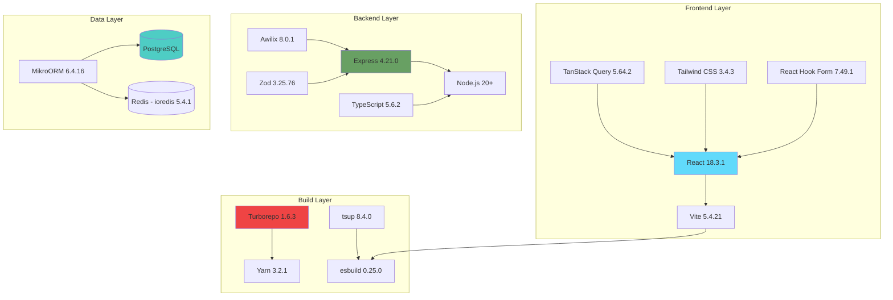

# Medusa Technology Stack Guide

**Version:** 2.11.3
**Last Updated:** November 18, 2025
**For:** Developers learning the technologies powering Medusa

---

## Table of Contents

1. [Stack Overview](#stack-overview)
2. [Backend Technologies](#backend-technologies)
3. [Frontend Technologies](#frontend-technologies)
4. [Database & ORM](#database--orm)
5. [Build & Development Tools](#build--development-tools)
6. [Testing Frameworks](#testing-frameworks)
7. [Architectural Patterns](#architectural-patterns)
8. [Version Currency & Migration Notes](#version-currency--migration-notes)

---

## Stack Overview

### Technology Layers



### Stack at a Glance

| Layer | Technology | Version | Purpose |
|-------|------------|---------|---------|
| **Runtime** | Node.js | 20+ | JavaScript runtime |
| **Language** | TypeScript | 5.6.2 | Type safety |
| **Backend Framework** | Express | 4.21.0 | HTTP server |
| **Frontend Framework** | React | 18.3.1 | UI components |
| **ORM** | MikroORM | 6.4.16 | Database abstraction |
| **Database** | PostgreSQL | Latest | Data storage |
| **Cache/Events** | Redis (ioredis) | 5.4.1 | Caching & pub/sub |
| **DI Container** | Awilix | 8.0.1 | Dependency injection |
| **Build Tool (Frontend)** | Vite | 5.4.21 | Fast dev server |
| **Build Tool (Backend)** | tsup | 8.4.0 | TypeScript bundler |
| **Bundler** | esbuild | 0.25.0 | Fast JavaScript bundler |
| **Monorepo** | Turborepo | 1.6.3 | Build orchestration |
| **Package Manager** | Yarn | 3.2.1 | Dependency management |
| **Validation** | Zod | 3.25.76 | Schema validation |
| **State Management** | TanStack Query | 5.64.2 | Server state |
| **Forms** | React Hook Form | 7.49.1 | Form handling |
| **Styling** | Tailwind CSS | 3.4.3 | Utility-first CSS |
| **Testing** | Jest + Vitest | 29.7.0 / 3.0.5 | Unit & integration tests |

---

## Backend Technologies

### 1. Node.js 20+

**Purpose:** JavaScript runtime environment

**Why Node 20+:**
- ✅ Active LTS (supported until April 2026)
- ✅ Native `fetch` API (no need for axios in some cases)
- ✅ Better performance than Node 18
- ✅ ES modules support

🌉 **Bridge from JavaScript:**
- Node.js = Chrome V8 engine running on the server
- Same JavaScript you know, but with file system access, HTTP servers, etc.

**Usage in Medusa:**

```typescript
// Native fetch (Node 18+)
const response = await fetch("https://api.stripe.com/v1/charges")

// File system access
import fs from "fs/promises"
await fs.writeFile("output.json", JSON.stringify(data))

// Process environment
const apiKey = process.env.STRIPE_API_KEY
```

**Official Docs:** https://nodejs.org/docs/latest-v20.x/api/

---

### 2. TypeScript 5.6.2

**Purpose:** Static type checking for JavaScript

**Why TypeScript:**
- ✅ Catch bugs at compile time, not runtime
- ✅ IntelliSense autocomplete in VS Code
- ✅ Self-documenting code
- ✅ Safer refactoring

🧠 **Mental Model:** TypeScript = JavaScript + Type Annotations

**Key Features Used in Medusa:**

```typescript
// 1. Interface definitions
interface CreateCartInput {
  region_id: string
  customer_id?: string
  items?: LineItemInput[]
}

// 2. Generic types
class MedusaService<TEntity> {
  async list(filters: Partial<TEntity>): Promise<TEntity[]> {
    // ...
  }
}

// 3. Union types
type PaymentStatus = "pending" | "authorized" | "captured" | "refunded"

// 4. Type inference
const cart = await cartService.retrieve("cart_123")
// TypeScript knows cart is of type Cart

// 5. Utility types
type PartialCart = Partial<Cart>  // All properties optional
type CartKeys = keyof Cart        // "id" | "email" | "region_id" | ...
```

**Version Notes:**
- Medusa uses TypeScript 5.6.2
- Latest stable: 5.9 (minor improvements, no breaking changes)
- Safe to learn from Medusa's TypeScript patterns

**Official Docs:** https://www.typescriptlang.org/docs/

🔍 **Needs Verification:** Check if newer TS features (5.7+) would benefit the codebase.

---

### 3. Express.js 4.21.0

**Purpose:** HTTP server and routing framework

**Why Express:**
- ✅ Industry standard for Node.js web servers
- ✅ Middleware ecosystem
- ✅ Simple, unopinionated API
- ✅ Battle-tested in production

🌉 **Bridge from React:**

| React Concept | Express Equivalent |
|---------------|-------------------|
| Component | Route handler |
| Props | Request params/body |
| useState | Session/database |
| useEffect | Middleware |
| Context | `req.scope` (DI container) |

**Core Concepts:**

```typescript
// 1. Route handlers
app.get("/api/products", async (req, res) => {
  const products = await productService.list()
  res.json({ products })
})

// 2. Middleware (runs before route handler)
app.use(async (req, res, next) => {
  req.user = await authenticate(req.headers.authorization)
  next()  // Pass to next middleware or route handler
})

// 3. Route parameters
app.get("/api/products/:id", async (req, res) => {
  const { id } = req.params
  const product = await productService.retrieve(id)
  res.json({ product })
})

// 4. Request body
app.post("/api/products", async (req, res) => {
  const { title, description } = req.body
  const product = await productService.create({ title, description })
  res.status(201).json({ product })
})
```

**Medusa's File-Based Routing:**

Instead of calling `app.get()` manually, Medusa uses **file-based routing**:

```
/packages/medusa/src/api/store/products/
├── route.ts           → GET/POST /store/products
└── [id]/
    └── route.ts       → GET/PATCH/DELETE /store/products/:id
```

**File:** `route.ts`

```typescript
import { MedusaRequest, MedusaResponse } from "@medusajs/framework/http"

// Export named functions for HTTP methods
export const GET = async (req: MedusaRequest, res: MedusaResponse) => {
  // Handler for GET /store/products
}

export const POST = async (req: MedusaRequest, res: MedusaResponse) => {
  // Handler for POST /store/products
}
```

💡 **Aha Moment:** File-based routing = Next.js App Router for backend!

**Version Notes:**
- Express 4.21 is current and actively maintained
- Express 5.0 released (October 2024) - mainly promise support and security
- Medusa patterns will work in Express 5 with minimal changes

**Official Docs:** https://expressjs.com/

---

### 4. Awilix 8.0.1 (Dependency Injection)

**Purpose:** Dependency injection container for managing services

**Why DI:**
- ✅ Loose coupling between components
- ✅ Easier testing (mock dependencies)
- ✅ Centralized service management
- ✅ Request-scoped services

🧠 **Mental Model:** DI Container = Service Registry + Automatic Wiring

**Without DI:**
```typescript
// ❌ Tight coupling - hard to test
class OrderService {
  private cartService = new CartService()
  private paymentService = new PaymentService()

  async createOrder(cartId: string) {
    const cart = await this.cartService.retrieve(cartId)
    const payment = await this.paymentService.authorize(cart.total)
    // ...
  }
}
```

**With DI (Awilix):**
```typescript
// ✅ Loose coupling - easy to test
class OrderService {
  private cartService: CartService
  private paymentService: PaymentService

  constructor({ cartService, paymentService }) {
    this.cartService = cartService
    this.paymentService = paymentService
  }

  async createOrder(cartId: string) {
    const cart = await this.cartService.retrieve(cartId)
    const payment = await this.paymentService.authorize(cart.total)
    // ...
  }
}

// Register services
container.register({
  cartService: asClass(CartService),
  paymentService: asClass(PaymentService),
  orderService: asClass(OrderService),  // Dependencies auto-injected!
})

// Resolve service
const orderService = container.resolve("orderService")
```

**Awilix in Medusa:**

```typescript
// In a route handler
export const POST = async (req: MedusaRequest, res: MedusaResponse) => {
  // req.scope is the DI container
  const orderService = req.scope.resolve("orderService")
  const cartService = req.scope.resolve("cartService")

  // Use services
  const order = await orderService.createFromCart(cartId)
  res.json({ order })
}
```

**Service Registration (automatic in Medusa):**

```typescript
// Framework automatically registers modules
container.register({
  [Modules.CART]: asFunction(() => cartModule),
  [Modules.PRODUCT]: asFunction(() => productModule),
  [Modules.ORDER]: asFunction(() => orderModule),
})
```

**Version Notes:**
- Awilix 8.0.1 in use
- Latest: v12.0.5 (adds strict mode for better error checking)
- Core DI patterns remain the same

**Official Docs:** https://github.com/jeffijoe/awilix

🌉 **Bridge from React:** DI Container ≈ React Context API
- Register services once (like `<Provider>`)
- Resolve anywhere (like `useContext()`)
- Request-scoped = fresh container per HTTP request

---

### 5. Zod 3.25.76 (Schema Validation)

**Purpose:** TypeScript-first schema validation

**Why Zod:**
- ✅ Type inference (no need to write types separately)
- ✅ Runtime validation (catch bad data)
- ✅ Great error messages
- ✅ Composable schemas

🧠 **Mental Model:** Zod = TypeScript types that work at runtime

**Basic Usage:**

```typescript
import { z } from "zod"

// Define schema
const CreateCartSchema = z.object({
  region_id: z.string(),
  customer_id: z.string().optional(),
  items: z.array(
    z.object({
      variant_id: z.string(),
      quantity: z.number().int().positive(),
    })
  ),
})

// Infer TypeScript type from schema
type CreateCartInput = z.infer<typeof CreateCartSchema>

// Validate data
const result = CreateCartSchema.safeParse(req.body)
if (!result.success) {
  return res.status(400).json({ errors: result.error.errors })
}

// result.data is typed and validated!
const validatedData: CreateCartInput = result.data
```

**Advanced Patterns:**

```typescript
// 1. Transformations
const EmailSchema = z.string().email().transform((email) => email.toLowerCase())

// 2. Refinements (custom validation)
const PasswordSchema = z.string().refine(
  (password) => password.length >= 8,
  { message: "Password must be at least 8 characters" }
)

// 3. Union types
const PaymentMethodSchema = z.union([
  z.literal("stripe"),
  z.literal("paypal"),
])

// 4. Discriminated unions
const EventSchema = z.discriminatedUnion("type", [
  z.object({ type: z.literal("cart.created"), data: z.object({ id: z.string() }) }),
  z.object({ type: z.literal("order.placed"), data: z.object({ id: z.string() }) }),
])
```

**Version Notes:**
- Zod 3.25.76 in use
- Latest: v4.1.12 (57% smaller bundle, 20x faster type-checking!)
- Zod 4 has breaking changes - migration guide needed
- All Zod 3 patterns still valid

**Official Docs:** https://zod.dev/

💡 **Aha Moment:** Write the schema once, get TypeScript types AND runtime validation!

---

## Frontend Technologies

### 1. React 18.3.1

**Purpose:** UI component library

**Why React 18:**
- ✅ Concurrent rendering (better performance)
- ✅ Automatic batching (fewer re-renders)
- ✅ Suspense for data fetching
- ✅ Industry standard

**Key React 18 Features Used:**

```typescript
// 1. Hooks (useState, useEffect, etc.)
function ProductList() {
  const [products, setProducts] = useState([])

  useEffect(() => {
    fetchProducts().then(setProducts)
  }, [])

  return <div>{products.map((p) => <ProductCard key={p.id} {...p} />)}</div>
}

// 2. Suspense for lazy loading
const AdminPanel = lazy(() => import("./AdminPanel"))

function App() {
  return (
    <Suspense fallback={<Loading />}>
      <AdminPanel />
    </Suspense>
  )
}

// 3. useTransition for concurrent rendering
function SearchableProductList() {
  const [query, setQuery] = useState("")
  const [isPending, startTransition] = useTransition()

  const handleSearch = (e) => {
    startTransition(() => {
      setQuery(e.target.value)  // Low priority update
    })
  }

  return <input onChange={handleSearch} />
}
```

**Version Notes:**
- React 18.3.1 in use
- Latest: React 19.2.0 (adds Server Components, Actions API)
- React 18 patterns are current and widely used
- No need to upgrade to React 19 immediately

**Official Docs:** https://react.dev/

---

### 2. Vite 5.4.21

**Purpose:** Fast development server and build tool

**Why Vite:**
- ✅ Instant server start (uses native ES modules)
- ✅ Lightning-fast HMR (Hot Module Replacement)
- ✅ Optimized production builds
- ✅ Better DX than Webpack

🌉 **Bridge from Create React App:**

| Create React App | Vite |
|------------------|------|
| Webpack | esbuild (10-100x faster) |
| Babel | SWC/esbuild |
| Slow start (~30s) | Instant start (~200ms) |
| Slow HMR | Instant HMR |

**Vite Config Example:**

**File:** `/packages/admin/dashboard/vite.config.ts`

```typescript
import react from "@vitejs/plugin-react"
import { defineConfig } from "vite"

export default defineConfig({
  plugins: [react()],
  server: {
    port: 7001,
  },
  build: {
    outDir: "dist",
    sourcemap: true,
  },
})
```

**Development:**
```bash
vite dev     # Start dev server (instant!)
vite build   # Production build
vite preview # Preview production build
```

**Version Notes:**
- Vite 5.4.21 in use
- Latest: Vite 7.2 (requires Node 20.19+, new Environment API)
- Vite 5 → 7 upgrade recommended for performance gains

**Official Docs:** https://vite.dev/

---

### 3. TanStack Query 5.64.2 (React Query)

**Purpose:** Server state management

**Why TanStack Query:**
- ✅ Automatic caching
- ✅ Background refetching
- ✅ Optimistic updates
- ✅ Loading/error states
- ✅ Replaces Redux for server data

🧠 **Mental Model:** TanStack Query = Smart `useEffect` for data fetching

**Without TanStack Query:**
```typescript
// ❌ Lots of boilerplate
function ProductList() {
  const [products, setProducts] = useState([])
  const [loading, setLoading] = useState(true)
  const [error, setError] = useState(null)

  useEffect(() => {
    setLoading(true)
    fetch("/api/products")
      .then((res) => res.json())
      .then((data) => {
        setProducts(data.products)
        setLoading(false)
      })
      .catch((err) => {
        setError(err)
        setLoading(false)
      })
  }, [])

  if (loading) return <div>Loading...</div>
  if (error) return <div>Error: {error.message}</div>
  return <div>{products.map(...)}</div>
}
```

**With TanStack Query:**
```typescript
// ✅ Clean and powerful
import { useQuery } from "@tanstack/react-query"

function ProductList() {
  const { data, isLoading, error } = useQuery({
    queryKey: ["products"],
    queryFn: async () => {
      const res = await fetch("/api/products")
      return res.json()
    },
  })

  if (isLoading) return <div>Loading...</div>
  if (error) return <div>Error: {error.message}</div>
  return <div>{data.products.map(...)}</div>
}
```

**Advanced Features:**

```typescript
// 1. Mutations (create/update/delete)
const mutation = useMutation({
  mutationFn: (newProduct) => {
    return fetch("/api/products", {
      method: "POST",
      body: JSON.stringify(newProduct),
    })
  },
  onSuccess: () => {
    queryClient.invalidateQueries({ queryKey: ["products"] })
  },
})

// 2. Optimistic updates
const mutation = useMutation({
  mutationFn: updateProduct,
  onMutate: async (newProduct) => {
    await queryClient.cancelQueries({ queryKey: ["product", newProduct.id] })
    const previous = queryClient.getQueryData(["product", newProduct.id])
    queryClient.setQueryData(["product", newProduct.id], newProduct)
    return { previous }
  },
  onError: (err, newProduct, context) => {
    queryClient.setQueryData(["product", newProduct.id], context.previous)
  },
})

// 3. Infinite queries (pagination)
const { data, fetchNextPage, hasNextPage } = useInfiniteQuery({
  queryKey: ["products"],
  queryFn: ({ pageParam = 0 }) => fetchProducts({ offset: pageParam }),
  getNextPageParam: (lastPage) => lastPage.nextOffset,
})
```

**Version Notes:**
- TanStack Query 5.64.2 in use
- Latest: v5.90.10 (patch releases, non-breaking)
- v5 is current major version
- Upgrade to v5.90 is safe

**Official Docs:** https://tanstack.com/query/latest

---

### 4. Tailwind CSS 3.4.3

**Purpose:** Utility-first CSS framework

**Why Tailwind:**
- ✅ No context switching (write styles in JSX)
- ✅ Design system constraints (spacing, colors)
- ✅ Responsive design made easy
- ✅ Tiny production bundle (only used classes)

🌉 **Bridge from CSS:**

```typescript
// Traditional CSS
<div className="product-card">
  <h2 className="product-title">Product Name</h2>
</div>

<style>
.product-card {
  padding: 16px;
  border-radius: 8px;
  box-shadow: 0 2px 4px rgba(0,0,0,0.1);
}
.product-title {
  font-size: 24px;
  font-weight: bold;
  margin-bottom: 8px;
}
</style>

// Tailwind CSS
<div className="p-4 rounded-lg shadow-sm">
  <h2 className="text-2xl font-bold mb-2">Product Name</h2>
</div>
```

**Common Patterns:**

```typescript
// Layout
<div className="flex flex-col gap-4">     {/* Flexbox column with gap */}
<div className="grid grid-cols-3 gap-6">  {/* 3-column grid */}

// Responsive
<div className="w-full md:w-1/2 lg:w-1/3">  {/* Responsive width */}
<div className="text-sm md:text-base lg:text-lg">  {/* Responsive font */}

// States
<button className="bg-blue-500 hover:bg-blue-600 active:bg-blue-700">
<input className="border border-gray-300 focus:border-blue-500 focus:ring-2 focus:ring-blue-200">

// Dark mode
<div className="bg-white dark:bg-gray-900 text-black dark:text-white">
```

**Version Notes:**
- Tailwind 3.4.3 in use
- Latest: Tailwind v4.1.17 (complete rewrite, CSS-based config)
- Tailwind v4 is a paradigm shift (JS config → CSS config)
- Tailwind v3 patterns still widely used

**Official Docs:** https://tailwindcss.com/docs

---

### 5. React Hook Form 7.49.1

**Purpose:** Performant form handling

**Why React Hook Form:**
- ✅ Minimal re-renders (uncontrolled components)
- ✅ Built-in validation
- ✅ Easy integration with Zod
- ✅ Great DX

**Basic Usage:**

```typescript
import { useForm } from "react-hook-form"
import { zodResolver } from "@hookform/resolvers/zod"
import { z } from "zod"

const schema = z.object({
  email: z.string().email(),
  password: z.string().min(8),
})

function LoginForm() {
  const {
    register,
    handleSubmit,
    formState: { errors },
  } = useForm({
    resolver: zodResolver(schema),
  })

  const onSubmit = (data) => {
    console.log(data)  // { email: "...", password: "..." }
  }

  return (
    <form onSubmit={handleSubmit(onSubmit)}>
      <input {...register("email")} />
      {errors.email && <span>{errors.email.message}</span>}

      <input {...register("password")} type="password" />
      {errors.password && <span>{errors.password.message}</span>}

      <button type="submit">Login</button>
    </form>
  )
}
```

**Official Docs:** https://react-hook-form.com/

---

## Database & ORM

### MikroORM 6.4.16

**Purpose:** TypeScript ORM for PostgreSQL

**Why MikroORM:**
- ✅ TypeScript-first (unlike Sequelize)
- ✅ Data Mapper pattern (vs Active Record in TypeORM)
- ✅ Unit of Work pattern (batched queries)
- ✅ Great migration system

🧠 **Mental Model:** MikroORM = TypeORM + Better TypeScript + Data Mapper

**Entity Definition:**

```typescript
import { model } from "@medusajs/framework/utils"

const Product = model.define("product", {
  id: model.id().primaryKey(),
  title: model.text(),
  description: model.text().nullable(),
  price: model.number(),

  // Relations
  variants: model.hasMany(() => ProductVariant, { mappedBy: "product" }),
  categories: model.manyToMany(() => Category),
})
```

**Repository Pattern:**

```typescript
// Get repository
const productRepo = em.getRepository(Product)

// Find one
const product = await productRepo.findOne({ id: "prod_123" })

// Find many
const products = await productRepo.find({ status: "published" })

// Create
const newProduct = productRepo.create({
  title: "New Product",
  price: 1999,
})
await em.persistAndFlush(newProduct)

// Update
product.price = 2499
await em.flush()

// Delete
await em.removeAndFlush(product)
```

**Query Builder:**

```typescript
const products = await em.qb(Product)
  .select("*")
  .where({ status: "published" })
  .andWhere({ price: { $gte: 1000 } })
  .orderBy({ createdAt: "DESC" })
  .limit(10)
  .getResult()
```

**Version Notes:**
- MikroORM 6.4.16 in use
- Latest: v6.6 (enhanced filter configurability)
- Upgrade to 6.6 is non-breaking

**Official Docs:** https://mikro-orm.io/docs/

---

## Build & Development Tools

### 1. Turborepo 1.6.3

**Purpose:** Monorepo build orchestration

**Why Turborepo:**
- ✅ Smart caching (skip unchanged packages)
- ✅ Parallel builds (utilize all CPU cores)
- ✅ Task dependencies (build order)
- ✅ Remote caching (share cache across team)

**Config:** `turbo.json`

```json
{
  "pipeline": {
    "build": {
      "dependsOn": ["^build"],
      "outputs": ["dist/**"]
    },
    "test": {
      "dependsOn": ["build"]
    }
  }
}
```

**Usage:**
```bash
turbo run build    # Build all packages (with caching)
turbo run test     # Run all tests
```

**Version Notes:**
- Turborepo 1.6.3 in use
- Latest: v2.6.1 (new terminal UI, watch mode, Rust-powered)
- Upgrade to Turbo 2.x strongly recommended

**Official Docs:** https://turbo.build/repo/docs

---

### 2. Yarn 3.2.1 (Berry)

**Purpose:** Package manager with workspaces

**Why Yarn 3:**
- ✅ Plug'n'Play (faster installs)
- ✅ Zero-installs (commit dependencies)
- ✅ Better workspace support
- ✅ Constraints (enforce dependencies)

**Commands:**
```bash
yarn install                          # Install dependencies
yarn workspace @medusajs/cart build  # Build specific package
yarn workspaces foreach run build    # Build all packages
```

**Official Docs:** https://yarnpkg.com/

---

## Testing Frameworks

### 1. Jest 29.7.0

**Purpose:** JavaScript testing framework

**Usage:**
```typescript
describe("CartService", () => {
  it("should create a cart", async () => {
    const cart = await cartService.create({ region_id: "reg_123" })
    expect(cart).toBeDefined()
    expect(cart.region_id).toBe("reg_123")
  })
})
```

**Official Docs:** https://jestjs.io/

---

### 2. Vitest 3.0.5

**Purpose:** Vite-native testing framework

**Why Vitest:**
- ✅ Same config as Vite
- ✅ Faster than Jest
- ✅ Better watch mode
- ✅ Jest-compatible API

**Official Docs:** https://vitest.dev/

---

## Architectural Patterns

### 1. Dependency Injection

**Pattern:** Inversion of Control
**Implementation:** Awilix
**Purpose:** Loose coupling, testability

### 2. Repository Pattern

**Pattern:** Data access abstraction
**Implementation:** MikroORM repositories
**Purpose:** Separate business logic from data access

### 3. Workflow Pattern

**Pattern:** Saga pattern
**Implementation:** @medusajs/workflows-sdk
**Purpose:** Orchestrate complex operations with rollback

### 4. Provider Pattern

**Pattern:** Strategy pattern
**Implementation:** Module providers
**Purpose:** Pluggable implementations

### 5. Module Pattern

**Pattern:** Bounded contexts
**Implementation:** Commerce modules
**Purpose:** Modular, isolated functionality

---

## Version Currency & Migration Notes

**Reference:** See `TECH_STACK_RESEARCH.md` for detailed version analysis.

### ✅ Current & Safe to Learn

- TypeScript 5.6.2
- Node.js 20+
- MikroORM 6.4.16
- Express 4.21.0
- React 18.3.1

### ⚠️ Minor Updates Available

- TanStack Query 5.64.2 → 5.90.10
- React Hook Form 7.49.1 → 7.66.1

### 🚨 Upgrade Recommended

- **Vite** 5.4.21 → 7.2 (performance gains)
- **Turborepo** 1.6.3 → 2.6.1 (better DX)
- **Zod** 3.25.76 → 4.1.12 (57% smaller, 20x faster)
- **Tailwind** 3.4.3 → 4.1.17 (paradigm shift to CSS config)

---

## Key Takeaways

### ✅ Technologies to Master

1. **TypeScript** - Foundation of everything
2. **Express + File-based routing** - Backend API
3. **React 18 + Hooks** - Frontend UI
4. **MikroORM** - Database access
5. **Awilix** - Dependency injection
6. **Workflows** - Business logic orchestration

### 🎯 Learning Path

**Week 1-2:** TypeScript, Express, React basics
**Week 3-4:** MikroORM, Awilix, TanStack Query
**Month 2:** Workflows, Module system, Event bus
**Month 3+:** Advanced patterns, custom modules

---

## Additional Resources

- **TypeScript Handbook:** https://www.typescriptlang.org/docs/handbook/intro.html
- **Express Guide:** https://expressjs.com/en/guide/routing.html
- **React Docs:** https://react.dev/learn
- **MikroORM Guide:** https://mikro-orm.io/docs/guide
- **Awilix README:** https://github.com/jeffijoe/awilix

---

**File Path:** `/home/user/medusa/docs/learning/TECH_STACK_GUIDE.md`
**Related Files:**
- `TECH_STACK_RESEARCH.md` - Detailed version analysis
- `ARCHITECTURE_OVERVIEW.md` - System architecture
- `DATA_FLOW_GUIDE.md` - Request flow examples
